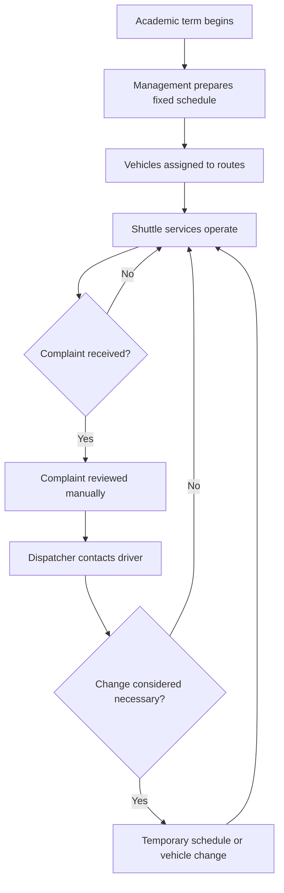

# As-Is Process

## Current Vehicle Allocation Process

## Process Weaknesses

- Performance is evaluated mainly through complaints.
- Capacity is not measured consistently.
- Temporary changes are not formally analyzed.
- Schedule decisions are not supported by historical evidence.
- There is no standard recommendation process.
