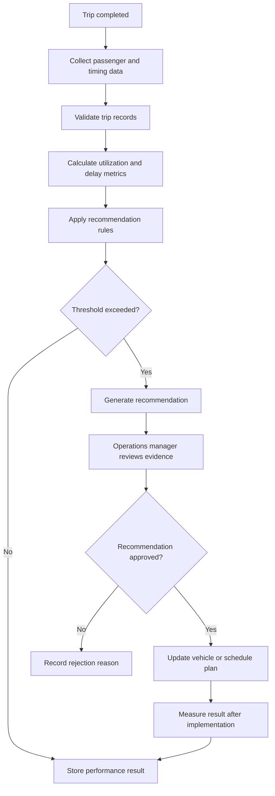

# To-Be Process

## Improvements

- Decisions are based on operational measurements.
- Recommendations remain subject to human approval.
- Rejected recommendations are recorded.
- Changes can be compared with later performance.
- Every recommendation is traceable.
