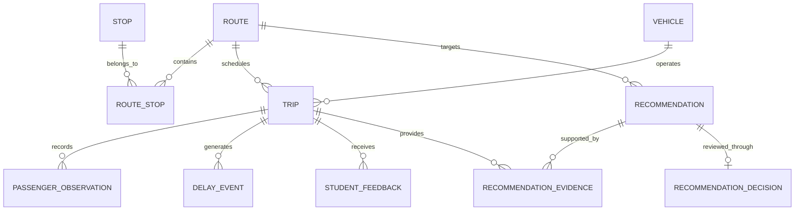

# Conceptual Data Model

## Purpose

This data model supports route planning, trip monitoring, passenger capacity
analysis, delay tracking, feedback management and operational recommendations.

The model separates operational records from recommendation and approval
records so that every decision remains traceable.

## Entity Relationship Diagram

## Core Entities

### Route

Represents a defined shuttle service connecting multiple stops.

| Field | Type | Description |
|---|---|---|
| route_id | String | Unique route identifier |
| route_name | String | Display name of the route |
| route_status | String | Active, inactive or temporarily suspended |
| planned_duration_minutes | Integer | Expected route duration |
| service_start_time | Time | Daily service starting time |
| service_end_time | Time | Daily service ending time |

### Stop

Represents a physical boarding or arrival point.

| Field | Type | Description |
|---|---|---|
| stop_id | String | Unique stop identifier |
| stop_name | String | Name of the stop |
| latitude | Decimal | Geographic latitude |
| longitude | Decimal | Geographic longitude |
| accessibility_available | Boolean | Indicates accessibility support |
| stop_status | String | Current operational status |

### Route Stop

Connects routes and stops while preserving stop order.

| Field | Type | Description |
|---|---|---|
| route_id | String | Related route |
| stop_id | String | Related stop |
| stop_sequence | Integer | Position of the stop within the route |
| planned_arrival_offset | Integer | Planned minutes from route departure |
| is_timepoint | Boolean | Indicates whether timing is controlled at the stop |

The combination of `route_id` and `stop_id` forms the logical primary key.

### Vehicle

Stores operational details of shuttle vehicles.

| Field | Type | Description |
|---|---|---|
| vehicle_id | String | Unique vehicle identifier |
| plate_number | String | Registered vehicle plate |
| usable_capacity | Integer | Maximum supported passenger count |
| vehicle_type | String | Minibus, bus or accessible vehicle |
| operational_status | String | Available, assigned, maintenance or inactive |
| accessibility_supported | Boolean | Indicates wheelchair accessibility |

### Trip

Represents one scheduled execution of a route.

| Field | Type | Description |
|---|---|---|
| trip_id | String | Unique trip identifier |
| route_id | String | Route operated by the trip |
| vehicle_id | String | Assigned vehicle |
| service_date | Date | Operating date |
| planned_departure_at | Timestamp | Planned departure time |
| actual_departure_at | Timestamp | Actual departure time |
| planned_arrival_at | Timestamp | Planned arrival time |
| actual_arrival_at | Timestamp | Actual arrival time |
| trip_status | String | Planned, active, completed or cancelled |

### Passenger Observation

Stores passenger count observations collected during a trip.

| Field | Type | Description |
|---|---|---|
| observation_id | String | Unique observation identifier |
| trip_id | String | Related trip |
| stop_id | String | Stop where the observation was recorded |
| passenger_count | Integer | Estimated number of passengers |
| observation_method | String | Manual, sensor or ticket system |
| observed_at | Timestamp | Observation time |
| confidence_score | Decimal | Reliability score of the observation |

### Delay Event

Records measurable delays affecting a trip.

| Field | Type | Description |
|---|---|---|
| delay_event_id | String | Unique delay record |
| trip_id | String | Related trip |
| stop_id | String | Stop associated with the delay |
| delay_minutes | Integer | Difference from planned time |
| delay_reason | String | Traffic, breakdown, weather or operational cause |
| recorded_at | Timestamp | Time the delay was recorded |

### Student Feedback

Stores feedback associated with shuttle operations.

| Field | Type | Description |
|---|---|---|
| feedback_id | String | Unique feedback identifier |
| trip_id | String | Related trip when known |
| route_id | String | Related route |
| stop_id | String | Related stop when known |
| feedback_category | String | Delay, overcrowding, safety or service quality |
| feedback_text | String | User-provided explanation |
| submitted_at | Timestamp | Submission time |
| feedback_status | String | Open, reviewed or resolved |

## Decision-Support Entities

### Recommendation

Represents a system-generated operational recommendation.

| Field | Type | Description |
|---|---|---|
| recommendation_id | String | Unique recommendation identifier |
| route_id | String | Target route |
| recommendation_type | String | Add vehicle, reduce frequency or revise schedule |
| target_time_slot | String | Time period affected by the recommendation |
| triggering_rule | String | Business rule that generated the recommendation |
| confidence_level | Decimal | Calculated recommendation confidence |
| expected_effect | String | Expected operational improvement |
| generated_at | Timestamp | Recommendation generation time |
| recommendation_status | String | Pending, approved, rejected or expired |

### Recommendation Evidence

Connects a recommendation with the trips and measurements supporting it.

| Field | Type | Description |
|---|---|---|
| evidence_id | String | Unique evidence identifier |
| recommendation_id | String | Related recommendation |
| trip_id | String | Supporting trip |
| metric_name | String | Utilization, delay rate or complaint count |
| metric_value | Decimal | Measured value |
| threshold_value | Decimal | Rule threshold |
| evidence_period | String | Time period used in the calculation |

### Recommendation Decision

Stores the human review outcome.

| Field | Type | Description |
|---|---|---|
| decision_id | String | Unique decision identifier |
| recommendation_id | String | Reviewed recommendation |
| decision_status | String | Approved or rejected |
| decision_reason | String | Explanation provided by the reviewer |
| decided_by | String | Authorized reviewer |
| decided_at | Timestamp | Decision time |
| implementation_date | Date | Planned implementation date |

## Key Relationships

1. A route may contain multiple stops.
2. A stop may belong to multiple routes.
3. A route may generate many scheduled trips.
4. Each trip uses one assigned vehicle.
5. A trip may contain multiple passenger observations and delay events.
6. Feedback may be connected to a route, stop or specific trip.
7. A recommendation targets one route and may be supported by many trips.
8. Recommendation evidence preserves the measurements used by the system.
9. A recommendation may receive one final human decision.

## Design Decisions

### Many-to-Many Route and Stop Relationship

The `Route Stop` entity is required because one stop may serve multiple routes,
and each route contains multiple stops.

It also preserves stop order and planned arrival offsets.

### Evidence-Based Recommendations

Recommendations do not store only the final result. Supporting trips,
measurements and thresholds are preserved through the
`Recommendation Evidence` entity.

This makes recommendations explainable and auditable.

### Human Approval

The recommendation and decision entities are separated because the system
provides operational advice but does not automatically change schedules.

### Historical Records

Completed trips, observations, recommendations and decisions should not be
overwritten. Historical records are required to evaluate whether approved
changes improved service performance.
