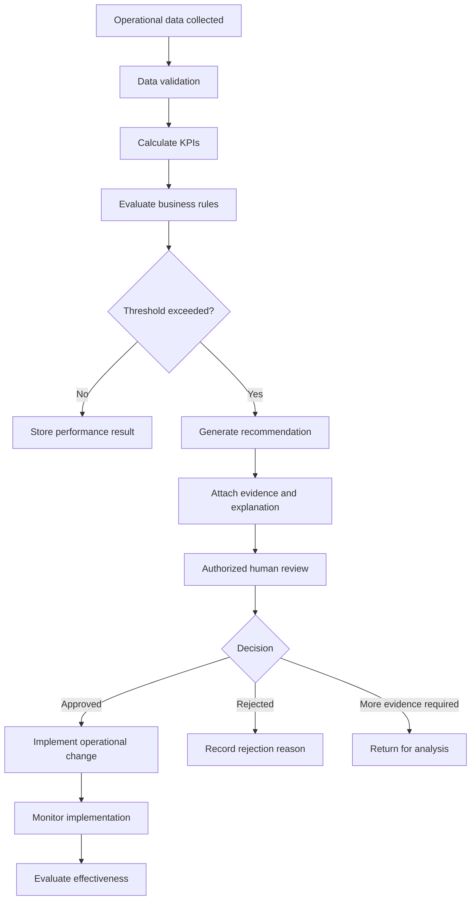

# Campus Shuttle Decision System

## Case Status

**Completed**

## Overview

This case study designs an explainable decision-support system for managing
university shuttle routes, vehicle capacity, service frequency and operational
performance.

The proposed system analyzes trip, passenger, vehicle, delay and feedback data
to help transportation managers decide:

- Which routes require additional vehicles
- Which time slots experience excessive demand
- Which services have low capacity utilization
- Which routes experience recurring delays
- Whether existing schedules should be revised
- Whether an operational recommendation should be approved

The system generates evidence-based recommendations but does not automatically
change shuttle operations.

Every operational recommendation requires authorized human review.

## Business Problem

The university currently plans shuttle services using fixed schedules, manual
observations and passenger complaints.

This creates several operational problems:

- Overcrowded vehicles during peak hours
- Underutilized vehicles during low-demand periods
- Recurring delays on specific routes
- Inconsistent passenger and timing records
- Limited visibility into route performance
- Reactive vehicle allocation decisions
- Difficulty evaluating whether changes improve service quality

## Proposed Solution

The proposed system converts operational data into measurable and traceable
recommendations.

The general decision process is:

1. Collect route, trip, vehicle and passenger information.
2. Validate the quality of operational records.
3. Calculate service and capacity KPIs.
4. Evaluate documented business rules.
5. Generate an explainable recommendation.
6. Present supporting evidence to an authorized reviewer.
7. Record approval or rejection decisions.
8. Monitor the result after implementation.

## Main Capabilities

- Route and stop management
- Trip scheduling
- Vehicle assignment
- Passenger-capacity monitoring
- Delay and punctuality analysis
- Student-feedback classification
- Operational KPI reporting
- Recommendation generation
- Human approval workflow
- Recommendation-effectiveness evaluation
- Risk and control monitoring
- Audit-history preservation

## Case Contents

| No. | Document | Description |
|---:|---|---|
| 01 | [Problem Brief](01-problem-brief.md) | Defines the current operational problem, business impact and target outcome |
| 02 | [Stakeholder Analysis](02-stakeholders.md) | Identifies stakeholders, goals, concerns and potential conflicts |
| 03 | [System Requirements](03-requirements.md) | Documents functional and non-functional requirements |
| 04 | [As-Is Process](04-as-is-process.md) | Models the current manual shuttle-management process |
| 05 | [To-Be Process](05-to-be-process.md) | Designs the proposed evidence-based decision process |
| 06 | [Business Rules](06-business-rules.md) | Defines capacity, delay and recommendation rules |
| 07 | [Conceptual Data Model](07-data-model.md) | Describes operational and decision-support entities |
| 08 | [OpenAPI Contract](08-api-contract.yml) | Defines route-performance and recommendation API operations |
| 09 | [KPI Framework](09-kpi-framework.md) | Documents formulas, targets and decision thresholds |
| 10 | [Analytical SQL](10-analytics.sql) | Contains route, capacity, delay and recommendation analyses |
| 11 | [Risk and Controls](11-risk-controls.md) | Identifies risks and preventive, detective and corrective controls |
| 12 | [Test Scenarios](12-test-scenarios.md) | Defines acceptance, boundary, security and data-quality tests |
| 13 | [Case Summary](13-case-summary.md) | Summarizes the completed system-design case |
| ADR-001 | [Human-Approved Recommendations](adr/adr-001-human-approved-recommendations.md) | Records the main architectural decision |

## Decision Workflow

## Core Business Rules

The system uses documented rules including:

- A trip is overcrowded when utilization exceeds 95 percent.
- Persistent overcapacity requires multiple comparable trips.
- A trip is significantly delayed when delay exceeds 10 minutes.
- Recurring delay requires more than 20 percent of comparable trips to be
  significantly delayed.
- Low utilization does not automatically result in service reduction.
- No recommendation may directly modify the operational schedule.
- Every recommendation must include evidence and an explanation.

## Key Performance Indicators

The case defines KPIs for:

### Capacity

- Capacity Utilization Rate
- Overcrowded Trip Rate
- Low-Utilization Trip Rate

### Punctuality and Reliability

- On-Time Performance Rate
- Average Arrival Delay
- Recurring Delay Rate
- Trip Completion Rate
- Schedule Adherence Rate

### Passenger Experience

- Complaint Rate
- Feedback Resolution Rate

### Decision Support

- Recommendation Approval Rate
- Recommendation Response Time
- Recommendation Implementation Rate
- Recommendation Effectiveness Rate

## Main Data Entities

### Operational Entities

- Route
- Stop
- Route Stop
- Vehicle
- Trip
- Passenger Observation
- Delay Event
- Student Feedback

### Decision-Support Entities

- Recommendation
- Recommendation Evidence
- Recommendation Decision

The recommendation and decision records are separated so that system-generated
advice and human responsibility remain independently traceable.

## Main Architectural Decision

The system uses a human-approved recommendation model.

The system may:

- Detect operational patterns
- Calculate KPIs
- Generate recommendations
- Present supporting evidence
- Estimate expected effects

The system may not automatically:

- Add or remove vehicles
- Modify route schedules
- Reduce service frequency
- Cancel trips
- Reassign accessible vehicles
- Publish timetable changes

This approach balances analytical consistency with operational judgment,
accountability, accessibility and safety.

## Skills Demonstrated

- Business analysis
- Stakeholder analysis
- Requirements engineering
- Process modeling
- Business-rule design
- Decision-support system design
- Conceptual data modeling
- OpenAPI contract design
- SQL analytics
- KPI development
- Risk and control analysis
- Acceptance testing
- Architecture decision documentation
- Technical documentation

## Scope Limitation

This repository represents a detailed system-design case study rather than a
deployed production application.

It currently does not contain:

- A running backend service
- A production database
- A user interface
- Live university transportation data
- Real vehicle integrations
- Deployed infrastructure

These limitations are documented to represent the project scope accurately.

## Final Outcome

The case demonstrates how a transportation operations problem can be converted
into a structured, measurable and auditable decision-support system.

The completed design connects:

- Business needs
- Stakeholder expectations
- System requirements
- Operational processes
- Data structures
- Decision rules
- Performance indicators
- Analytical queries
- Risk controls
- Acceptance tests
- Human decision-making
