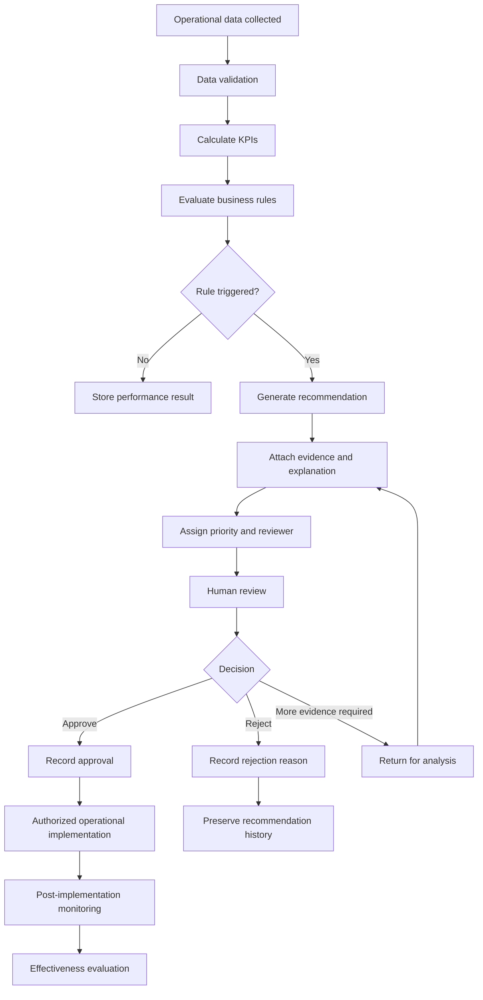
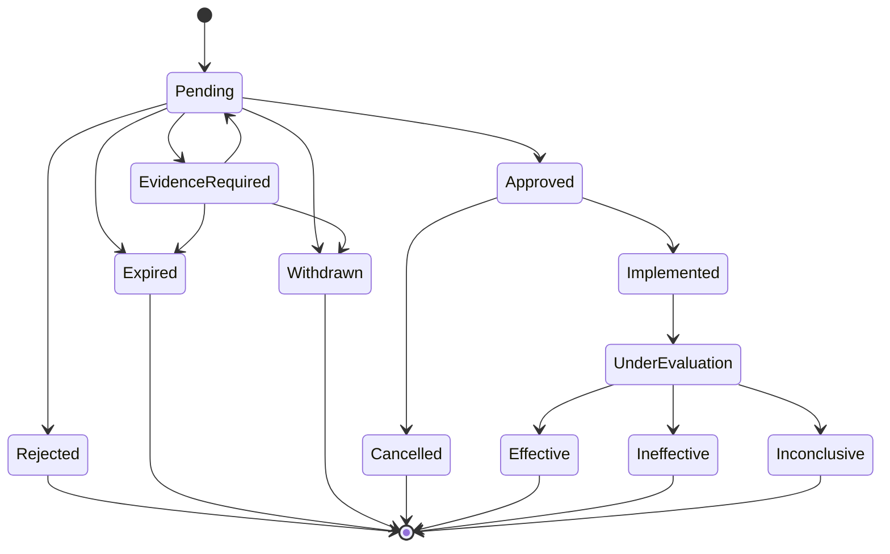

# ADR-001: Use Human-Approved Operational Recommendations

## Status

Accepted

## Date

2026-08-01

## Decision Owners

- Transportation Operations Manager
- Management Information Systems Team
- University IT Governance
- Service Quality Management

## Context

The Campus Shuttle Decision System analyzes operational information such as:

- Passenger capacity utilization
- Recurring delays
- Trip completion
- Student complaints
- Vehicle availability
- Route performance
- Historical operating patterns

Based on these measurements, the system can recommend actions such as:

- Adding a vehicle to a route
- Reducing service frequency
- Revising a timetable
- Investigating recurring delays
- Reassigning vehicle capacity
- Reviewing an underutilized service period

Some recommendations can significantly affect:

- Passenger waiting times
- Vehicle operating costs
- Accessibility coverage
- Driver and dispatcher workloads
- Service availability
- Other routes that share the same fleet

The available operational data may also contain uncertainty.

Examples include:

- Inaccurate passenger observations
- Missing timing information
- Temporary event-related demand
- Road closures
- Weather conditions
- Vehicle breakdowns
- Academic calendar changes
- Incomplete complaint records

For these reasons, a recommendation that appears mathematically correct may
still be inappropriate when broader operational context is considered.

A decision is therefore required on whether the system should:

1. Automatically apply operational changes
2. Generate recommendations that require authorized human approval

## Decision

The system will use a **human-approved recommendation model**.

The decision-support system may:

- Analyze operational data
- Detect threshold violations
- Generate recommendations
- Assign recommendation priority
- Present supporting evidence
- Estimate expected operational effects
- Track recommendation outcomes

The system will not automatically:

- Add or remove vehicles
- Change route schedules
- Reduce service frequency
- Cancel scheduled trips
- Reassign accessible vehicles
- Modify operational thresholds
- Publish timetable changes

Every operational recommendation must be reviewed by an authorized user before
it can affect shuttle operations.

## Decision Workflow



## Required Recommendation Information

A recommendation cannot be submitted for review unless it contains:

- Unique recommendation identifier
- Target route
- Target time slot
- Recommendation type
- Triggering business rule
- Supporting trip records
- Relevant KPI values
- Threshold values
- Evidence period
- Data-quality status
- Confidence level
- Expected operational effect
- Potential operational risks
- Generation timestamp
- Recommendation-rule version

## Human Review Requirements

The reviewer must be able to examine:

- The evidence supporting the recommendation
- The reliability of the underlying data
- Comparable historical periods
- Other affected routes
- Available vehicle capacity
- Accessibility requirements
- Current operational incidents
- Passenger feedback
- Estimated cost impact
- Expected service improvement

The reviewer must select one of the following outcomes:

- Approved
- Rejected
- Additional evidence required
- Expired
- Withdrawn

## Approval Requirements

An approval must include:

- Reviewer identity
- Decision timestamp
- Decision reason
- Planned implementation date
- Responsible implementation role
- Expected improvement
- Monitoring period
- Rollback condition

A recommendation should not be approved using only a status value without a
documented reason.

## Rejection Requirements

A rejection must include a reason selected from or related to:

- Insufficient evidence
- Low-confidence data
- Temporary demand pattern
- Vehicle unavailable
- Accessibility conflict
- Excessive operational cost
- Negative impact on another route
- Recommendation no longer relevant
- Alternative action preferred
- Incorrect rule configuration

Free-text explanation may be added for additional context.

## Decision Drivers

The following factors influenced this decision.

### Passenger Safety

Changes involving vehicle capacity and overcrowding can affect passenger
safety. High-impact changes require accountable human review.

### Operational Context

Not every relevant condition is available in structured system data.

Dispatchers and operations managers may know about:

- Temporary roadworks
- Campus events
- Driver shortages
- Maintenance requirements
- Security restrictions
- Weather-related conditions

### Data Uncertainty

Passenger observations, delay records and complaint information may be
incomplete or inaccurate.

### Accessibility

A capacity-improvement recommendation must not reduce accessible-service
availability elsewhere.

### Accountability

Operational changes must be attributable to an authorized decision-maker.

### Explainability

Managers must understand why a recommendation was generated before accepting
its consequences.

### Reversibility

Human review allows implementation and rollback conditions to be defined
before a change is applied.

## Considered Alternatives

### Alternative 1: Fully Automated Operational Changes

Under this approach, the system would automatically modify schedules or
vehicle assignments when predefined thresholds were exceeded.

#### Advantages

- Fast response to operational problems
- Reduced management workload
- Consistent application of rules
- Immediate reaction to capacity or delay conditions

#### Disadvantages

- Incorrect data could directly affect operations
- Temporary demand could trigger unnecessary changes
- Accessibility conflicts might not be identified
- A change could negatively affect another route
- Accountability would be less clear
- Schedule changes could occur without adequate operational context
- Rollback could become more complex

#### Decision

Rejected.

The operational impact and data uncertainty are too high for fully automated
implementation.

---

### Alternative 2: Manual Analysis Without System Recommendations

Under this approach, managers would review dashboards and independently decide
whether an operational change was required.

#### Advantages

- Maximum human control
- Flexible interpretation of unusual conditions
- No risk of automatic recommendation errors

#### Disadvantages

- Important patterns may be missed
- Decision quality may vary between managers
- Manual analysis requires more time
- Thresholds may be applied inconsistently
- Supporting evidence may not be preserved
- Decisions may become difficult to audit

#### Decision

Rejected.

Human judgment is necessary, but relying only on manual analysis would reduce
consistency, traceability and scalability.

---

### Alternative 3: Human-Approved Recommendations

Under this approach, the system detects patterns and generates structured
recommendations, but authorized users make the final decision.

#### Advantages

- Combines analytical consistency with operational judgment
- Preserves human accountability
- Makes evidence visible
- Supports auditability
- Reduces the risk of automatic operational harm
- Allows rejection reasons to improve future rules
- Supports controlled implementation and rollback

#### Disadvantages

- Recommendations may remain pending
- Human review creates additional workload
- Response time may be slower than full automation
- Decision quality may differ between reviewers
- Appropriate permissions and governance are required

#### Decision

Accepted.

This approach provides the best balance between automation, explainability,
control and operational safety.

## Consequences

### Positive Consequences

- Operational changes remain accountable.
- Recommendations are supported by measurable evidence.
- Managers can include context not available to the system.
- Incorrect recommendations can be rejected before implementation.
- Historical decisions can be audited.
- Approval and rejection reasons can improve future recommendation rules.
- Accessibility and network-wide effects can be reviewed.
- Rollback conditions can be defined before implementation.

### Negative Consequences

- Recommendations may not be implemented immediately.
- Management response time becomes an important performance indicator.
- Authorized reviewers must be available.
- Additional user-interface and workflow features are required.
- Reviewers may make inconsistent decisions.
- Recommendation backlogs may develop.
- Human bias may still affect outcomes.

### Neutral Consequences

- The system remains a decision-support tool rather than a fully autonomous
  operational platform.
- Recommendation quality and human review quality must both be measured.
- Approval does not guarantee that a recommendation will be effective.

## Risks Introduced by the Decision

### Risk 1: Review Delays

Recommendations may remain pending beyond their useful operating period.

#### Controls

- Define review deadlines.
- Use priority-based review queues.
- Send escalation alerts.
- Expire outdated recommendations.
- Reassign recommendations when reviewers are unavailable.
- Measure recommendation response time.

### Risk 2: Reviewer Bias

Different reviewers may interpret the same evidence differently.

#### Controls

- Use standardized review criteria.
- Require a documented decision reason.
- Provide comparable historical evidence.
- Analyze decision patterns by reviewer.
- Require secondary review for high-impact decisions.

### Risk 3: Approval Without Sufficient Review

A reviewer may approve a recommendation without examining its evidence.

#### Controls

- Present an evidence summary before the approval action.
- Require confirmation that key evidence was reviewed.
- Prevent approval when required evidence is missing.
- Record evidence viewed during the review session.
- Audit unusually fast approvals.

### Risk 4: Recommendation Backlog

A large number of recommendations may reduce the effectiveness of the review
process.

#### Controls

- Assign recommendation priorities.
- Combine duplicate recommendations.
- Suppress repeated recommendations during a defined period.
- Expire recommendations that are no longer relevant.
- Monitor the number and age of pending recommendations.

### Risk 5: Human Error

A reviewer may approve the wrong action, route or implementation period.

#### Controls

- Display the target route and time slot prominently.
- Require confirmation before final submission.
- Validate implementation dates.
- Support controlled correction procedures.
- Require additional approval for critical changes.

### Risk 6: Unauthorized Approval

A user without the required responsibility may attempt to approve a
recommendation.

#### Controls

- Apply role-based access control.
- Require strong authentication.
- Record failed authorization attempts.
- Review privileged-user access regularly.
- Separate analysis, approval and implementation roles.

## Recommendation Priority Model

Recommendations should be assigned one of the following priorities.

### Critical

Used when the recommendation concerns:

- Passenger safety
- Severe overcrowding
- Accessibility failure
- Repeated trip cancellations
- Major operational disruption

Critical recommendations should be reviewed as soon as operationally possible.

### High

Used when:

- Utilization repeatedly exceeds the critical threshold
- Recurring delay rate exceeds 20 percent
- A route has repeated reliability failures
- Complaint rates significantly exceed the accepted level

### Standard

Used when:

- Low utilization suggests a frequency review
- Performance is declining but remains within safe limits
- An optimization opportunity exists without immediate service risk

## Decision State Model



## Role Responsibilities

| Activity | Responsible Role |
|---|---|
| Configure business rules | System administrator and governance owner |
| Generate recommendations | Decision-support system |
| Validate recommendation evidence | Operations analyst |
| Approve or reject recommendations | Operations manager |
| Implement approved changes | Authorized dispatcher |
| Evaluate implementation results | Operations analyst |
| Review audit records | Internal control or IT security |

No single user should control the complete recommendation lifecycle for
high-impact changes.

## Audit Requirements

The system must record:

- Recommendation creation
- Triggering business rule
- Business-rule version
- Supporting evidence
- Evidence-quality status
- Recommendation status changes
- Reviewer identity
- Decision reason
- Decision timestamp
- Planned implementation date
- Operational implementation
- Post-implementation result
- Recommendation withdrawal or expiration
- Unauthorized approval attempts

Each audit record should contain:

- Event identifier
- Event type
- User or system identity
- Timestamp
- Affected recommendation
- Previous status
- New status
- Change reason
- Correlation or trace identifier

## Expiration Rules

A recommendation should expire when:

- Its evidence period is no longer current
- The related route or schedule has changed
- The operational problem no longer exists
- The recommendation has remained pending beyond its validity period
- A newer recommendation replaces it
- The required vehicle or operational resource is no longer available

An expired recommendation must not be approved without recalculating and
validating its evidence.

## Withdrawal Rules

A pending recommendation may be withdrawn when:

- Its source data is found to be incorrect
- Its business-rule configuration was invalid
- Duplicate recommendations exist
- A major operational change makes it irrelevant
- The system detects insufficient evidence
- The recommendation was generated in error

Withdrawal must preserve:

- Original recommendation information
- Withdrawal reason
- Responsible user or system process
- Withdrawal timestamp
- Related incident or correction reference

## Implementation Requirements

An approved recommendation does not automatically mean that implementation
has been completed.

Implementation must record:

- Implementation status
- Responsible role
- Actual implementation date
- Affected route or schedule
- Previous operational configuration
- New operational configuration
- Rollback procedure
- Monitoring start date
- Evaluation end date

Possible implementation statuses include:

- Planned
- In progress
- Implemented
- Cancelled
- Rolled back
- Partially implemented

## Post-Implementation Evaluation

Every implemented recommendation should be evaluated after a defined monitoring
period.

The evaluation should compare:

- Baseline KPI value
- Target KPI value
- Post-implementation KPI value
- Passenger feedback
- Effects on related routes
- Accessibility impact
- Operating-cost impact
- Unintended operational consequences

Possible evaluation outcomes include:

- Effective
- Partially effective
- Ineffective
- Worsened
- Inconclusive

## Example Decision Record

```yaml
recommendation_id: REC-2026-0042
route_id: ROUTE-A
recommendation_type: add_vehicle
target_time_slot: 08:00-09:00
triggering_rule: BR-002
rule_version: 1.0
confidence_level: 0.91
recommendation_status: approved

evidence:
  comparable_trip_count: 5
  overcrowded_trip_count: 4
  average_utilization_rate: 99.6
  overcrowding_threshold: 95
  data_quality_status: reliable

decision:
  decided_by: operations.manager@example-university.edu
  decided_at: 2026-08-01T11:15:00Z
  decision_reason: >
    Repeated morning capacity problems are supported by five comparable
    trips and reliable passenger observations.
  implementation_date: 2026-08-10

monitoring:
  baseline_overcrowded_trip_rate: 24
  target_overcrowded_trip_rate: 10
  monitoring_period_days: 28
  rollback_condition: >
    Roll back the change if another route's overcrowded trip rate increases
    by more than 10 percentage points.
```

## Success Measures

The decision will be considered successful when:

- Recommendations contain complete and understandable evidence.
- Unauthorized users cannot approve operational actions.
- High-priority recommendations are reviewed within defined time limits.
- Approval and rejection reasons are consistently recorded.
- Incorrect recommendations are rejected before implementation.
- Implemented recommendations are evaluated using before-and-after KPIs.
- Historical recommendation decisions remain auditable.
- Accessibility and network-wide effects are considered during review.

## Review Triggers

This architectural decision should be reviewed when:

- Data quality improves enough to support safe automation
- Recommendation volume becomes operationally unmanageable
- A recommendation causes a serious service incident
- New legal, accessibility or safety obligations apply
- Real-time operational integrations are introduced
- Management requests partial automation
- Decision accuracy and implementation outcomes become measurable at scale

## Future Evolution

The system may later support limited automation for low-risk actions.

Examples may include:

- Sending informational alerts
- Creating draft schedule proposals
- Prioritizing recommendations
- Automatically expiring outdated recommendations
- Generating monitoring tasks
- Updating non-operational dashboard labels

Any future automated operational action must be evaluated through a separate
architecture decision record.

The future decision must consider:

- Action impact
- Data reliability
- Reversibility
- Safety
- Accessibility
- Authorization
- Auditability
- Failure handling
- Human override capability

## Final Decision Summary

The Campus Shuttle Decision System will generate explainable, evidence-based
operational recommendations.

Authorized human reviewers will remain responsible for approving or rejecting
actions that affect shuttle routes, schedules, vehicle allocations and service
availability.

This decision preserves analytical consistency while maintaining operational
judgment, accountability, safety and auditability.
