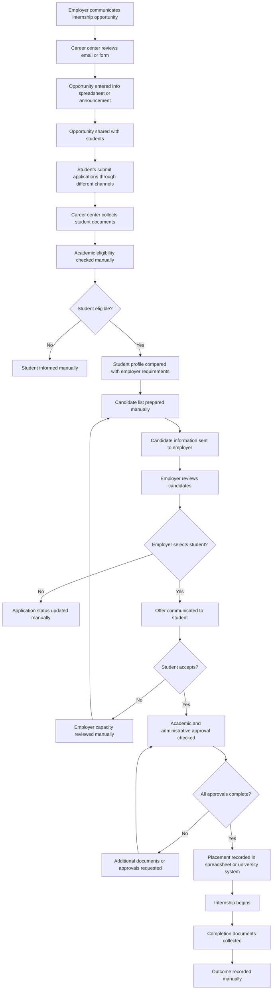

# As-Is Internship Placement Process

## Case

Internship Placement and Matching System

## Domain

University Career Services and Internship Operations

## Document Purpose

This document models the current internship application and placement process
before the proposed system is introduced.

The current process relies on multiple communication channels, disconnected
records and manual decision-making.

The purpose of the as-is analysis is to identify:

- Current activities
- Responsible stakeholders
- Information handoffs
- Decision points
- Repeated work
- Delays
- Data-quality problems
- Control weaknesses
- Opportunities for process improvement

## Process Scope

The current process begins when an employer or university unit communicates an
internship opportunity.

It ends when:

- A student is placed
- An application is rejected
- An opportunity is closed
- The student finds an external internship
- The placement period ends without a successful placement

The process includes:

- Opportunity collection
- Opportunity review
- Student announcement
- Application collection
- Eligibility checking
- Candidate comparison
- Employer review
- Offer communication
- Placement confirmation
- Internship follow-up
- Completion recording

## Current Tools and Channels

The current process may use:

- Email
- Online forms
- Shared spreadsheets
- Department spreadsheets
- Student information systems
- Employer websites
- Messaging applications
- Telephone calls
- Paper documents
- CV files
- PDF forms
- Staff notes
- Faculty approval messages

These tools are not always connected.

The same student, employer or application may therefore appear differently in
multiple records.

## High-Level Current Process

## Current Process Participants

| Participant | Current Responsibility |
|---|---|
| Student | Reviews opportunities, submits documents and responds to offers |
| Employer representative | Shares opportunities, evaluates candidates and communicates decisions |
| Career-center specialist | Coordinates applications, records statuses and communicates with stakeholders |
| Academic advisor | Checks academic eligibility and internship relevance |
| Department coordinator | Applies department-specific rules and approvals |
| Career-center manager | Resolves escalated cases and monitors overall placement activity |
| University IT | Supports existing systems and account access |
| University administration | Receives periodic summary reports |

# Detailed Current Process

## Phase 1: Internship Opportunity Collection

### Current Activities

Employers communicate internship opportunities through channels such as:

- Email
- Employer meetings
- Career fairs
- Faculty contacts
- Online forms
- Telephone calls
- Existing partnership contacts
- Student referrals

The opportunity information may include:

- Company name
- Internship title
- Responsibilities
- Required department
- Preferred student year
- Required skills
- Internship dates
- Location
- Working model
- Capacity
- Application deadline
- Contact information

### Current Information Problems

Opportunity descriptions may be:

- Incomplete
- Unstructured
- Written using inconsistent terminology
- Missing capacity information
- Missing internship dates
- Missing mandatory requirements
- Missing compensation information
- Unclear about remote or on-site conditions

Career-center staff may need to contact the employer several times before the
opportunity can be announced.

### Current Records

Opportunity information may be stored in:

- Email messages
- Shared spreadsheets
- Announcement documents
- Career-center notes
- Department files

There may be no single authoritative opportunity record.

---

## Phase 2: Opportunity Review

### Current Activities

Career-center or academic staff manually review whether the opportunity is
appropriate.

Review may consider:

- Employer legitimacy
- Internship relevance
- Duration
- Working conditions
- Department suitability
- Required skills
- Student safety
- University policy
- Application deadline

### Current Decision Process

The reviewer may:

- Approve the opportunity
- Request additional information
- Reject the opportunity
- Send it to an academic department
- Publish it provisionally

### Current Weaknesses

- Review criteria may not be documented.
- Different staff members may apply different standards.
- Approval reasons may not be recorded.
- Material changes may not trigger re-review.
- An old opportunity version may remain visible.
- Employer suspension information may not be checked consistently.

---

## Phase 3: Opportunity Announcement

### Current Activities

Approved opportunities are communicated to students through:

- Email lists
- University websites
- Department groups
- Messaging applications
- Social-media accounts
- Career-center announcements
- Faculty communication

### Current Student Experience

Students may need to search several channels to find opportunities.

Different students may receive information at different times.

Opportunity announcements may not use a consistent format.

### Current Weaknesses

- Students may miss announcements.
- Expired opportunities may remain visible.
- Capacity changes may not be reflected.
- Updated requirements may not reach all students.
- Students cannot easily compare opportunities.
- Eligibility conditions may not be clear.

---

## Phase 4: Student Profile and Document Collection

### Current Activities

Students submit information such as:

- CV
- Academic transcript
- Contact details
- Skills
- Language proficiency
- Preferred internship areas
- Availability
- Required application forms
- Department approval documents

The same documents may be requested for each application.

### Current Storage

Student information may exist in:

- Email attachments
- Shared folders
- Online form responses
- Department systems
- Student information systems
- Career-center spreadsheets

### Current Weaknesses

- Student information may be duplicated.
- Old CV versions may remain in use.
- Missing documents may be identified late.
- Academic information may not be current.
- Staff may manually copy data between systems.
- Sensitive information may be shared more widely than necessary.
- Students may not know whether their profile is complete.

---

## Phase 5: Application Submission

### Current Activities

Students apply through different methods depending on the opportunity.

Possible methods include:

- Sending an email to the career center
- Completing an online form
- Applying directly on the employer website
- Sending a CV to the employer
- Contacting a department coordinator
- Entering information into a spreadsheet
- Submitting paper documents

### Current Status Tracking

Application status may be maintained manually using values such as:

- Applied
- Under review
- Sent to employer
- Accepted
- Rejected
- Waiting
- Withdrawn

The same status may have different meanings across files.

### Current Weaknesses

- Duplicate applications may be submitted.
- Application deadlines may be missed.
- Application limits may not be enforced consistently.
- Students may apply despite ineligibility.
- Career-center staff may not know about direct employer applications.
- Students may not know the current status.
- Status changes may not include timestamps or reasons.

---

## Phase 6: Academic Eligibility Review

### Current Activities

Academic staff or career-center staff check whether a student is eligible.

The review may consider:

- Department
- Student year
- GPA
- Completed credits
- Required courses
- Enrollment status
- Previous internship
- Academic calendar
- Internship period
- Department approval

### Current Review Method

Staff may review:

- Transcript files
- Student information system screens
- Department spreadsheets
- Email approval messages
- Student-submitted documents

### Current Decision Outcomes

The student may be classified informally as:

- Eligible
- Ineligible
- Waiting for document
- Waiting for advisor approval
- Exception required

### Current Weaknesses

- Rules may not be centrally documented.
- Different departments may apply different interpretations.
- The rule version may not be known.
- Eligibility may be checked repeatedly.
- Failed conditions may not be recorded separately.
- Exceptions may be approved through email without a structured record.
- Students may receive unclear rejection explanations.

---

## Phase 7: Candidate Comparison

### Current Activities

Career-center staff manually compare eligible students with opportunity
requirements.

The comparison may include:

- Academic program
- GPA
- Skills
- Language proficiency
- CV quality
- Project experience
- Location
- Availability
- Employer preferences
- Student interests

### Current Comparison Tools

Staff may use:

- Spreadsheet filters
- Manual CV review
- Personal notes
- Email searches
- Informal knowledge of students
- Employer-provided templates

### Current Weaknesses

- Mandatory and preferred requirements may not be separated.
- Staff judgment may vary.
- Student preferences may be overlooked.
- Stronger profiles may repeatedly receive more attention.
- Missing information may be interpreted as a failed requirement.
- Candidate comparisons are difficult to reproduce.
- No structured explanation is generated.
- Staff familiarity may unintentionally influence decisions.

---

## Phase 8: Candidate List Preparation

### Current Activities

Selected candidate information is prepared and sent to the employer.

The candidate package may contain:

- CV
- Contact information
- Academic program
- GPA
- Skills
- Availability
- Career-center notes

### Current Weaknesses

- Employers may receive unnecessary personal information.
- Different employers may receive different candidate formats.
- Candidate consent may not be tracked consistently.
- Duplicate candidates may be submitted.
- Candidate lists may not reflect updated student availability.
- There may be no record of which profile version was shared.

---

## Phase 9: Employer Review

### Current Activities

Employers review candidates and may:

- Request interviews
- Request additional documents
- Accept a candidate
- Reject a candidate
- Create a shortlist
- Change requirements
- Reduce capacity
- Cancel the opportunity

### Current Communication

Employer decisions may be communicated through:

- Email
- Telephone
- Messaging applications
- Employer portals
- Career-center meetings

### Current Weaknesses

- Employer response time may not be monitored.
- Rejection reasons may be missing.
- Capacity changes may not be updated centrally.
- The same candidate may remain under review for a long period.
- Confidential employer comments may be stored insecurely.
- Opportunity changes may not trigger a new university review.

---

## Phase 10: Offer Communication

### Current Activities

When an employer selects a student, the career center or employer communicates
an offer.

The offer may include:

- Employer
- Internship role
- Start and end dates
- Location
- Working model
- Compensation
- Response deadline
- Required documents

### Current Weaknesses

- Offer deadlines may not be tracked.
- Capacity may not be reserved consistently.
- Students may hold multiple offers.
- Declined offers may not release capacity immediately.
- Offer conditions may differ from the approved opportunity.
- Students may accept directly without notifying the university.

---

## Phase 11: Student Decision

### Current Activities

The student may:

- Accept the offer
- Decline the offer
- Request more information
- Wait for another opportunity
- Stop responding
- Accept an external opportunity

### Current Weaknesses

- Non-response may not trigger an automatic expiration.
- Other applications may remain active after acceptance.
- Students may accept overlapping offers.
- Capacity may remain blocked.
- The career center may learn about an external placement late.
- Decision reasons may not be collected.

---

## Phase 12: Academic and Administrative Approval

### Current Activities

Before final confirmation, university staff may verify:

- Academic suitability
- Internship dates
- Required documents
- Employer approval
- Department approval
- Insurance or administrative requirements
- Student acceptance
- Opportunity capacity

### Current Weaknesses

- Approvals may occur in different systems.
- Staff may not know which approvals are complete.
- Documents may be requested repeatedly.
- A placement may be treated as confirmed before all approvals are complete.
- Academic approval may be confused with employer acceptance.
- There may be no unified checklist.

---

## Phase 13: Final Placement Recording

### Current Activities

Confirmed placements may be recorded in:

- Career-center spreadsheets
- Department spreadsheets
- Student information systems
- Email archives
- Internship-management forms

### Current Weaknesses

- The same placement may be entered multiple times.
- Conflicting placements may not be detected.
- Capacity may not be updated.
- Placement status may differ between departments.
- Decision history may be incomplete.
- Changes may overwrite previous values.
- Students at risk of remaining unplaced may not be visible.

---

## Phase 14: Internship Monitoring

### Current Activities

During the internship, the university may collect:

- Start confirmation
- Attendance information
- Midpoint review
- Student feedback
- Employer feedback
- Internship reports
- Problem notifications

### Current Weaknesses

- Monitoring practices may differ by department.
- Problems may be reported late.
- Student and employer records may not be connected to the original placement.
- Early termination may not update capacity or student status.
- Support requests may remain in email.

---

## Phase 15: Completion and Outcome Recording

### Current Activities

At the end of the internship, students and employers may submit:

- Completion form
- Employer evaluation
- Student evaluation
- Internship report
- Attendance record
- Academic assessment document

### Current Weaknesses

- Completion outcomes may not be standardized.
- Missing documents may be detected late.
- Academic-credit status may be confused with internship completion.
- Historical results may not be analyzed.
- Employer performance may not be reviewed.
- Matching quality cannot easily be compared with final outcomes.

# Current Swimlane Process

```mermaid
flowchart LR
    subgraph Employer
        E1[Send opportunity]
        E2[Clarify requirements]
        E3[Review candidate list]
        E4[Select or reject candidate]
        E5[Confirm internship outcome]
    end

    subgraph Career_Center
        C1[Review opportunity]
        C2[Create announcement]
        C3[Collect applications]
        C4[Check documents]
        C5[Compare candidates]
        C6[Send candidate list]
        C7[Communicate offer]
        C8[Record placement]
        C9[Prepare reports]
    end

    subgraph Student
        S1[Review announcement]
        S2[Submit application]
        S3[Provide missing documents]
        S4[Accept or decline offer]
        S5[Complete internship]
        S6[Submit completion documents]
    end

    subgraph Academic_Unit
        A1[Review eligibility]
        A2[Approve exception if applicable]
        A3[Confirm academic suitability]
        A4[Evaluate completion]
    end

    E1 --> C1
    C1 --> E2
    E2 --> C2
    C2 --> S1
    S1 --> S2
    S2 --> C3
    C3 --> C4
    C4 --> S3
    C4 --> A1
    A1 --> A2
    A1 --> C5
    A2 --> C5
    C5 --> C6
    C6 --> E3
    E3 --> E4
    E4 --> C7
    C7 --> S4
    S4 --> A3
    A3 --> C8
    C8 --> S5
    S5 --> E5
    S5 --> S6
    S6 --> A4
    A4 --> C9
```

# Current Decision Points

## Decision 1: Is the Opportunity Suitable?

Current decision owner may be:

- Career-center specialist
- Academic advisor
- Department coordinator

Current issues:

- No shared checklist
- Unclear rejection reasons
- Inconsistent approval authority

## Decision 2: Is the Student Academically Eligible?

Current decision owner may be:

- Academic advisor
- Department coordinator
- Career-center specialist using department guidance

Current issues:

- Rules may differ by department.
- Data may be outdated.
- Exception handling may occur through email.

## Decision 3: Does the Student Match the Opportunity?

Current decision owner may be:

- Career-center specialist
- Employer
- Academic advisor

Current issues:

- No consistent matching framework
- Mandatory and preferred criteria may be mixed
- Student preferences may not be considered

## Decision 4: Should the Student Be Sent to the Employer?

Current issues:

- Candidate concentration may not be monitored.
- Staff judgment may not be documented.
- No standard explanation is preserved.

## Decision 5: Has the Employer Accepted the Student?

Current issues:

- Employer decisions may arrive through different channels.
- Decision timestamps and reasons may be missing.

## Decision 6: Has the Student Accepted the Offer?

Current issues:

- Offer expiration may be manual.
- Capacity release may be delayed.
- Other active applications may remain open.

## Decision 7: Is the Placement Fully Confirmed?

Current issues:

- Employer acceptance may be confused with university approval.
- Required documents may remain incomplete.
- Conflicting placements may not be detected.

# Current Information Handoffs

| From | To | Information | Current Risk |
|---|---|---|---|
| Employer | Career center | Opportunity details | Missing or unstructured requirements |
| Career center | Students | Opportunity announcement | Inconsistent or outdated information |
| Student | Career center | Profile and documents | Duplicate or outdated files |
| Career center | Academic unit | Eligibility request | Missing context or delayed response |
| Academic unit | Career center | Eligibility decision | Informal email approval |
| Career center | Employer | Candidate information | Excessive personal-data sharing |
| Employer | Career center | Candidate decision | Missing reason or delayed response |
| Career center | Student | Placement offer | Unclear deadline or conditions |
| Student | Career center | Acceptance decision | Late notification |
| Career center | Department | Final placement information | Status inconsistencies |
| Employer and student | University | Completion documents | Missing or unconnected records |

# Current Documents and Records

The current process may create:

- Opportunity email
- Opportunity spreadsheet row
- Announcement text
- Student application form
- CV
- Transcript
- Eligibility approval email
- Candidate shortlist
- Employer decision email
- Offer message
- Student acceptance message
- Placement spreadsheet record
- Internship agreement
- Completion form
- Employer evaluation
- Student evaluation

## Documentation Weaknesses

- No consistent identifier connects all records.
- Multiple versions may exist.
- File naming may be inconsistent.
- Decision reasons may not be structured.
- Historical changes may be overwritten.
- Records may be retained without a defined period.
- Access permissions may depend on shared-folder settings.

# Current Process Delays

Common delay sources include:

- Waiting for complete employer information
- Waiting for student documents
- Manual academic eligibility review
- Repeated communication between units
- Manual candidate comparison
- Employer response time
- Student offer-response time
- Missing capacity updates
- Exception approval
- Conflicting internship dates
- Final document completion

## Delay Effects

Delays may result in:

- Missed application deadlines
- Unfilled opportunities
- Students remaining unplaced
- Employers selecting candidates from other sources
- Increased staff workload
- Student dissatisfaction
- Academic deadline risk
- Repeated emergency escalation

# Current Manual Controls

Existing controls may include:

- Staff review of student transcripts
- Department approval messages
- Spreadsheet application limits
- Manual duplicate checks
- Career-center approval of opportunities
- Employer verification through existing relationships
- Manual capacity tracking
- Supervisor review of exceptional cases
- Shared-folder access restrictions

## Control Weaknesses

- Controls may depend on staff memory.
- Evidence may not be preserved.
- Rules may not be applied consistently.
- Manual checks may be skipped during busy periods.
- Spreadsheet formulas may be changed accidentally.
- Access may remain after responsibilities change.
- Override decisions may not receive secondary review.

# Current Pain Points by Stakeholder

## Students

- Unclear eligibility
- Repeated document submission
- Limited application visibility
- Delayed decisions
- Inconsistent explanations
- Missed announcements
- Uncertain offer status

## Employers

- Ineligible applications
- Incomplete candidate profiles
- Delayed communication
- Duplicate candidate submissions
- Unclear capacity status
- Students declining late

## Career-Center Staff

- Repetitive data entry
- Manual profile comparison
- Multiple spreadsheets
- Missing information
- High communication workload
- Difficulty identifying unplaced students
- Difficult reporting

## Academic Units

- Repeated eligibility requests
- Incomplete opportunity descriptions
- Late exception requests
- Inconsistent placement records
- Limited department-level visibility

## University Management

- Delayed reporting
- Limited fairness visibility
- Weak outcome analysis
- Incomplete employer-performance information
- Difficulty measuring process efficiency

# Current Process Risks

| Risk ID | Current Risk | Consequence |
|---|---|---|
| AS-001 | Ineligible student proceeds to employer review | Wasted effort and delayed rejection |
| AS-002 | Opportunity capacity becomes outdated | Duplicate or excessive offers |
| AS-003 | Student accepts conflicting placements | Operational and academic conflict |
| AS-004 | Employer receives unnecessary personal data | Privacy risk |
| AS-005 | Manual comparison favors familiar candidates | Inconsistent or unfair outcomes |
| AS-006 | Academic exception is not documented | Weak accountability |
| AS-007 | Expired opportunity remains active | Invalid applications |
| AS-008 | Student remains unplaced without intervention | Missed internship requirement |
| AS-009 | Decision reason is missing | Difficult appeal and audit |
| AS-010 | Historical record is overwritten | Loss of traceability |
| AS-011 | Employer changes approved conditions | Placement-quality risk |
| AS-012 | Completion result is not recorded | Weak outcome analysis |

# Current Process Metrics

The current process may not consistently calculate the following metrics:

- Total eligible students
- Total active opportunities
- Available internship capacity
- Application-to-placement conversion
- Average eligibility-review time
- Average employer-response time
- Average time to placement
- Offer acceptance rate
- Students with no recommendation
- Unplaced students approaching deadlines
- Opportunity fill rate
- Placement cancellation rate
- Internship completion rate
- Manual override rate
- Department-level placement differences

The absence of these metrics limits operational planning and continuous
improvement.

# Key Process Weaknesses

## Fragmentation

Information is distributed across multiple tools and organizational units.

## Manual Repetition

The same information is entered, reviewed and communicated repeatedly.

## Limited Standardization

Statuses, eligibility rules, requirements and decision reasons may be
interpreted differently.

## Weak Traceability

It may be difficult to determine:

- Who made a decision
- Which information was used
- Which rule version applied
- Why an override occurred
- When capacity changed

## Limited Explainability

Students may receive only a general rejection without a specific eligibility
or requirement explanation.

## Inaccurate Capacity Management

Pending offers, accepted offers and confirmed placements may not be
distinguished.

## Delayed Intervention

Students with no suitable opportunity may be identified too late.

## Privacy Exposure

Student documents may be shared through email or folders without strong
purpose-based access controls.

## Limited Historical Learning

Placement and completion outcomes are not connected systematically to earlier
recommendations and decisions.

# Process Bottlenecks

The main bottlenecks are:

1. Opportunity-information clarification
2. Academic eligibility review
3. Student-document completion
4. Manual candidate comparison
5. Employer response
6. Student offer response
7. Exception approval
8. Final placement confirmation
9. Completion-document collection

# Current Process Failure Scenarios

## Scenario 1: Student Applies Without Eligibility

1. Student sees an announcement.
2. Eligibility conditions are unclear.
3. Student submits documents.
4. Career-center staff process the application.
5. Academic unit later rejects eligibility.
6. The student and employer lose time.

## Scenario 2: Capacity Is Allocated Twice

1. Employer has one position.
2. Two staff members use separate files.
3. Two students receive offers.
4. Both accept.
5. The conflict is discovered during final confirmation.

## Scenario 3: Student Remains Unplaced

1. Student submits few applications.
2. Applications are rejected.
3. No consolidated alert is generated.
4. Staff focus on active employer requests.
5. The student is identified near the academic deadline.

## Scenario 4: Employer Requirement Changes

1. Opportunity is approved.
2. Employer changes the working model or required skill.
3. Some students receive the old announcement.
4. Candidate evaluation uses inconsistent requirements.
5. Rejections become difficult to explain.

## Scenario 5: Manual Override Is Not Traceable

1. A staff member recommends a lower-ranked student.
2. The decision is communicated by email.
3. No structured override reason is recorded.
4. The student or department later requests an explanation.
5. The evidence cannot be reconstructed completely.

# Current Process Assessment

| Process Area | Current Maturity | Main Issue |
|---|---|---|
| Opportunity management | Low to medium | Unstructured information and manual review |
| Student profile management | Low | Fragmented and duplicated information |
| Academic eligibility | Medium | Manual and department-dependent |
| Application management | Low | Multiple channels and inconsistent statuses |
| Candidate matching | Low | Manual comparison without standard explanation |
| Capacity management | Low | Spreadsheet-based and difficult to synchronize |
| Human review | Medium | Present but weakly documented |
| Placement confirmation | Low to medium | Multiple approvals without unified status |
| Outcome monitoring | Low | Limited connection to earlier decisions |
| Reporting | Low | Manual aggregation and incomplete metrics |
| Privacy and access | Low to medium | Depends on tools and local practices |
| Auditability | Low | Important decisions may not be reconstructable |

# Improvement Opportunities

The future process should introduce:

- One authoritative opportunity record
- Standard opportunity requirements
- Structured mandatory and preferred criteria
- Central student profile
- Automated profile-completeness checks
- Rule-based academic eligibility
- Controlled exception workflow
- Unified application statuses
- Explainable compatibility indicators
- Recommendation review
- Central capacity management
- Offer expiration
- Duplicate placement prevention
- Unplaced-student alerts
- Structured decision reasons
- Controlled access
- Audit history
- Placement-outcome monitoring

# As-Is Process Summary

The current internship-placement process achieves placements through
significant manual coordination.

However, the process is:

- Fragmented
- Repetitive
- Difficult to monitor
- Slow during high-volume periods
- Dependent on individual staff knowledge
- Inconsistent across departments
- Weakly documented
- Difficult to audit

The process does not provide a reliable connection between:

- Student eligibility
- Employer requirements
- Student preferences
- Opportunity capacity
- Candidate recommendations
- Human decisions
- Placement confirmation
- Internship outcomes

The next document will design the future to-be process with standardized
eligibility checks, structured matching, explainable recommendations, capacity
control and authorized human review.
