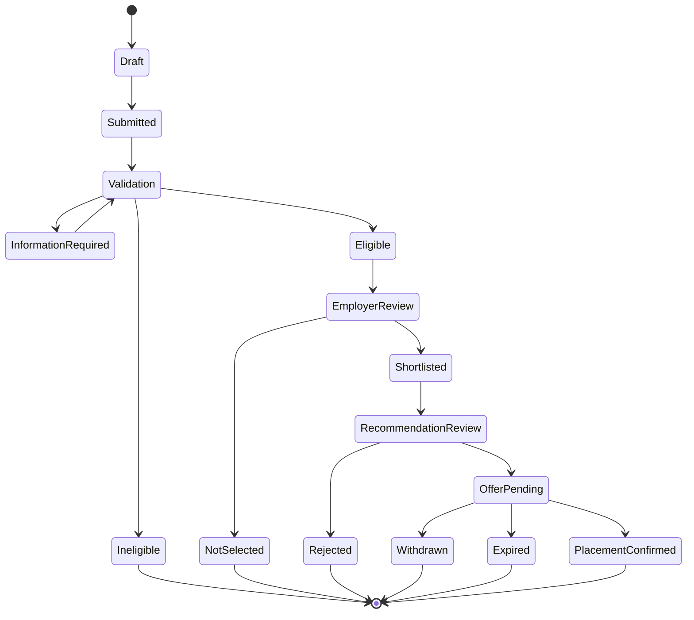
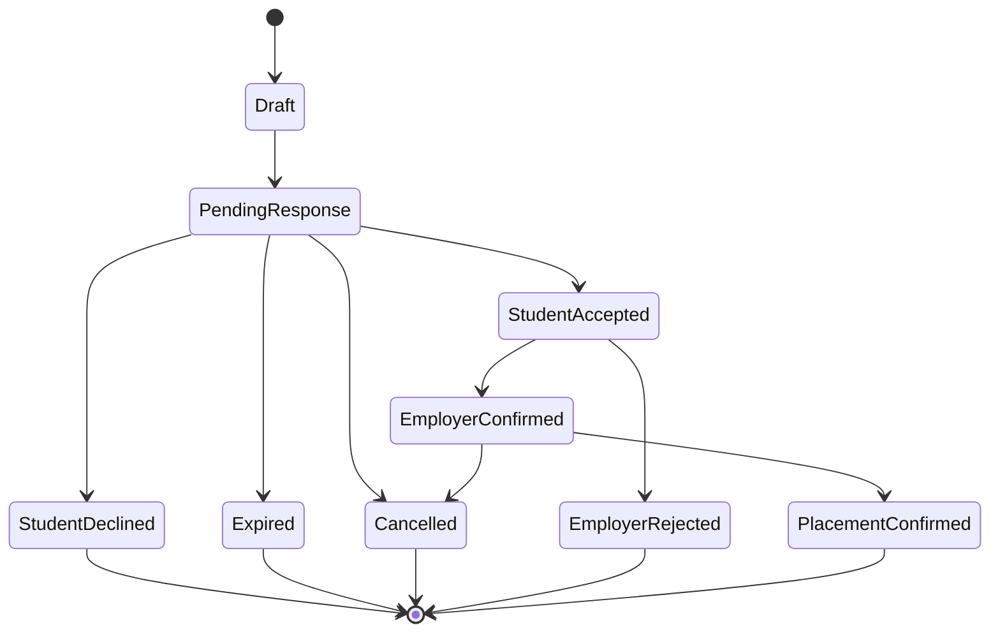

# To-Be Internship Placement Process

## Case

Internship Placement and Matching System

## Domain

University Career Services and Internship Operations

## Document Purpose

This document defines the proposed future internship placement process.

The to-be process replaces fragmented spreadsheets, emails and manual
comparisons with a unified, controlled and explainable workflow.

The proposed process is designed to:

- Standardize academic eligibility checks
- Structure employer requirements
- Reduce repeated data entry
- Consider student preferences
- Manage opportunity capacity accurately
- Generate explainable recommendations
- Preserve authorized human review
- Prevent conflicting placements
- Identify unplaced students early
- Protect personal information
- Record decisions and overrides
- Connect placement outcomes with earlier recommendations

## Process Principles

The future process follows several principles.

### Eligibility Before Ranking

A student-opportunity combination must satisfy mandatory eligibility rules
before receiving compatibility indicators.

A high compatibility result cannot compensate for:

- Academic ineligibility
- Missing mandatory employer requirements
- Invalid internship dates
- Missing required documents
- Conflicting confirmed placements
- Closed opportunities

### Structured Requirements

Employer requirements must be classified as:

- Mandatory
- Preferred
- Optional

Only approved mandatory requirements may exclude candidates automatically.

### Explainable Recommendations

Every recommendation must show:

- Eligibility result
- Passed mandatory requirements
- Failed or missing requirements
- Student preference alignment
- Compatibility indicators
- Capacity status
- Data-quality status
- Rule and configuration version
- Supporting evidence

### Human Review

The system may generate and rank recommendations, but it cannot confirm a final
placement automatically.

Authorized reviewers remain responsible for:

- Approving recommendations
- Rejecting recommendations
- Requesting additional information
- Applying permitted overrides
- Escalating academic exceptions

### Capacity Integrity

Opportunity capacity must distinguish:

- Total positions
- Available positions
- Reserved positions
- Pending offers
- Accepted offers
- Confirmed placements
- Released positions
- Cancelled positions

### Traceability

Every important action must preserve:

- Responsible user or system process
- Timestamp
- Previous status
- New status
- Decision reason
- Related student
- Related opportunity
- Relevant rule version

### Privacy by Purpose

Users may only access the information required for their authorized role.

Employers should not receive unrelated:

- Academic records
- Student-support information
- Other applications
- Other employer decisions
- Sensitive personal data

## Future Process Overview

```mermaid
flowchart TD
    A[Student profile created] --> B[Profile completeness validation]
    B --> C{Profile complete?}

    C -- No --> D[Request missing information]
    D --> B

    C -- Yes --> E[Retrieve academic information]
    E --> F[Evaluate academic eligibility]
    F --> G{Eligible for placement cycle?}

    G -- No --> H[Record eligibility reasons]
    G -- Review required --> I[Send to academic review]
    I --> J{Academic decision}
    J -- Approved exception --> K[Record exception and validity]
    J -- Rejected --> H

    G -- Yes --> L[Activate eligible student profile]
    K --> L

    M[Employer registration] --> N[Employer verification]
    N --> O{Employer approved?}
    O -- No --> P[Reject or request correction]
    O -- Yes --> Q[Create internship opportunity]

    Q --> R[Validate opportunity information]
    R --> S[Review academic and operational suitability]
    S --> T{Opportunity approved?}

    T -- No --> U[Return opportunity for correction]
    U --> Q

    T -- Yes --> V[Publish approved opportunity]
    V --> W[Student reviews opportunity]
    L --> W

    W --> X[Student submits application]
    X --> Y[Validate deadline, limits and documents]
    Y --> Z{Application valid?}

    Z -- No --> AA[Record rejection reasons]
    Z -- Yes --> AB[Create active application]

    AB --> AC[Evaluate mandatory requirements]
    AC --> AD{Mandatory requirements passed?}

    AD -- No --> AE[Record exclusion reasons]
    AD -- Data incomplete --> AF[Request additional information]
    AF --> AC

    AD -- Yes --> AG[Calculate compatibility indicators]
    AG --> AH[Evaluate preferences and constraints]
    AH --> AI[Check capacity and conflicts]
    AI --> AJ[Generate explainable recommendation]

    AJ --> AK[Career-center review]
    AK --> AL{Review decision}

    AL -- Reject --> AM[Record rejection reason]
    AL -- More information --> AN[Request clarification]
    AN --> AK
    AL -- Override --> AO[Validate override authority]
    AO --> AP[Record override justification]
    AL -- Approve --> AQ[Create placement offer]
    AP --> AQ

    AQ --> AR[Reserve opportunity capacity]
    AR --> AS[Send offer to student and employer]

    AS --> AT{Student accepts?}
    AT -- No --> AU[Release reserved capacity]
    AU --> AV[Continue matching]
    AT -- No response --> AW[Expire offer]
    AW --> AU

    AT -- Yes --> AX{Employer acceptance confirmed?}
    AX -- No --> AU
    AX -- Yes --> AY[Validate final placement prerequisites]

    AY --> AZ{All approvals complete?}
    AZ -- No --> BA[Request missing approval or document]
    BA --> AY

    AZ -- Yes --> BB[Confirm final placement]
    BB --> BC[Consume opportunity capacity]
    BC --> BD[Close conflicting applications and offers]
    BD --> BE[Monitor internship]

    BE --> BF[Collect student and employer evaluations]
    BF --> BG[Record internship outcome]
    BG --> BH[Evaluate matching and placement effectiveness]
```



# Phase 1: Student Profile Activation

## Objective

Create a complete, current and authorized student profile before applications
and recommendations are processed.

## Process

1. The student authenticates using the university identity service.
2. The system creates or retrieves the student's placement profile.
3. Authoritative academic information is imported.
4. The student completes permitted profile sections.
5. The student declares skills, interests and preferences.
6. Required documents are verified.
7. The system calculates profile completeness.
8. Missing or invalid information is displayed.
9. A complete profile becomes eligible for academic evaluation.

## Profile Information

The profile may include:

- University student identifier
- Academic program
- Academic year
- GPA where required
- Completed credits
- Completed courses
- Skills
- Certifications
- Language proficiency
- Project experience
- Industry interests
- Role preferences
- Location preferences
- Working-model preferences
- Availability
- Required documents

## Controls

- One active placement profile per student
- Student-editable and authoritative fields separated
- Profile changes timestamped
- Controlled skill vocabulary
- Required-document validation
- Sensitive information restricted
- Profile completeness recalculated after changes

## Outputs

- Complete profile
- Incomplete profile alert
- Missing-document list
- Academic data-quality warning
- Profile version

# Phase 2: Academic Eligibility Evaluation

## Objective

Determine whether a student may participate in the internship placement cycle.

## Process

1. The system retrieves approved academic rules.
2. Institution-level rules are evaluated.
3. Department-specific rules are evaluated.
4. Failed conditions are recorded separately.
5. The result is classified as:
   - Eligible
   - Ineligible
   - Review required
   - Data incomplete
6. The student receives an authorized explanation.
7. Review-required cases are assigned to an academic role.
8. Approved exceptions receive a validity period.

## Example Eligibility Rules

- Student must be actively enrolled.
- Student must belong to an eligible academic program.
- Student must have completed the required academic year.
- Student must meet the minimum credit requirement.
- Required courses must be completed.
- Mandatory internship must not already be completed.
- Internship dates must fit the approved academic period.

## Controls

- Rule version preserved
- Rule owner identified
- Effective dates applied
- Students cannot modify academic information
- Students cannot approve exceptions
- Career-center staff cannot override academic rules without authority
- Exceptions require a reason and supporting evidence

## Outputs

- Eligibility result
- Failed-rule list
- Academic review task
- Approved exception
- Eligibility expiration date

# Phase 3: Employer Verification

## Objective

Ensure that only reviewed and authorized employers can publish internship
opportunities.

## Process

1. Employer representative submits organization information.
2. Duplicate employer records are checked.
3. Organization and contact information are reviewed.
4. Existing university relationship is verified.
5. Privacy and candidate-data responsibilities are accepted.
6. The employer is classified as:
   - Pending
   - Active
   - Restricted
   - Suspended
   - Rejected
7. Approved representatives receive role-based access.

## Controls

- Employer verification before activation
- Duplicate detection
- Representative permissions limited to one employer
- Suspended employers blocked from new opportunities
- Status changes audited
- Inactive representatives lose access
- Candidate information access restricted by opportunity

## Outputs

- Approved employer
- Rejected registration
- Correction request
- Employer suspension
- Authorized representative account

# Phase 4: Opportunity Creation and Approval

## Objective

Create complete and structured opportunity records before publication.

## Process

1. Employer creates an opportunity.
2. Required fields are validated.
3. Internship dates and deadlines are checked.
4. Capacity is validated.
5. Employer requirements are structured.
6. Requirements are classified as:
   - Mandatory
   - Preferred
   - Optional
7. Career-center staff review operational suitability.
8. Academic staff review academic relevance where required.
9. Opportunity is approved, rejected or returned for correction.
10. The approved version is published.

## Required Opportunity Information

- Opportunity identifier
- Employer
- Title
- Responsibilities
- Department or role
- Industry
- Location
- Working model
- Start date
- End date
- Application deadline
- Capacity
- Compensation information where applicable
- Required documents
- Mandatory requirements
- Preferred requirements
- Opportunity status

## Controls

- Capacity greater than zero
- End date later than start date
- Deadline compatible with internship dates
- Employer must be active
- Material changes trigger re-review
- Approved versions preserved
- Requirement importance clearly identified
- Unstructured text cannot silently exclude students

## Outputs

- Approved opportunity
- Correction request
- Rejected opportunity
- Published opportunity
- Opportunity version

# Phase 5: Opportunity Discovery and Preference Management

## Objective

Allow eligible students to discover relevant opportunities and maintain
structured preferences.

## Process

1. Students view approved active opportunities.
2. The system filters clearly ineligible opportunities where appropriate.
3. Students compare:
   - Role
   - Industry
   - Location
   - Working model
   - Dates
   - Employer
   - Requirements
4. Students maintain ranked or categorized preferences.
5. Conflicting hard preferences are detected.
6. Preference changes are versioned.

## Preference Types

- Required
- Strongly preferred
- Preferred
- Neutral
- Unacceptable

## Controls

- Hard constraints distinguished from ranking preferences
- Historical evaluations retain the preference version used
- Sensitive personal circumstances not exposed to employers
- Students warned when restrictive preferences reduce available opportunities
- Preferences cannot override mandatory eligibility requirements

## Outputs

- Student preference profile
- Preference-conflict warning
- Opportunity shortlist
- Preference version

# Phase 6: Application Submission

## Objective

Validate applications before they enter review and matching.

## Process

1. Student selects an active opportunity.
2. The system checks:
   - Profile completeness
   - Academic eligibility
   - Application deadline
   - Application limit
   - Required documents
   - Existing application
   - Conflicting placement
   - Opportunity status
3. A valid application is submitted.
4. An invalid application is rejected with reasons.
5. Submission time and profile version are recorded.

## Controls

- Duplicate active applications prevented
- Application limits enforced
- Expired opportunities blocked
- Required documents checked
- Conflicting placements detected
- Submission timestamp preserved
- Status displayed to the student

## Outputs

- Submitted application
- Validation failure
- Application-limit warning
- Missing-document request
- Application audit event

# Phase 7: Mandatory Requirement Evaluation

## Objective

Remove ineligible student-opportunity combinations before compatibility
ranking.

## Process

1. The system retrieves the approved opportunity requirements.
2. Every mandatory requirement is evaluated.
3. Results are classified as:
   - Passed
   - Failed
   - Evidence missing
   - Review required
4. Failed combinations are excluded.
5. Incomplete combinations generate information requests.
6. Passed combinations proceed to compatibility evaluation.

## Example Mandatory Requirements

- Academic program
- Student year
- Required course
- Language level
- Work authorization where applicable
- Availability period
- On-site attendance capability
- Required technical skill
- Mandatory document

## Controls

- Preferred qualifications cannot compensate for mandatory failure
- Each failure recorded separately
- Requirement version preserved
- Missing evidence distinguished from confirmed failure
- Exceptions limited to authorized policies
- Requirement changes trigger reevaluation when necessary

## Outputs

- Eligible combination
- Excluded combination
- Missing-evidence task
- Requirement-evaluation record

# Phase 8: Compatibility Evaluation

## Objective

Evaluate eligible combinations across documented and explainable dimensions.

## Compatibility Dimensions

### Skill Compatibility

Measures alignment between student skills and preferred opportunity skills.

### Academic Relevance

Measures how closely the opportunity relates to the student's academic
program and learning objectives.

### Role Preference Alignment

Measures whether the opportunity role matches the student's preferred career
areas.

### Industry Preference Alignment

Measures the alignment between employer industry and student preference.

### Location Compatibility

Evaluates city, travel distance and permitted location constraints.

### Working-Model Compatibility

Evaluates remote, hybrid and on-site preferences.

### Period Compatibility

Checks student availability against internship dates.

### Language Compatibility

Evaluates preferred or required working-language conditions.

### Preferred Requirement Satisfaction

Measures how many preferred employer qualifications are satisfied.

## Process

1. Eligible student-opportunity combination is created.
2. Each approved compatibility indicator is calculated.
3. Missing data is flagged.
4. Indicator weights are applied.
5. Overall compatibility result is calculated.
6. The explanation identifies major positive and negative factors.
7. The model and weight version are stored.

## Controls

- Only approved factors used
- Sensitive attributes excluded unless legally and institutionally authorized
- Weights versioned
- Missing data does not produce an automatic positive result
- Score boundaries validated
- Explanations generated
- Historical results not silently recalculated

## Outputs

- Compatibility indicators
- Overall compatibility result
- Explanation
- Data-quality status
- Model version

# Phase 9: Capacity and Conflict Evaluation

## Objective

Ensure that recommendations are operationally possible.

## Checks

The system evaluates:

- Opportunity availability
- Reserved capacity
- Pending offers
- Accepted offers
- Confirmed placements
- Student application limits
- Existing offers
- Internship-date conflicts
- Duplicate placement risk
- Employer suspension status
- Opportunity expiration

## Capacity Calculation

```text
Available Capacity =
Total Capacity
- Confirmed Placements
- Active Reservations
```

Pending applications do not automatically consume final capacity.

A reservation may be created when a placement offer is issued.

## Controls

- Capacity cannot become negative
- Concurrent reservations controlled
- Expired offers release reservations
- Declined offers release reservations
- Cancelled placements update capacity
- Opportunity changes trigger conflict review
- Capacity changes audited

## Outputs

- Capacity available
- Capacity unavailable
- Conflict alert
- Reservation eligibility
- Opportunity-status warning

# Phase 10: Recommendation Generation

## Objective

Create explainable placement recommendations for authorized human review.

## Recommendation Contents

Each recommendation contains:

- Recommendation identifier
- Student identifier
- Opportunity identifier
- Application identifier
- Eligibility result
- Mandatory requirement result
- Compatibility indicators
- Overall compatibility result
- Preference alignment
- Capacity status
- Conflict status
- Data-quality status
- Supporting evidence
- Recommendation timestamp
- Rule version
- Model version
- Recommendation status

## Possible Recommendation Statuses

- Pending review
- Additional information required
- Approved
- Rejected
- Overridden
- Expired
- Withdrawn
- Superseded

## Controls

- Only eligible combinations recommended
- Recommendations advisory
- Evidence required
- Low-quality data highlighted
- Recommendation version preserved
- Duplicate active recommendations controlled
- Expiration rules applied

## Outputs

- Ranked recommendation
- Recommendation explanation
- Reviewer task
- No-recommendation alert

# Phase 11: Human Review

## Objective

Allow authorized staff to evaluate recommendations using both system evidence
and operational context.

## Reviewer Information

The reviewer sees:

- Student eligibility
- Opportunity requirements
- Mandatory requirement results
- Compatibility indicators
- Student preferences
- Capacity
- Existing applications and offers
- Data-quality warnings
- Academic approvals
- Relevant historical decisions
- Potential conflicts

## Possible Decisions

- Approve
- Reject
- Request additional information
- Place on hold
- Apply authorized override
- Escalate to academic review
- Mark recommendation as expired

## Approval Requirements

An approval records:

- Reviewer
- Timestamp
- Decision reason
- Recommendation version
- Capacity status
- Required next action

## Rejection Requirements

A rejection may use categories such as:

- Insufficient compatibility
- Student preference conflict
- Opportunity no longer available
- Employer condition changed
- Academic concern
- Incomplete information
- Duplicate or conflicting process
- Alternative candidate selected

## Controls

- Reason mandatory
- Reviewer permissions checked
- Original recommendation preserved
- Final decision not editable without controlled correction
- High-impact decisions may require secondary approval
- Evidence must be available

## Outputs

- Approved recommendation
- Rejected recommendation
- Information request
- Academic escalation
- Review audit event

# Phase 12: Manual Override

## Objective

Support justified exceptions without hiding or replacing the system result.

## Override Conditions

Overrides may be considered when:

- An approved academic exception exists
- Accessibility or support needs require contextual review
- Opportunity requirements were interpreted incorrectly
- A student has documented exceptional circumstances
- A strategic employer relationship requires authorized handling
- The recommendation data is incomplete but verified evidence exists
- A lower-ranked candidate is operationally more appropriate

## Override Record

The override must include:

- Original recommendation
- Original compatibility result
- Final human decision
- Override category
- Detailed reason
- Supporting evidence
- Reviewer identity
- Secondary approver where required
- Timestamp
- Expiration or validity period

## Controls

- Unauthorized roles cannot override mandatory academic rules
- Sensitive details minimized
- High-impact overrides require secondary approval
- Override rate monitored
- Original result preserved
- Repeated override patterns reviewed

## Outputs

- Approved override
- Rejected override
- Secondary approval task
- Governance alert

# Phase 13: Placement Offer Creation

## Objective

Convert an approved recommendation into a controlled offer without prematurely
confirming placement.

## Offer Contents

- Offer identifier
- Student
- Opportunity
- Employer
- Internship dates
- Location
- Working model
- Conditions
- Offer date
- Expiration date
- Capacity reservation
- Offer status

## Offer Statuses

- Draft
- Pending student response
- Pending employer confirmation
- Accepted
- Declined
- Expired
- Cancelled
- Superseded

## Process

1. Approved recommendation selected.
2. Capacity availability rechecked.
3. Reservation created.
4. Offer terms validated.
5. Offer sent to student and employer.
6. Expiration deadline monitored.
7. Responses recorded.

## Controls

- Offer linked to recommendation
- Capacity reserved atomically
- Expiration later than creation
- Opportunity conditions match approved version
- Conflicting offers identified
- Offer access restricted
- Status transitions controlled

## Outputs

- Active offer
- Capacity reservation
- Offer notification
- Conflict warning

# Phase 14: Student and Employer Decisions

## Student Decision

The student may:

- Accept
- Decline
- Request clarification
- Allow the offer to expire

The student decision records:

- Status
- Timestamp
- Reason where collected
- Offer version
- Explicit confirmation

## Employer Decision

The employer may:

- Confirm acceptance
- Reject the candidate
- Request additional information
- Withdraw the opportunity

## Controls

- Expired offers cannot be accepted
- Employer acts only on its own opportunity
- Student identity verified
- Decline or expiration releases capacity
- Confidential employer notes restricted
- Decision time recorded
- Changes after acceptance require controlled handling

## Outputs

- Student acceptance
- Student decline
- Employer acceptance
- Employer rejection
- Released capacity
- Offer expiration

# Phase 15: Final Placement Confirmation

## Objective

Confirm placement only after all required decisions and documents are complete.

## Confirmation Preconditions

- Student accepted
- Employer accepted
- Career-center approval complete
- Academic approval complete where required
- Opportunity active
- Capacity available or reserved
- No conflicting placement
- Required documents complete
- Internship dates valid
- Employer not suspended

## Process

1. The system validates all prerequisites.
2. Any missing prerequisite creates a task.
3. Valid placement is confirmed.
4. Capacity reservation becomes consumed capacity.
5. Conflicting applications or offers are handled according to policy.
6. Stakeholders receive confirmation.
7. Placement record becomes historically protected.

## Controls

- One authoritative placement record
- Duplicate placement prevention
- Overlapping date detection
- Capacity transaction integrity
- Confirmation audit event
- Historical record protected from hard deletion
- Student, employer and academic statuses remain distinct

## Outputs

- Confirmed placement
- Missing-prerequisite task
- Duplicate-placement rejection
- Updated capacity
- Placement confirmation notice

# Phase 16: Unplaced Student Intervention

## Objective

Identify and support students at risk of missing internship requirements.

## Detection Conditions

A student may be classified as at risk when:

- No active application exists
- No recommendation exists
- All applications were rejected
- Profile remains incomplete
- Eligibility requires review
- Preferences are highly restrictive
- No opportunity matches required dates
- Placement deadline is approaching
- A confirmed placement was cancelled

## Intervention Process

1. The system identifies the risk condition.
2. Priority is assigned based on deadline.
3. Career-center task is created.
4. Staff review the reason.
5. Possible actions include:
   - Profile improvement
   - Preference review
   - Academic guidance
   - Alternative opportunity search
   - Employer outreach
   - External placement review
6. Intervention result is recorded.

## Controls

- Student preferences not changed automatically
- Support actions documented
- Sensitive cases restricted
- Risk status reviewed periodically
- Escalation deadlines defined

## Outputs

- Unplaced-student alert
- Intervention task
- Support action
- Escalation record

# Phase 17: Placement Monitoring

## Objective

Track whether confirmed internships begin and continue as expected.

## Monitoring Events

- Internship start confirmation
- Student participation
- Employer confirmation
- Midpoint evaluation
- Attendance issue
- Role change
- Working-condition change
- Early termination
- Support request
- Academic concern

## Controls

- Changes linked to confirmed placement
- Material employer changes reviewed
- Early termination reason recorded
- Sensitive support information restricted
- Academic impact evaluated
- Replacement-placement need identified

## Outputs

- Active placement status
- Incident record
- Support task
- Cancellation workflow
- Replacement-placement alert

# Phase 18: Completion and Outcome Evaluation

## Objective

Record final results and evaluate the quality of the placement process.

## Completion Inputs

- Student evaluation
- Employer evaluation
- Internship report
- Attendance information
- Academic assessment
- Completion date
- Termination reason where applicable

## Outcome Statuses

- Successfully completed
- Partially completed
- Failed
- Cancelled by student
- Cancelled by employer
- Terminated by university
- Under review

## Outcome Evaluation

The system connects the final outcome with:

- Original eligibility result
- Compatibility indicators
- Recommendation
- Human decision
- Override status
- Opportunity
- Employer
- Placement duration

## Controls

- Completion and academic credit distinguished
- Historical recommendation preserved
- Evaluations access controlled
- Free-text responses protected
- Outcome changes audited
- Aggregated reporting privacy protected

## Outputs

- Internship outcome
- Completion evaluation
- Employer-performance record
- Matching-effectiveness measurement
- Institutional report data

# Future Swimlane Process

```mermaid
flowchart LR
    subgraph Student
        S1[Complete profile]
        S2[Set preferences]
        S3[Submit application]
        S4[Provide additional information]
        S5[Accept or decline offer]
        S6[Complete internship]
        S7[Submit evaluation]
    end

    subgraph Employer
        E1[Register employer]
        E2[Create opportunity]
        E3[Define requirements]
        E4[Review candidate]
        E5[Confirm or reject]
        E6[Submit outcome evaluation]
    end

    subgraph Career_Center
        C1[Verify employer]
        C2[Review opportunity]
        C3[Review recommendation]
        C4[Create offer]
        C5[Confirm placement]
        C6[Monitor unplaced students]
        C7[Monitor placement outcome]
    end

    subgraph Academic_Unit
        A1[Define eligibility rules]
        A2[Review eligibility]
        A3[Approve exception]
        A4[Confirm academic suitability]
        A5[Evaluate completion]
    end

    subgraph System
        Y1[Validate profile]
        Y2[Evaluate eligibility]
        Y3[Evaluate mandatory requirements]
        Y4[Calculate compatibility]
        Y5[Check capacity and conflicts]
        Y6[Generate recommendation]
        Y7[Manage offer expiration]
        Y8[Detect unplaced students]
        Y9[Calculate outcomes]
    end

    S1 --> Y1
    A1 --> Y2
    Y1 --> Y2
    Y2 --> A2
    A2 --> A3
    E1 --> C1
    C1 --> E2
    E2 --> E3
    E3 --> C2
    C2 --> S2
    S2 --> S3
    S3 --> Y3
    Y3 --> Y4
    Y4 --> Y5
    Y5 --> Y6
    Y6 --> C3
    C3 --> S4
    C3 --> E4
    E4 --> E5
    E5 --> C4
    C4 --> S5
    S5 --> Y7
    S5 --> A4
    A4 --> C5
    C5 --> S6
    C6 --> Y8
    S6 --> S7
    S6 --> E6
    S7 --> C7
    E6 --> C7
    C7 --> A5
    A5 --> Y9
```



# Future Status Models

## Application Status Model



## Offer Status Model



# Exception Processes

## Academic Exception

1. Standard eligibility rule fails.
2. System identifies whether exception is permitted.
3. Student or authorized staff submits a request.
4. Supporting evidence is attached.
5. Academic reviewer evaluates the case.
6. Decision is recorded.
7. Approved exception receives scope and validity dates.
8. Eligibility is recalculated.

## Opportunity Exception

1. Opportunity fails a standard review condition.
2. Employer provides clarification.
3. Career-center or academic role reviews the exception.
4. Decision and conditions are recorded.
5. Opportunity is approved, rejected or restricted.

## Placement Override

1. Human reviewer disagrees with the system recommendation.
2. Reviewer selects an override category.
3. Detailed justification is entered.
4. Secondary approval is requested where required.
5. Original recommendation remains preserved.
6. Final decision is audited.

# Notification Model

## Student Notifications

- Profile incomplete
- Academic eligibility result
- Application submitted
- Additional information required
- Application rejected
- Recommendation under review
- Offer created
- Offer approaching expiration
- Offer accepted or declined
- Placement confirmed
- Placement cancelled
- Completion documents due

## Employer Notifications

- Registration approved
- Opportunity correction required
- Opportunity approved
- Candidate available for review
- Candidate response received
- Capacity updated
- Placement confirmed
- Completion evaluation due

## Staff Notifications

- Academic review required
- Opportunity pending approval
- Recommendation awaiting review
- Offer nearing expiration
- Capacity conflict
- Duplicate placement attempt
- Unplaced student alert
- Override awaiting approval
- Placement cancellation
- Data-quality issue

## Notification Controls

- Required action clearly stated
- Deadline included
- Sensitive information minimized
- Delivery status monitored
- In-system notification history retained
- Notification preferences limited by policy

# Service-Level Targets

| Process Activity | Preliminary Target |
|---|---:|
| Profile-completeness calculation | Immediate after profile update |
| Standard eligibility evaluation | Within the same processing cycle |
| Opportunity review | Within 3 business days |
| Additional information response | Within assigned deadline |
| Recommendation review | Within 2 business days |
| Critical deadline intervention | Same business day |
| Offer response period | Defined per opportunity |
| Expired capacity release | Immediate after expiration |
| Placement confirmation | Within 1 business day after prerequisites |
| Cancellation follow-up | Same business day |
| Unplaced-student review | Before institutional intervention deadline |

These targets are preliminary and require stakeholder approval.

# To-Be Control Improvements

| Current Weakness | Future Control |
|---|---|
| Multiple opportunity records | One authoritative opportunity record |
| Unstructured requirements | Mandatory, preferred and optional classification |
| Repeated profile collection | Central student profile |
| Manual eligibility interpretation | Versioned eligibility rules |
| Missing decision reasons | Mandatory structured reason |
| Manual capacity tracking | Transactional capacity states |
| Duplicate offers | Conflict and reservation checks |
| Unknown unplaced students | Automated intervention alerts |
| Unclear recommendation logic | Explainable indicators and evidence |
| Undocumented overrides | Authorized override workflow |
| Excessive document sharing | Role- and purpose-based access |
| Overwritten history | Versioning and audit events |
| Weak outcome analysis | Recommendation-to-outcome traceability |

# Expected Benefits

## Student Benefits

- Clear eligibility explanations
- Fewer repeated document requests
- Better visibility into application status
- More relevant recommendations
- Improved deadline management
- Transparent offer status
- Earlier support when no placement is available

## Employer Benefits

- More suitable candidate pool
- Fewer academically invalid applications
- Structured requirements
- Accurate capacity tracking
- Clear candidate and offer status
- Reduced duplicate communication
- Better university coordination

## Career-Center Benefits

- Reduced repetitive comparison
- Standard decision workflows
- Explainable recommendations
- Early identification of unplaced students
- More reliable capacity information
- Faster operational reporting
- Complete decision history

## Academic Benefits

- Consistent eligibility application
- Controlled exception handling
- Clear academic authority
- Better department-level visibility
- Reduced invalid placement requests
- Connected completion outcomes

## Governance Benefits

- Role-based access
- Structured override records
- Historical rule versions
- Auditability
- Privacy controls
- Fairness review indicators
- Measurable process performance

# Expected Risks in the Future Process

The proposed process introduces new risks, including:

- Incorrect rule configuration
- Excessive reliance on compatibility scores
- Recommendation concentration
- Unauthorized access
- Incorrect capacity reservations
- Delayed human review
- Unexplained overrides
- Stale academic data
- Employer requirement manipulation
- Integration failures
- Notification failures
- Privacy exposure through reports

These risks will be addressed in the later risk and control document.

# To-Be Process Success Criteria

The future process will be considered successful when:

- All applications receive eligibility validation.
- Mandatory requirements are evaluated before ranking.
- Opportunity capacity remains accurate.
- Recommendations contain understandable evidence.
- Final placements require human approval.
- Duplicate confirmed placements are prevented.
- Students with no recommendation are identified early.
- Manual overrides include reasons and authority.
- Statuses are consistent across stakeholders.
- Personal information is restricted by purpose.
- Placement outcomes remain connected to recommendations.
- Important changes are auditable.
- Management KPIs can be calculated from controlled records.

# Process Transformation Summary

The future internship placement process replaces disconnected manual activities
with a unified decision-support workflow.

The new process connects:

- Student profiles
- Academic eligibility
- Employer verification
- Opportunity approval
- Structured requirements
- Student preferences
- Applications
- Compatibility evaluation
- Capacity management
- Human review
- Placement offers
- Final confirmation
- Internship outcomes

The system automates validation, calculation, tracking and alerts while
preserving human authority over academic exceptions, recommendation review and
final placement decisions.

The next document will define the detailed business rules governing academic
eligibility, applications, mandatory requirements, capacity, recommendations,
offers, overrides and final placements.
