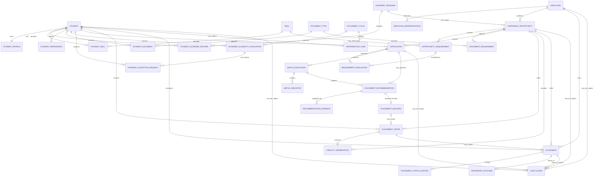

# Conceptual Data Model

## Case

Internship Placement and Matching System

## Domain

University Career Services and Internship Operations

## Document Purpose

This document defines the conceptual data model for the Internship Placement
and Matching System.

The model connects:

- Students
- Academic programs
- Academic eligibility
- Skills and preferences
- Employers
- Internship opportunities
- Opportunity requirements
- Applications
- Match evaluations
- Recommendations
- Human decisions
- Placement offers
- Capacity reservations
- Confirmed placements
- Internship outcomes
- Documents
- Exceptions
- Audit records

The design separates system-generated evaluations from human decisions so that
eligibility, recommendation, approval and final placement remain independently
traceable.

## Modeling Principles

### Separation of Business States

The following concepts are modeled separately:

- Academic eligibility
- Employer requirement evaluation
- Compatibility evaluation
- Placement recommendation
- Human review decision
- Student offer response
- Employer response
- Final placement confirmation
- Internship outcome

One state must not automatically represent another.

### Historical Traceability

Important records should preserve historical versions.

Examples include:

- Student preferences
- Academic eligibility rules
- Opportunity requirements
- Match evaluations
- Recommendations
- Human decisions
- Placement offers
- Confirmed placements

### Authoritative Sources

Academic information received from the student information system is separated
from student-editable profile information.

### Explainability

Recommendations must retain the factors and evidence that produced them.

### Capacity Integrity

Opportunity capacity, reservations, offers and confirmed placements are modeled
separately to prevent over-allocation.

### Privacy by Design

Sensitive student information should not be stored in general matching
entities unless there is a documented and approved purpose.

## Entity Relationship Diagram



# Student and Academic Entities

## Student

Represents the university identity of a student participating in the internship
placement process.

| Field | Type | Description |
|---|---|---|
| student_id | String | Stable university student identifier |
| university_account_id | String | Authenticated university identity |
| first_name | String | Student first name |
| last_name | String | Student last name |
| university_email | String | Official university email address |
| student_status | String | Active, inactive, suspended or graduated |
| placement_participation_status | String | Current participation state |
| created_at | Timestamp | Record creation time |
| updated_at | Timestamp | Last update time |

### Important Rules

- `student_id` must be unique.
- One student may have only one active placement profile.
- Academic status is obtained from an authoritative university source.
- Student records should not be permanently deleted through normal operations.

---

## Student Profile

Stores student-editable career and internship information.

| Field | Type | Description |
|---|---|---|
| student_profile_id | String | Unique profile identifier |
| student_id | String | Related student |
| professional_summary | Text | Student career summary |
| preferred_role_summary | Text | General role interests |
| profile_completeness_rate | Decimal | Percentage of required profile completion |
| profile_status | String | Draft, incomplete, complete or inactive |
| profile_version | Integer | Historical profile version |
| effective_from | Timestamp | Version activation time |
| effective_to | Timestamp | Version expiration time |
| created_at | Timestamp | Record creation time |
| updated_at | Timestamp | Last update time |

### Design Note

Academic information is not stored directly in this entity because students
must not be able to edit authoritative academic values.

---

## Academic Program

Represents an academic department or program.

| Field | Type | Description |
|---|---|---|
| academic_program_id | String | Unique program identifier |
| program_name | String | Official program name |
| department_name | String | Related department |
| faculty_name | String | Related faculty |
| program_level | String | Associate, bachelor's or graduate |
| program_status | String | Active or inactive |
| academic_owner_role | String | Role responsible for academic rules |

---

## Student Academic Record

Stores effective-dated academic information received from an authoritative
source.

| Field | Type | Description |
|---|---|---|
| academic_record_id | String | Unique record identifier |
| student_id | String | Related student |
| academic_program_id | String | Current academic program |
| academic_year | Integer | Current academic year |
| gpa | Decimal | Current authoritative GPA |
| completed_credits | Decimal | Number of completed credits |
| enrollment_status | String | Current enrollment state |
| expected_graduation_date | Date | Expected graduation date |
| previous_mandatory_internship_completed | Boolean | Previous completion indicator |
| source_system | String | Authoritative source |
| source_updated_at | Timestamp | Source update time |
| valid_from | Timestamp | Record validity start |
| valid_to | Timestamp | Record validity end |
| data_quality_status | String | Complete, stale, conflicting or incomplete |

### Design Note

Multiple historical records may exist for a student, but only one current
record should be active for a defined period.

---

## Placement Cycle

Represents an institutional internship application and placement period.

| Field | Type | Description |
|---|---|---|
| placement_cycle_id | String | Unique cycle identifier |
| cycle_name | String | Display name |
| academic_term | String | Related term |
| application_start_at | Timestamp | Application opening time |
| application_end_at | Timestamp | Application closing time |
| placement_deadline | Date | Final placement deadline |
| internship_period_start | Date | Permitted internship period start |
| internship_period_end | Date | Permitted internship period end |
| cycle_status | String | Planned, active, closed or archived |

# Skill and Preference Entities

## Skill

Represents a controlled skill-catalog entry.

| Field | Type | Description |
|---|---|---|
| skill_id | String | Unique skill identifier |
| skill_name | String | Standard skill name |
| skill_category | String | Technical, business, language or other |
| parent_skill_id | String | Optional broader skill |
| skill_status | String | Active or inactive |
| catalog_version | String | Skill catalog version |

### Examples

- Python
- SQL
- Data Analysis
- Project Coordination
- Customer Communication
- English
- Excel
- Cybersecurity Fundamentals

---

## Student Skill

Connects a student with a skill and its evidence.

| Field | Type | Description |
|---|---|---|
| student_skill_id | String | Unique record identifier |
| student_id | String | Related student |
| skill_id | String | Related skill |
| proficiency_level | String | Approved proficiency level |
| experience_months | Integer | Estimated experience duration |
| verification_status | String | Self-declared, course verified or certification verified |
| evidence_reference | String | Optional supporting evidence |
| last_used_date | Date | Last known use date |
| valid_from | Timestamp | Version start |
| valid_to | Timestamp | Version end |

### Logical Constraint

The active combination of `student_id` and `skill_id` should be unique.

---

## Student Preference

Stores effective-dated student internship preferences.

| Field | Type | Description |
|---|---|---|
| student_preference_id | String | Unique preference identifier |
| student_id | String | Related student |
| preference_category | String | Industry, role, location, working model or period |
| preference_value | String | Preferred or restricted value |
| preference_strength | String | Required, strongly preferred, preferred or neutral |
| preference_status | String | Active or inactive |
| preference_version | Integer | Historical version |
| effective_from | Timestamp | Version start |
| effective_to | Timestamp | Version end |

### Examples

| Category | Value | Strength |
|---|---|---|
| Working model | Hybrid | Strongly preferred |
| City | Istanbul | Preferred |
| Industry | Technology | Preferred |
| Working model | On-site only | Unacceptable |
| Internship period | July–August | Required |

# Document Entities

## Document Type

Defines a controlled document category.

| Field | Type | Description |
|---|---|---|
| document_type_id | String | Unique document-type identifier |
| document_type_name | String | Display name |
| document_category | String | Academic, identity, application or completion |
| sensitive_flag | Boolean | Indicates sensitive content |
| default_validity_days | Integer | Optional validity period |
| document_type_status | String | Active or inactive |

---

## Student Document

Represents a document provided or referenced by a student.

| Field | Type | Description |
|---|---|---|
| student_document_id | String | Unique document identifier |
| student_id | String | Related student |
| document_type_id | String | Related document type |
| document_reference | String | Secure storage reference |
| document_status | String | Submitted, verified, rejected, expired or withdrawn |
| verification_status | String | Pending, verified or failed |
| verified_by | String | Authorized verifier |
| verified_at | Timestamp | Verification time |
| valid_from | Date | Document validity start |
| valid_to | Date | Document validity end |
| uploaded_at | Timestamp | Upload time |

### Privacy Note

The model stores a secure reference rather than exposing document contents in
general analytical entities.

---

## Document Requirement

Defines which documents are required for an opportunity.

| Field | Type | Description |
|---|---|---|
| document_requirement_id | String | Unique requirement identifier |
| opportunity_id | String | Related internship opportunity |
| document_type_id | String | Required document type |
| requirement_importance | String | Mandatory, preferred or optional |
| requirement_description | Text | Additional explanation |
| requirement_version | Integer | Requirement version |
| effective_from | Timestamp | Version activation time |
| effective_to | Timestamp | Version expiration time |

# Academic Evaluation Entities

## Academic Eligibility Evaluation

Represents the result of evaluating a student against placement-cycle academic
rules.

| Field | Type | Description |
|---|---|---|
| eligibility_evaluation_id | String | Unique evaluation identifier |
| student_id | String | Evaluated student |
| placement_cycle_id | String | Related placement cycle |
| academic_record_id | String | Academic record used |
| eligibility_status | String | Eligible, ineligible, review required or data incomplete |
| rule_set_version | String | Academic rule version |
| failed_rule_count | Integer | Number of failed rules |
| data_quality_status | String | Reliability of evaluation inputs |
| evaluated_at | Timestamp | Evaluation time |
| expires_at | Timestamp | Evaluation validity end |

---

## Eligibility Rule Result

Stores the individual academic rule results supporting an eligibility
evaluation.

| Field | Type | Description |
|---|---|---|
| eligibility_rule_result_id | String | Unique result identifier |
| eligibility_evaluation_id | String | Parent eligibility evaluation |
| rule_id | String | Evaluated academic rule |
| rule_version | String | Rule version |
| expected_value | String | Required value |
| observed_value | String | Student value |
| result_status | String | Passed, failed, missing or review required |
| explanation | Text | Result explanation |

### Design Note

This entity makes it possible to explain why a student was considered eligible
or ineligible without reducing the result to one status value.

---

## Academic Exception Request

Represents a request to override a permitted academic eligibility rule.

| Field | Type | Description |
|---|---|---|
| academic_exception_id | String | Unique exception identifier |
| student_id | String | Related student |
| eligibility_evaluation_id | String | Related evaluation |
| rule_id | String | Rule requested for exception |
| request_reason | Text | Reason for the request |
| request_status | String | Pending, approved, rejected, expired or withdrawn |
| requested_by | String | Requesting user |
| requested_at | Timestamp | Request time |
| decided_by | String | Authorized academic reviewer |
| decided_at | Timestamp | Decision time |
| decision_reason | Text | Decision explanation |
| valid_from | Date | Exception validity start |
| valid_to | Date | Exception validity end |

# Employer Entities

## Employer

Represents an organization offering internship positions.

| Field | Type | Description |
|---|---|---|
| employer_id | String | Unique employer identifier |
| employer_name | String | Official organization name |
| industry | String | Main industry |
| registration_identifier | String | Optional legal identifier |
| website | String | Organization website |
| headquarters_city | String | Main location |
| employer_status | String | Pending, active, restricted, suspended or inactive |
| university_relationship_status | String | Partnership status |
| verification_status | String | Verification result |
| verified_at | Timestamp | Verification time |
| created_at | Timestamp | Record creation time |

---

## Employer Representative

Represents an employer user authorized to access opportunities and candidates.

| Field | Type | Description |
|---|---|---|
| employer_representative_id | String | Unique representative identifier |
| employer_id | String | Related employer |
| full_name | String | Representative name |
| email | String | Business email |
| role_title | String | Employer role |
| account_status | String | Pending, active, suspended or inactive |
| verification_status | String | Identity verification result |
| permission_group | String | Approved permission set |
| last_access_at | Timestamp | Most recent access time |

### Access Constraint

An employer representative may access only records associated with their own
employer and approved opportunities.

# Internship Opportunity Entities

## Internship Opportunity

Represents an approved or proposed internship position.

| Field | Type | Description |
|---|---|---|
| opportunity_id | String | Unique opportunity identifier |
| employer_id | String | Related employer |
| academic_program_id | String | Optional target academic program |
| placement_cycle_id | String | Related placement cycle |
| opportunity_title | String | Position title |
| role_category | String | Standard role category |
| industry | String | Opportunity industry |
| responsibilities | Text | Internship responsibilities |
| city | String | Primary location |
| working_model | String | Remote, hybrid or on-site |
| internship_start_date | Date | Planned start date |
| internship_end_date | Date | Planned end date |
| application_deadline | Timestamp | Final application time |
| total_capacity | Integer | Approved position count |
| opportunity_status | String | Draft, review, active, closed, cancelled or expired |
| opportunity_version | Integer | Approved record version |
| approved_at | Timestamp | Approval time |
| created_at | Timestamp | Creation time |

---

## Opportunity Requirement

Represents one structured employer requirement.

| Field | Type | Description |
|---|---|---|
| opportunity_requirement_id | String | Unique requirement identifier |
| opportunity_id | String | Related opportunity |
| skill_id | String | Optional related skill |
| requirement_category | String | Skill, academic, language, location or document |
| requirement_name | String | Requirement name |
| requirement_operator | String | Equals, minimum, contains or other |
| required_value | String | Required condition |
| importance | String | Mandatory, preferred or optional |
| verification_level | String | Required evidence level |
| requirement_version | Integer | Requirement version |
| effective_from | Timestamp | Version start |
| effective_to | Timestamp | Version end |

### Example

```yaml
requirement_category: language
requirement_name: English proficiency
requirement_operator: minimum
required_value: B2
importance: mandatory
```

# Application Entities

## Application

Represents a student's application to an internship opportunity.

| Field | Type | Description |
|---|---|---|
| application_id | String | Unique application identifier |
| student_id | String | Applicant student |
| opportunity_id | String | Related opportunity |
| student_profile_version | Integer | Profile version used at submission |
| preference_version | Integer | Preference version used |
| application_status | String | Current controlled status |
| submitted_at | Timestamp | Submission time |
| withdrawn_at | Timestamp | Optional withdrawal time |
| closed_at | Timestamp | Optional closure time |
| status_reason | String | Current status explanation |
| application_source | String | University system, external or assisted |

### Logical Constraint

A student may not have more than one active application for the same
opportunity.

---

## Application Status History

Preserves the lifecycle of an application.

| Field | Type | Description |
|---|---|---|
| application_status_history_id | String | Unique history identifier |
| application_id | String | Related application |
| previous_status | String | Status before change |
| new_status | String | Status after change |
| change_reason | Text | Reason for the transition |
| changed_by | String | User or system identity |
| changed_at | Timestamp | Change time |

# Requirement Evaluation Entities

## Requirement Evaluation

Represents the result of evaluating one opportunity requirement against one
application.

| Field | Type | Description |
|---|---|---|
| requirement_evaluation_id | String | Unique result identifier |
| application_id | String | Related application |
| opportunity_requirement_id | String | Requirement evaluated |
| evaluation_status | String | Passed, failed, evidence missing, review required or not applicable |
| observed_value | String | Student value used |
| required_value | String | Opportunity value |
| evidence_reference | String | Supporting evidence |
| evaluated_at | Timestamp | Evaluation time |
| rule_version | String | Evaluation rule version |

### Important Rule

A failed mandatory requirement prevents standard recommendation ranking unless
an authorized exception exists.

# Matching Entities

## Match Evaluation

Represents the complete compatibility evaluation of an eligible application.

| Field | Type | Description |
|---|---|---|
| match_evaluation_id | String | Unique match identifier |
| application_id | String | Related application |
| eligibility_evaluation_id | String | Academic evaluation used |
| overall_compatibility_score | Decimal | Overall score within approved range |
| match_status | String | Eligible, excluded, review required or evaluated |
| model_version | String | Matching configuration version |
| preference_version | Integer | Student preference version used |
| data_quality_status | String | Reliability of evaluation inputs |
| evaluated_at | Timestamp | Evaluation time |
| expires_at | Timestamp | Result validity end |

---

## Match Indicator

Stores an individual explainable matching factor.

| Field | Type | Description |
|---|---|---|
| match_indicator_id | String | Unique indicator identifier |
| match_evaluation_id | String | Parent evaluation |
| indicator_name | String | Matching dimension |
| indicator_value | Decimal | Calculated value |
| indicator_weight | Decimal | Applied weight |
| weighted_value | Decimal | Weighted contribution |
| indicator_status | String | Calculated, missing, excluded or review required |
| explanation | Text | Human-readable explanation |
| source_reference | String | Input source reference |

### Example Indicators

- Skill Compatibility
- Academic Relevance
- Role Preference Alignment
- Industry Preference Alignment
- Location Compatibility
- Working-Model Compatibility
- Period Compatibility
- Language Compatibility
- Preferred Requirement Satisfaction

# Recommendation Entities

## Placement Recommendation

Represents a system-generated advisory result.

| Field | Type | Description |
|---|---|---|
| recommendation_id | String | Unique recommendation identifier |
| application_id | String | Related application |
| match_evaluation_id | String | Supporting match evaluation |
| recommendation_rank | Integer | Rank within the relevant candidate set |
| recommendation_status | String | Pending, approved, rejected, expired, withdrawn or superseded |
| recommendation_type | String | Standard, intervention or exceptional review |
| overall_score | Decimal | Copied evaluated compatibility result |
| capacity_status | String | Available, reserved, unavailable or uncertain |
| conflict_status | String | None, warning or blocking |
| confidence_level | Decimal | Recommendation confidence |
| explanation_summary | Text | Main explanation |
| generated_at | Timestamp | Generation time |
| expires_at | Timestamp | Recommendation validity end |
| rule_set_version | String | Rule version |
| model_version | String | Matching model version |

### Design Note

A recommendation is not equivalent to:

- Employer acceptance
- Student acceptance
- Academic approval
- Final placement

---

## Recommendation Evidence

Stores the factors and records supporting a recommendation.

| Field | Type | Description |
|---|---|---|
| recommendation_evidence_id | String | Unique evidence identifier |
| recommendation_id | String | Related recommendation |
| evidence_type | String | Eligibility, requirement, indicator, capacity or preference |
| evidence_reference | String | Related source record |
| evidence_name | String | Display name |
| observed_value | String | Observed value |
| expected_value | String | Relevant threshold or condition |
| evidence_status | String | Supporting, warning, blocking or informational |
| explanation | Text | Evidence explanation |

---

## Placement Decision

Represents an authorized human review decision.

| Field | Type | Description |
|---|---|---|
| placement_decision_id | String | Unique decision identifier |
| recommendation_id | String | Reviewed recommendation |
| decision_status | String | Approved, rejected, information required, on hold or overridden |
| decision_reason_category | String | Structured reason |
| decision_reason | Text | Detailed explanation |
| decided_by | String | Authorized reviewer |
| decided_at | Timestamp | Decision time |
| secondary_approval_required | Boolean | Secondary approval indicator |
| secondary_approved_by | String | Optional second approver |
| secondary_approved_at | Timestamp | Secondary approval time |
| decision_version | Integer | Decision version |

### Design Note

The original system recommendation remains unchanged after a human decision.

---

## Manual Override

Stores the details of an authorized override.

| Field | Type | Description |
|---|---|---|
| manual_override_id | String | Unique override identifier |
| placement_decision_id | String | Related decision |
| original_result | String | System result before override |
| final_result | String | Human-selected result |
| override_category | String | Academic, operational, accessibility or other |
| override_reason | Text | Detailed justification |
| supporting_evidence | String | Supporting record reference |
| approved_by | String | Authorized approver |
| approved_at | Timestamp | Approval time |
| valid_from | Timestamp | Override validity start |
| valid_to | Timestamp | Override validity end |

# Offer and Capacity Entities

## Placement Offer

Represents a controlled offer created from an approved recommendation.

| Field | Type | Description |
|---|---|---|
| placement_offer_id | String | Unique offer identifier |
| placement_decision_id | String | Approved human decision |
| student_id | String | Student receiving the offer |
| opportunity_id | String | Offered opportunity |
| offer_status | String | Draft, pending, accepted, declined, expired or cancelled |
| offer_created_at | Timestamp | Creation time |
| offer_expires_at | Timestamp | Response deadline |
| student_response_status | String | Pending, accepted or declined |
| student_responded_at | Timestamp | Student response time |
| employer_response_status | String | Pending, accepted or rejected |
| employer_responded_at | Timestamp | Employer response time |
| offer_version | Integer | Offer version |

---

## Capacity Reservation

Represents a temporary position reservation associated with an offer.

| Field | Type | Description |
|---|---|---|
| capacity_reservation_id | String | Unique reservation identifier |
| opportunity_id | String | Related opportunity |
| placement_offer_id | String | Related offer |
| student_id | String | Related student |
| reservation_status | String | Active, consumed, released or expired |
| reserved_at | Timestamp | Reservation creation time |
| expires_at | Timestamp | Reservation expiration time |
| released_at | Timestamp | Optional release time |
| release_reason | String | Reason capacity was released |

### Capacity Formula

```text
Available Capacity =
Total Opportunity Capacity
- Confirmed Placements
- Active Capacity Reservations
```

### Integrity Rule

Available capacity must never become negative.

# Placement Entities

## Placement

Represents a final confirmed internship placement.

| Field | Type | Description |
|---|---|---|
| placement_id | String | Unique placement identifier |
| student_id | String | Placed student |
| employer_id | String | Host employer |
| opportunity_id | String | Related opportunity |
| placement_offer_id | String | Accepted offer |
| placement_cycle_id | String | Related placement cycle |
| placement_status | String | Confirmed, active, completed, cancelled or terminated |
| confirmed_at | Timestamp | Confirmation time |
| internship_start_date | Date | Confirmed start date |
| internship_end_date | Date | Confirmed end date |
| working_model | String | Confirmed working model |
| city | String | Confirmed location |
| academic_approval_status | String | Separate academic approval state |
| created_by | String | Confirming user |
| placement_version | Integer | Placement version |

### Important Rule

A confirmed placement must satisfy all required prerequisites and consume one
unit of opportunity capacity.

---

## Placement Status History

Preserves placement lifecycle changes.

| Field | Type | Description |
|---|---|---|
| placement_status_history_id | String | Unique history identifier |
| placement_id | String | Related placement |
| previous_status | String | Status before change |
| new_status | String | Status after change |
| change_reason | Text | Explanation |
| changed_by | String | Responsible user |
| changed_at | Timestamp | Change time |

---

## Placement Cancellation

Represents a controlled cancellation or termination process.

| Field | Type | Description |
|---|---|---|
| placement_cancellation_id | String | Unique cancellation identifier |
| placement_id | String | Related placement |
| requested_by_party | String | Student, employer or university |
| cancellation_reason_category | String | Structured reason |
| cancellation_reason | Text | Detailed explanation |
| requested_at | Timestamp | Request time |
| approved_by | String | Authorized decision-maker |
| approved_at | Timestamp | Approval time |
| effective_date | Date | Cancellation effective date |
| capacity_release_status | String | Pending, released or retained |
| replacement_support_required | Boolean | Student support indicator |

# Internship Outcome Entities

## Internship Outcome

Represents the final result of an internship placement.

| Field | Type | Description |
|---|---|---|
| internship_outcome_id | String | Unique outcome identifier |
| placement_id | String | Related placement |
| outcome_status | String | Successfully completed, failed, cancelled or under review |
| completion_date | Date | Actual completion date |
| academic_credit_status | String | Separate academic-credit result |
| student_evaluation_status | String | Student evaluation completion state |
| employer_evaluation_status | String | Employer evaluation completion state |
| overall_outcome_summary | Text | Final outcome explanation |
| recorded_by | String | Responsible user |
| recorded_at | Timestamp | Recording time |

---

## Student Internship Evaluation

Stores the student's post-internship evaluation.

| Field | Type | Description |
|---|---|---|
| student_evaluation_id | String | Unique evaluation identifier |
| placement_id | String | Related placement |
| satisfaction_score | Decimal | Approved rating value |
| role_relevance_score | Decimal | Academic or career relevance |
| working_condition_score | Decimal | Working-condition rating |
| recommendation_score | Decimal | Willingness to recommend |
| feedback_text | Text | Protected free-text response |
| submitted_at | Timestamp | Submission time |

---

## Employer Internship Evaluation

Stores the employer's evaluation of the internship.

| Field | Type | Description |
|---|---|---|
| employer_evaluation_id | String | Unique evaluation identifier |
| placement_id | String | Related placement |
| performance_score | Decimal | Overall performance |
| skill_alignment_score | Decimal | Skill alignment |
| attendance_score | Decimal | Attendance or reliability |
| completion_recommendation | String | Completion recommendation |
| confidential_feedback | Text | Restricted employer feedback |
| submitted_at | Timestamp | Submission time |

# Intervention Entity

## Intervention Case

Represents a support case for a student at risk of remaining unplaced.

| Field | Type | Description |
|---|---|---|
| intervention_case_id | String | Unique intervention identifier |
| student_id | String | Related student |
| placement_cycle_id | String | Relevant placement cycle |
| intervention_reason | String | No recommendation, repeated rejection or other |
| priority | String | Critical, high or standard |
| intervention_status | String | Open, in progress, resolved or closed |
| assigned_to | String | Responsible staff member |
| deadline | Timestamp | Intervention deadline |
| action_summary | Text | Support actions taken |
| opened_at | Timestamp | Case creation time |
| resolved_at | Timestamp | Optional resolution time |

# Audit and Governance Entities

## Audit Event

Represents an immutable record of an important system or user action.

| Field | Type | Description |
|---|---|---|
| audit_event_id | String | Unique audit identifier |
| event_type | String | Type of audited activity |
| actor_type | String | User, employer representative or system |
| actor_id | String | Responsible identity |
| entity_type | String | Affected entity type |
| entity_id | String | Affected entity identifier |
| previous_value | Text | Previous state or value |
| new_value | Text | New state or value |
| event_reason | Text | Change or decision reason |
| occurred_at | Timestamp | Event time |
| correlation_id | String | Related transaction or workflow identifier |
| source_ip_or_channel | String | Optional source information |

### Audited Activities

Examples include:

- Academic eligibility decision
- Academic exception approval
- Opportunity approval
- Requirement change
- Application status change
- Recommendation generation
- Human review decision
- Manual override
- Capacity reservation
- Offer response
- Placement confirmation
- Placement cancellation
- Access-permission change
- Sensitive-data export

---

## Rule Configuration Version

Represents a versioned business or matching rule configuration.

| Field | Type | Description |
|---|---|---|
| rule_configuration_id | String | Unique configuration identifier |
| rule_group | String | Academic, matching, capacity or other |
| version | String | Configuration version |
| configuration_status | String | Draft, approved, active or retired |
| effective_from | Timestamp | Activation time |
| effective_to | Timestamp | Retirement time |
| business_owner | String | Responsible business role |
| technical_owner | String | Responsible technical role |
| approved_by | String | Approving authority |
| approval_date | Timestamp | Approval time |
| change_reason | Text | Reason for the version change |

# Core Relationships

## Student Relationships

1. A student owns one active student profile.
2. A student may have multiple historical academic records.
3. A student may declare multiple skills.
4. A student may define multiple preferences.
5. A student may submit multiple applications.
6. A student may receive multiple recommendations and offers.
7. A student may have multiple historical placements.
8. A student may have only the number of active confirmed placements permitted
   by institutional policy.

## Employer Relationships

1. An employer may authorize multiple representatives.
2. An employer may publish multiple opportunities.
3. An employer may host multiple placements.
4. A suspended employer cannot create active opportunities.

## Opportunity Relationships

1. An opportunity belongs to one employer.
2. An opportunity may target one or more academic programs.
3. An opportunity contains multiple structured requirements.
4. An opportunity may require multiple document types.
5. An opportunity receives multiple student applications.
6. An opportunity may issue multiple offers.
7. Confirmed placements and active reservations consume capacity.

## Application Relationships

1. An application connects one student and one opportunity.
2. An application receives requirement evaluations.
3. An eligible application may receive a match evaluation.
4. A match evaluation may produce a recommendation.
5. An approved recommendation may produce an offer.
6. An accepted and fully approved offer may produce a placement.

## Recommendation Relationships

1. A recommendation is supported by one match evaluation.
2. A recommendation may contain multiple evidence records.
3. A recommendation receives at most one active final human decision.
4. A correction creates a new decision version instead of overwriting history.

## Placement Relationships

1. A placement connects a student, employer and opportunity.
2. A placement is created from a valid offer.
3. A placement has a status history.
4. A placement may receive one final internship outcome.
5. A cancelled placement may release capacity and create an intervention case.

# Logical Uniqueness Constraints

The design expects the following logical uniqueness rules:

| Entity | Logical Unique Constraint |
|---|---|
| Student | `student_id` |
| Student Profile | One active profile per `student_id` |
| Student Skill | One active record per `student_id + skill_id` |
| Employer | Approved employer identifier |
| Employer Representative | `employer_id + email` |
| Opportunity | `opportunity_id` |
| Application | One active application per `student_id + opportunity_id` |
| Match Evaluation | One active evaluation per application and model version |
| Recommendation | One active recommendation per application and evaluation version |
| Placement Offer | Controlled active offer policy per student and opportunity |
| Placement | No conflicting confirmed placement for overlapping dates |
| Capacity Reservation | One active reservation per offer |
| Internship Outcome | One current final outcome per placement |

# Status Separation

The system must not combine the following statuses into one field.

| Concept | Example Statuses |
|---|---|
| Academic eligibility | Eligible, ineligible, review required |
| Application | Submitted, employer review, withdrawn |
| Recommendation | Pending, approved, rejected, expired |
| Student offer response | Pending, accepted, declined |
| Employer response | Pending, accepted, rejected |
| Placement | Confirmed, active, completed, cancelled |
| Academic credit | Approved, rejected, pending |
| Internship outcome | Successfully completed, failed, terminated |

This separation prevents incorrect assumptions such as:

```text
Recommendation approved = Placement confirmed
```

or:

```text
Employer accepted = Academic approval completed
```

# Historical Versioning

The following entities should support versioning or effective dates:

- Student Profile
- Student Preference
- Student Academic Record
- Opportunity
- Opportunity Requirement
- Document Requirement
- Academic Eligibility Evaluation
- Match Evaluation
- Placement Recommendation
- Placement Decision
- Placement Offer
- Rule Configuration

## Versioning Principle

A material change creates a new version.

The old version remains available for:

- Audit
- Appeals
- Historical analysis
- Decision explanation
- Outcome evaluation

# Privacy Classification

| Data Category | Example | Suggested Classification |
|---|---|---|
| Public opportunity data | Opportunity title and responsibilities | Public or university visible |
| Student profile data | Skills and interests | Restricted |
| Academic data | GPA and completed courses | Restricted |
| Employer decision data | Candidate notes | Confidential |
| Support information | Accessibility or personal circumstances | Highly restricted |
| Audit data | Access and decision history | Confidential |
| Aggregated reporting | Department placement rate | Controlled aggregate |

## Privacy Design Rules

- Employers receive only approved candidate information.
- Sensitive support information is not used as a general matching feature.
- Free-text fields require additional access control.
- Analytical reports should minimize re-identification risk.
- Small groups require privacy protection.
- Document contents should remain outside general analytics tables.

# Data Quality Requirements

## Completeness

Critical fields must be complete before high-impact decisions.

Examples include:

- Student identity
- Academic eligibility inputs
- Opportunity capacity
- Internship dates
- Mandatory requirements
- Application status
- Offer expiration

## Validity

Values must follow approved formats and controlled vocabularies.

Examples include:

- GPA range
- Capacity greater than zero
- Valid date order
- Compatibility score range
- Approved language scale
- Controlled status values

## Uniqueness

Duplicate active records must be prevented for:

- Student profiles
- Applications
- Capacity reservations
- Confirmed placements
- Current final decisions

## Consistency

Related states must remain consistent.

Examples include:

- A cancelled opportunity cannot accept a new application.
- An expired offer cannot have an active reservation.
- A confirmed placement must consume capacity.
- A suspended employer cannot publish an active opportunity.
- An internship outcome requires a placement.

## Freshness

Academic, capacity and opportunity information must identify its last update
time.

Stale information should create a warning or block decisions according to
policy.

# Example Placement Trace

The following example shows how one placement can be traced across the model.

```text
Student
  STUDENT-1042

Student Academic Record
  ACADEMIC-2026-1042-V3

Academic Eligibility Evaluation
  ELIG-2026-0188
  Status: Eligible

Internship Opportunity
  OPP-2026-0045
  Employer: EMP-0081

Application
  APP-2026-0231

Requirement Evaluations
  All mandatory requirements passed

Match Evaluation
  MATCH-2026-0194
  Overall compatibility score: 86.5

Placement Recommendation
  REC-2026-0128
  Rank: 2
  Status: Approved

Placement Decision
  DEC-2026-0099
  Decision: Approved

Placement Offer
  OFFER-2026-0072
  Student response: Accepted
  Employer response: Accepted

Capacity Reservation
  RES-2026-0058
  Status: Consumed

Placement
  PL-2026-0044
  Status: Confirmed

Internship Outcome
  OUT-2026-0036
  Status: Successfully completed
```

This trace allows the university to explain:

- Why the student was eligible
- Which requirements were evaluated
- How compatibility was calculated
- Why the recommendation was approved
- Whether capacity was available
- Who confirmed the placement
- Whether the internship was completed successfully

# Design Decisions

## Separate Eligibility and Match Evaluation

Academic eligibility is modeled separately from compatibility.

A student may have a strong skill match but remain academically ineligible.

## Separate Recommendation and Human Decision

The system recommendation is preserved even when a reviewer disagrees.

This supports:

- Explainability
- Override monitoring
- Appeals
- Auditability
- Model evaluation

## Separate Offer and Placement

An offer is not a confirmed placement.

The placement is created only after required student, employer, career-center
and academic actions are complete.

## Separate Reservation and Confirmed Capacity

Temporary capacity reservations are modeled separately from confirmed
placements.

This prevents unanswered offers from permanently consuming capacity.

## Separate Internship Completion and Academic Credit

Completing an internship does not necessarily mean that academic credit has
already been approved.

The two results remain separate.

## Preserve Historical Evaluations

Eligibility, matching and recommendations retain the rule and model versions
used at the time of evaluation.

## Model Intervention Cases

Students with no recommendation or cancelled placements require a structured
support process rather than disappearing from the normal application workflow.

# Limitations

This is a conceptual data model.

It does not yet define:

- Physical database indexes
- Exact SQL data types
- Table partitioning
- Encryption implementation
- Storage architecture
- API payload mappings
- Database-engine-specific constraints
- Performance optimization
- Production backup strategy

These items may be defined during logical and physical design.

# Future Extensions

The model may later be extended with:

- Interview scheduling
- Employer interview evaluations
- Student consent records
- Appeal cases
- Notification history
- Communication records
- Internship agreement management
- Insurance or administrative records
- Mentor assignments
- Timesheet tracking
- Learning objectives
- Employer risk assessments
- Placement cost analysis
- Recommendation simulation results

# Data Model Success Criteria

The conceptual model is successful when it supports:

- Consistent academic eligibility
- Structured employer requirements
- Student preference management
- Explainable compatibility evaluation
- Human-reviewed recommendations
- Controlled opportunity capacity
- Student and employer offer decisions
- Duplicate placement prevention
- Final placement confirmation
- Internship outcome analysis
- Unplaced-student intervention
- Historical traceability
- Privacy controls
- Auditability

# Data Model Summary

The Internship Placement and Matching System requires more than a simple
student and opportunity table.

The model separates the complete decision lifecycle:

1. Student and academic information
2. Academic eligibility
3. Employer and opportunity approval
4. Applications
5. Mandatory requirement evaluation
6. Compatibility evaluation
7. System recommendation
8. Human decision
9. Placement offer
10. Capacity reservation
11. Final placement
12. Internship outcome

This structure ensures that every placement can be traced from the original
student and opportunity information to the final internship result.

The next document will define the matching model, compatibility dimensions,
scoring approach, exclusion logic, missing-data treatment and explainability
requirements.
