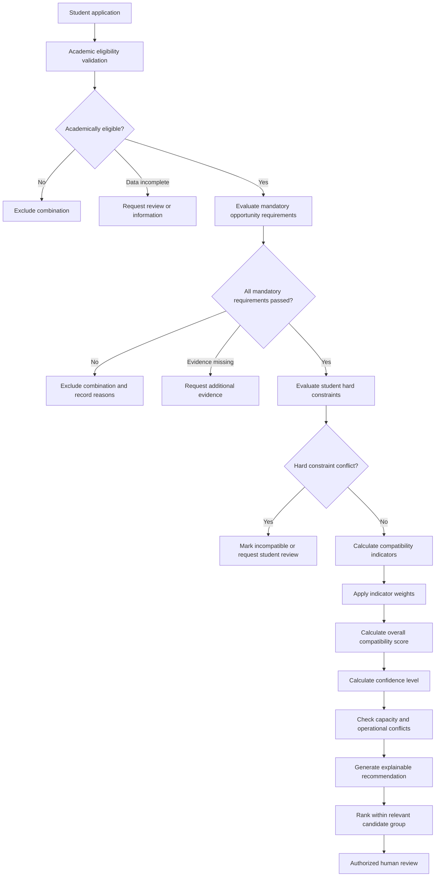
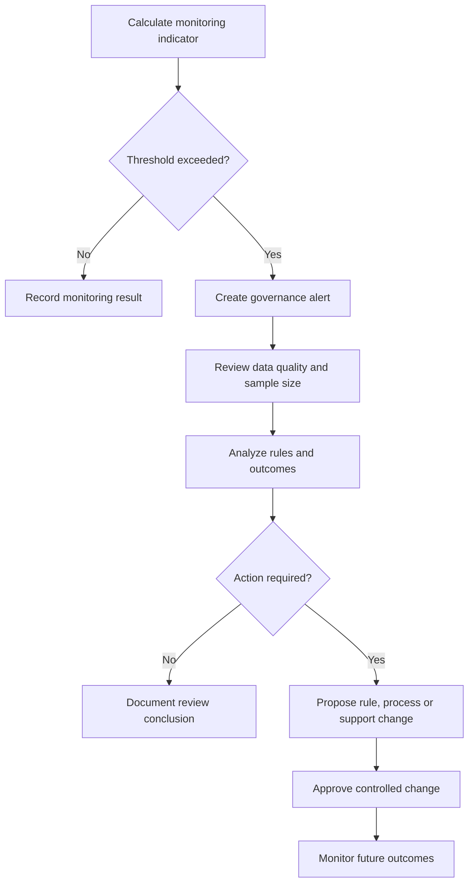

# Matching Model

## Case

Internship Placement and Matching System

## Domain

University Career Services and Internship Operations

## Document Purpose

This document defines the proposed matching model used to evaluate eligible
student-opportunity combinations.

The model explains:

- Which combinations are excluded before scoring
- Which compatibility dimensions are evaluated
- How individual indicators are calculated
- How indicator weights are applied
- How missing and low-confidence data are handled
- How student preferences influence recommendations
- How recommendation confidence is calculated
- How ties are handled
- How recommendations are explained
- How fairness and concentration risks are monitored
- How matching configurations are governed and versioned

The model is intended to support human placement decisions.

It does not autonomously:

- Select the final student
- Confirm a placement
- Override academic rules
- Reserve capacity permanently
- Reject a student without an explainable rule result
- Replace employer, student or university approval

## Matching Model Objectives

The model should:

- Exclude invalid combinations consistently
- Evaluate eligible combinations across multiple dimensions
- Respect employer mandatory requirements
- Consider student preferences
- Avoid reducing placement quality to one unexplained number
- Present understandable evidence
- Identify uncertainty and missing information
- Support staff review
- Preserve historical configurations
- Enable outcome and fairness monitoring

## Matching Model Principles

### Eligibility Before Compatibility

Academic eligibility and mandatory employer requirements must be evaluated
before compatibility scoring.

A student who fails a mandatory condition does not receive a standard
compatibility score for that opportunity.

### Multiple Dimensions

Compatibility is evaluated across several documented dimensions.

The model does not assume that one strong attribute should compensate for every
other weakness.

### Preference Awareness

Student preferences influence recommendation quality.

An opportunity may be academically valid and technically compatible while
still being unsuitable because of:

- Location
- Working model
- Internship period
- Role preference
- Industry preference
- A documented hard constraint

### Explainability

Every recommendation must be supported by understandable factors.

The reviewer should be able to answer:

- Why was this student considered eligible?
- Which mandatory requirements passed?
- Which preferred requirements were satisfied?
- Which preferences aligned?
- Which indicators increased the result?
- Which indicators reduced the result?
- Which information was missing?
- Which model version was used?

### Human Oversight

The model generates advisory results.

Authorized reviewers remain responsible for:

- Interpreting contextual information
- Requesting additional evidence
- Resolving exceptional cases
- Reviewing fairness concerns
- Approving or rejecting recommendations
- Applying documented overrides

### Historical Stability

A historical recommendation must preserve:

- Eligibility rule version
- Opportunity requirement version
- Student profile version
- Student preference version
- Matching model version
- Indicator weights
- Missing-data treatment
- Recommendation result

A later configuration change must not silently modify an earlier result.

# Matching Pipeline

The proposed matching pipeline contains six major stages.



## Stage 1: Academic Eligibility

The matching process begins only after the student receives an academic
eligibility result.

Possible results are:

- Eligible
- Ineligible
- Review required
- Data incomplete

Only an eligible student or a student with a valid approved academic exception
may continue through standard matching.

## Stage 2: Mandatory Opportunity Requirements

Every mandatory opportunity requirement is evaluated separately.

Possible requirement results are:

- Passed
- Failed
- Evidence missing
- Review required
- Not applicable

A confirmed failure excludes the combination.

Missing evidence should not automatically be treated as a confirmed failure
unless an approved deadline or policy requires that result.

## Stage 3: Student Hard Constraints

The system evaluates student preferences classified as required constraints.

Examples include:

- Unacceptable location
- Required remote working model
- Incompatible internship period
- Maximum travel distance
- Documented availability restriction

A hard constraint is different from an ordinary ranking preference.

A hard constraint may make a combination incompatible even when employer
requirements are satisfied.

## Stage 4: Compatibility Indicators

Eligible combinations receive individual indicator values.

Indicators measure different aspects of compatibility and remain visible
separately.

## Stage 5: Confidence and Operational Validation

The system calculates a confidence level based on:

- Data completeness
- Data freshness
- Verification status
- Evidence quality
- Indicator availability
- Conflicting information

Capacity and operational conflicts are then checked.

## Stage 6: Recommendation Generation

The system creates an explainable recommendation containing:

- Eligibility evidence
- Mandatory requirement evidence
- Compatibility indicators
- Overall score
- Confidence level
- Preference alignment
- Capacity status
- Conflict status
- Data-quality warnings
- Model version

# Exclusion Logic

Exclusion rules are evaluated before ranking.

## Academic Exclusions

A combination is excluded when:

- The student is not actively eligible.
- The academic program is not permitted.
- The minimum academic year is not met.
- The minimum GPA is not met.
- Required credits are incomplete.
- A mandatory course is incomplete.
- The internship period is academically invalid.
- A required academic approval is rejected.
- The student has already completed the same mandatory internship requirement.

An approved academic exception may change the result only within its documented
scope and validity period.

## Employer Mandatory Requirement Exclusions

A combination is excluded when a confirmed mandatory employer requirement
fails.

Examples include:

- Required academic program
- Minimum student year
- Required technical skill
- Required language level
- Required certification
- Mandatory working-model availability
- Mandatory internship dates
- Required document
- Mandatory location condition

## Operational Exclusions

A combination may be excluded or blocked when:

- The opportunity is inactive.
- The employer is suspended.
- The application deadline has passed.
- Opportunity capacity is unavailable.
- The student has a conflicting confirmed placement.
- Required application documents are missing after the permitted deadline.
- The application was withdrawn.
- The opportunity was cancelled.
- The recommendation has expired.

## Exclusion Result Structure

Each exclusion should record:

| Field | Description |
|---|---|
| exclusion_code | Controlled exclusion identifier |
| exclusion_category | Academic, employer, student or operational |
| rule_id | Rule that produced the result |
| rule_version | Applied rule version |
| expected_value | Required condition |
| observed_value | Student or opportunity value |
| result | Failed, missing or review required |
| explanation | Human-readable reason |
| evaluated_at | Evaluation timestamp |

## Exclusion Example

```yaml
exclusion_code: MANDATORY_LANGUAGE_LEVEL_NOT_MET
exclusion_category: employer_requirement
rule_id: BR-RQ-006
rule_version: 1.0
expected_value: B2
observed_value: B1
result: failed
explanation: The opportunity requires a minimum English level of B2.
```

# Compatibility Dimensions

The initial matching model uses nine compatibility dimensions.

| No. | Dimension | Default Weight |
|---:|---|---:|
| 1 | Skill Compatibility | 25% |
| 2 | Academic Relevance | 15% |
| 3 | Preferred Requirement Satisfaction | 15% |
| 4 | Role Preference Alignment | 10% |
| 5 | Industry Preference Alignment | 10% |
| 6 | Location Compatibility | 8% |
| 7 | Working-Model Compatibility | 7% |
| 8 | Internship-Period Compatibility | 5% |
| 9 | Language Compatibility | 5% |
|  | **Total** | **100%** |

These values are an initial case-study configuration.

They require stakeholder validation before production use.

# Indicator Scoring Scale

Each compatibility indicator is normalized to a value between 0 and 100.

| Score Range | Interpretation |
|---:|---|
| 90–100 | Very strong alignment |
| 75–89.99 | Strong alignment |
| 60–74.99 | Moderate alignment |
| 40–59.99 | Limited alignment |
| 1–39.99 | Weak alignment |
| 0 | No demonstrated alignment |

The score represents compatibility evidence.

It does not represent:

- Student quality
- General employability
- Personal value
- Guaranteed internship success
- Employer acceptance
- Final placement approval

# 1. Skill Compatibility

## Purpose

Measures alignment between student skills and the opportunity's preferred or
optional skill requirements.

Mandatory skills are already evaluated during exclusion logic.

## Inputs

- Student skills
- Student proficiency levels
- Skill verification status
- Opportunity preferred skills
- Opportunity optional skills
- Required proficiency levels
- Skill importance
- Skill-catalog relationships

## Basic Skill Score

For each relevant skill:

```text
Skill Match Ratio =
Student Proficiency Value
/
Required or Preferred Proficiency Value
```

The result is capped at 1.

```text
Normalized Skill Score =
MIN(Skill Match Ratio, 1) × 100
```

## Weighted Skill Compatibility

```text
Skill Compatibility =
SUM(Normalized Skill Score × Skill Importance Weight)
/
SUM(Skill Importance Weight)
```

## Example Proficiency Scale

| Level | Numeric Value |
|---|---:|
| Awareness | 1 |
| Beginner | 2 |
| Intermediate | 3 |
| Advanced | 4 |
| Expert | 5 |

## Example

The opportunity prefers:

| Skill | Preferred Level | Importance |
|---|---:|---:|
| SQL | 3 | 50% |
| Excel | 3 | 30% |
| Power BI | 2 | 20% |

The student has:

| Skill | Student Level |
|---|---:|
| SQL | 3 |
| Excel | 4 |
| Power BI | 1 |

Calculations:

```text
SQL Score = MIN(3 / 3, 1) × 100 = 100
Excel Score = MIN(4 / 3, 1) × 100 = 100
Power BI Score = MIN(1 / 2, 1) × 100 = 50
```

```text
Skill Compatibility =
(100 × 0.50)
+ (100 × 0.30)
+ (50 × 0.20)

Skill Compatibility = 90
```

## Verification Adjustment

An approved evidence adjustment may be used.

Example:

| Verification Status | Evidence Factor |
|---|---:|
| University verified | 1.00 |
| Certification verified | 1.00 |
| Course verified | 0.95 |
| Document supported | 0.90 |
| Self-declared | 0.80 |
| Unverified or conflicting | Review required |

The adjustment must not be used to unfairly exclude students whose skills can
reasonably be assessed through another approved process.

## Explainability Output

```text
Skill compatibility: 90/100

Positive factors:
- SQL meets the preferred level.
- Excel exceeds the preferred level.

Improvement area:
- Power BI is below the preferred level.
```

# 2. Academic Relevance

## Purpose

Measures how closely the opportunity relates to the student's academic program
and approved learning objectives.

Academic relevance is not the same as academic eligibility.

A student may be eligible for an opportunity with moderate rather than perfect
academic relevance.

## Inputs

- Student academic program
- Opportunity role category
- Opportunity responsibilities
- Approved program-role mapping
- Department learning objectives
- Academic reviewer classification

## Example Scoring

| Relationship | Score |
|---|---:|
| Directly aligned with program | 100 |
| Strongly related | 85 |
| Partially related | 65 |
| Transferable but indirect | 45 |
| Weak relationship | 20 |
| Not academically relevant | Academic review or exclusion |

## Control

The program-role mapping must be:

- Documented
- Versioned
- Owned by an academic role
- Reviewed periodically

# 3. Preferred Requirement Satisfaction

## Purpose

Measures how many preferred employer requirements the student satisfies.

Mandatory requirements are not included because they have already been
evaluated as pass or fail conditions.

## Formula

```text
Preferred Requirement Satisfaction =
SUM(Satisfied Preferred Requirement Weight)
/
SUM(All Applicable Preferred Requirement Weight)
× 100
```

## Example

| Preferred Requirement | Weight | Result |
|---|---:|---|
| Previous project experience | 40 | Passed |
| B2 English | 35 | Passed |
| Presentation experience | 25 | Not demonstrated |

```text
Preferred Requirement Satisfaction =
(40 + 35) / 100 × 100

Preferred Requirement Satisfaction = 75
```

## Missing Evidence

When a preferred qualification is not verified:

- It may receive zero contribution.
- It may be marked as evidence missing.
- It may be sent for review.

The configured treatment must remain visible.

# 4. Role Preference Alignment

## Purpose

Measures whether the opportunity role matches the student's preferred career
roles.

## Example Preference Strength Values

| Preference Strength | Alignment Value |
|---|---:|
| Strongly preferred | 100 |
| Preferred | 80 |
| Neutral | 60 |
| Not preferred | 30 |
| Unacceptable | Hard constraint |

## Role Hierarchy

Related roles may receive partial alignment.

Example:

```text
Preferred role: Business Analyst
Opportunity role: Data Analyst
Relationship: Related role family
Alignment score: 75
```

Role relationships must use a controlled taxonomy rather than undocumented text
similarity alone.

# 5. Industry Preference Alignment

## Purpose

Measures whether the employer's industry aligns with the student's declared
industry preferences.

## Example Scoring

| Preference | Score |
|---|---:|
| Strongly preferred industry | 100 |
| Preferred industry | 80 |
| Related industry | 65 |
| Neutral industry | 50 |
| Not preferred industry | 25 |
| Unacceptable industry | Hard constraint when approved |

A student without an industry preference should not automatically receive a
negative score.

The configured missing-preference treatment may use a neutral value.

# 6. Location Compatibility

## Purpose

Measures alignment between the opportunity location and the student's location
preferences or travel constraints.

## Inputs

- Opportunity city
- Opportunity address or location category
- Student preferred cities
- Student maximum travel distance
- Student relocation availability
- Working model
- Approved location constraints

## Example Scoring

| Condition | Score |
|---|---:|
| Preferred city | 100 |
| Acceptable nearby location | 80 |
| Acceptable with travel | 60 |
| Possible but not preferred | 40 |
| Outside acceptable range | Hard constraint or 0 |

## Privacy Consideration

The model should not require exact home-location data when a broader area is
sufficient.

# 7. Working-Model Compatibility

## Purpose

Measures alignment across:

- Remote
- Hybrid
- On-site

## Example Matrix

| Student Preference | Remote Opportunity | Hybrid Opportunity | On-Site Opportunity |
|---|---:|---:|---:|
| Remote strongly preferred | 100 | 75 | 30 |
| Hybrid strongly preferred | 75 | 100 | 65 |
| On-site strongly preferred | 45 | 75 | 100 |
| No preference | 70 | 70 | 70 |

A required working-model constraint overrides the scoring matrix.

Example:

```text
Student constraint: Remote only
Opportunity: On-site
Result: Incompatible
```

# 8. Internship-Period Compatibility

## Purpose

Measures alignment between:

- Student availability
- Opportunity dates
- Academic internship period
- Required internship duration

## Basic Formula

```text
Period Compatibility =
Overlapping Available Days
/
Required Internship Days
× 100
```

## Example

```text
Required internship days: 40
Student available days within the period: 36

Period Compatibility =
36 / 40 × 100

Period Compatibility = 90
```

A mandatory complete-period requirement excludes a student whose availability
does not cover the entire period.

# 9. Language Compatibility

## Purpose

Measures alignment between student language proficiency and preferred
opportunity language conditions.

Mandatory language levels are evaluated before scoring.

## Example CEFR Mapping

| Level | Numeric Value |
|---|---:|
| A1 | 1 |
| A2 | 2 |
| B1 | 3 |
| B2 | 4 |
| C1 | 5 |
| C2 | 6 |

## Preferred Language Formula

```text
Language Compatibility =
MIN(Student Language Level / Preferred Level, 1)
× 100
```

Example:

```text
Preferred level: C1 = 5
Student level: B2 = 4

Language Compatibility =
4 / 5 × 100

Language Compatibility = 80
```

# Overall Compatibility Score

The overall compatibility score is calculated only for eligible combinations.

## Formula

```text
Overall Compatibility Score =
SUM(Indicator Score × Indicator Weight)
```

All active indicator weights must total 1 or 100 percent.

## Default Formula

```text
Overall Compatibility Score =
(Skill Compatibility × 0.25)
+ (Academic Relevance × 0.15)
+ (Preferred Requirement Satisfaction × 0.15)
+ (Role Preference Alignment × 0.10)
+ (Industry Preference Alignment × 0.10)
+ (Location Compatibility × 0.08)
+ (Working-Model Compatibility × 0.07)
+ (Internship-Period Compatibility × 0.05)
+ (Language Compatibility × 0.05)
```

## Example Calculation

| Indicator | Score | Weight | Weighted Contribution |
|---|---:|---:|---:|
| Skill Compatibility | 90 | 0.25 | 22.50 |
| Academic Relevance | 85 | 0.15 | 12.75 |
| Preferred Requirement Satisfaction | 75 | 0.15 | 11.25 |
| Role Preference Alignment | 100 | 0.10 | 10.00 |
| Industry Preference Alignment | 80 | 0.10 | 8.00 |
| Location Compatibility | 70 | 0.08 | 5.60 |
| Working-Model Compatibility | 100 | 0.07 | 7.00 |
| Internship-Period Compatibility | 90 | 0.05 | 4.50 |
| Language Compatibility | 80 | 0.05 | 4.00 |
| **Overall** |  | **1.00** | **85.60** |

```text
Overall Compatibility Score = 85.60
```

## Compatibility Classification

| Overall Score | Classification |
|---:|---|
| 85–100 | Very strong recommendation candidate |
| 70–84.99 | Strong recommendation candidate |
| 55–69.99 | Moderate recommendation candidate |
| 40–54.99 | Limited recommendation candidate |
| Below 40 | Weak compatibility; human review before recommendation |

These classifications guide review.

They do not create automatic placement decisions.

# Missing-Data Treatment

Missing information must be handled explicitly.

## Missing-Data Categories

- Required data missing
- Optional data missing
- Evidence missing
- Data stale
- Data conflicting
- Data unverified
- Data unavailable from source system

## Treatment Options

Each indicator configuration must define one treatment:

### Blocking

Used when the missing information is required for eligibility or a mandatory
requirement.

Result:

```text
Evaluation status: Data incomplete
Recommendation: Not generated
```

### Review Required

Used when the information may materially influence a decision but can be
verified manually.

Result:

```text
Evaluation status: Review required
Recommendation: Held for review
```

### Zero Contribution

Used when an optional qualification has no demonstrated evidence.

Result:

```text
Indicator contribution: 0
Warning: Evidence not provided
```

### Neutral Contribution

Used only when absence of preference or optional information should not be
treated negatively.

Example:

```text
Student has no industry preference.
Industry alignment receives the configured neutral value.
```

### Weight Redistribution

Weight redistribution may be used only for approved non-critical indicators.

Example:

- One optional indicator is unavailable.
- Its weight is distributed proportionally among remaining indicators.

This method must be documented because it changes the meaning of the total
score.

## Initial Model Decision

The initial model uses:

- Blocking for mandatory eligibility data
- Review required for conflicting critical data
- Zero contribution for unsupported preferred qualifications
- Neutral contribution for genuinely undeclared optional preferences
- No automatic weight redistribution

# Data Confidence

The compatibility score and confidence level are separate.

A combination may have a high compatibility score but a low confidence level
because important evidence is unverified.

## Confidence Factors

| Factor | Example |
|---|---|
| Profile completeness | Required student fields available |
| Academic data freshness | Current authoritative record |
| Skill verification | Verified rather than self-declared |
| Requirement clarity | Structured and approved requirements |
| Preference freshness | Current preference version |
| Evidence completeness | Supporting records available |
| Data consistency | No conflicting values |

## Confidence Formula

Each confidence factor receives a value between 0 and 100.

```text
Confidence Level =
SUM(Confidence Factor Score × Confidence Factor Weight)
```

## Initial Confidence Weights

| Confidence Factor | Weight |
|---|---:|
| Profile completeness | 20% |
| Academic data freshness | 20% |
| Skill evidence quality | 20% |
| Requirement clarity | 15% |
| Preference freshness | 10% |
| Evidence completeness | 10% |
| Data consistency | 5% |
| **Total** | **100%** |

## Confidence Classification

| Confidence | Classification |
|---:|---|
| 90–100 | High confidence |
| 75–89.99 | Good confidence |
| 60–74.99 | Moderate confidence |
| Below 60 | Low confidence; review recommended |

## Example

```text
Compatibility score: 88
Confidence level: 57

Interpretation:
The student appears strongly compatible, but several skills are self-declared
and the academic record is stale. Additional verification is required.
```

# Recommendation Status Logic

The matching result may produce one of the following recommendation statuses.

| Status | Meaning |
|---|---|
| Excluded | A mandatory rule failed |
| Data Incomplete | Critical information is missing |
| Review Required | Human interpretation is required before ranking |
| Eligible for Ranking | All exclusion rules passed |
| Recommended | Meets the configured recommendation conditions |
| Limited Recommendation | Eligible but has weak or uncertain compatibility |
| Capacity Hold | Suitable but no capacity is currently available |
| Expired | Recommendation validity ended |
| Superseded | Replaced by a newer evaluation |
| Withdrawn | Related application was withdrawn |

## Initial Recommendation Conditions

A standard recommendation may be generated when:

- Academic eligibility is valid.
- All mandatory employer requirements pass.
- No hard student constraint fails.
- No blocking conflict exists.
- Overall compatibility is at least 55.
- Confidence is at least 60.
- The opportunity remains active.
- Capacity is available or can be reviewed.

A combination below these thresholds may still be presented for human review
when institutional policy permits.

# Ranking Logic

Recommendations are ranked within a defined comparison group.

## Possible Comparison Groups

- Candidates for one opportunity
- Opportunities for one student
- Students within one academic department
- Applications within one placement cycle
- Unplaced students approaching a deadline

A ranking must identify which comparison group was used.

## Standard Candidate Ranking

For one opportunity, eligible candidates are ordered by:

1. Overall compatibility score
2. Confidence level
3. Student preference alignment
4. Placement urgency when institutionally approved
5. Documented tie-handling method

The ranking does not automatically create an employer shortlist or placement.

## Student Opportunity Ranking

For one student, opportunities may be ordered by:

1. Student hard-constraint compliance
2. Overall compatibility score
3. Student preference alignment
4. Available capacity
5. Recommendation confidence

# Tie Handling

A tie exists when candidates have the same score within the approved precision.

Example:

```text
Candidate A: 82.50
Candidate B: 82.50
```

## Initial Tie-Handling Sequence

1. Higher student preference alignment
2. Higher confidence level
3. Higher preferred-requirement satisfaction
4. Higher placement urgency where approved
5. Human review

Application time should not automatically decide a tie unless university policy
explicitly adopts a first-completed or first-submitted rule.

## Prohibited Tie Factors

The model must not use undocumented factors such as:

- Staff familiarity
- Personal relationships
- Unrecorded employer preference
- Profile photograph
- Name-based assumptions
- Unapproved sensitive attributes
- Hidden historical labels

# Placement Urgency

Placement urgency may support intervention and review priority.

It must not silently increase academic or skill compatibility.

## Possible Urgency Factors

- Mandatory internship deadline
- No existing recommendation
- Repeated employer rejection
- Previous confirmed placement cancellation
- Limited remaining opportunity period
- Academic graduation risk

## Urgency Output

Urgency should be shown separately.

Example:

```text
Compatibility score: 72
Placement urgency: High
Recommendation priority: High review priority
```

The system should not present the adjusted review priority as a higher
compatibility score.

# Capacity-Aware Recommendation Logic

A strong compatibility result does not guarantee available capacity.

## Capacity Statuses

- Available
- Limited
- Temporarily reserved
- Fully reserved
- Full
- Uncertain
- Closed

## Capacity Rules

- Applications do not consume capacity.
- Recommendations do not consume capacity.
- Approved offers may create temporary reservations.
- Confirmed placements consume capacity.
- Declined and expired offers release reservations.

## Capacity-Aware Output Example

```text
Compatibility score: 91
Confidence: 94
Capacity status: Full
Recommendation status: Capacity hold
```

The recommendation may remain available for review if capacity is later
released.

# Explainability Model

Every recommendation contains three explanation levels.

## Level 1: Summary Explanation

Designed for quick review.

Example:

```text
Strong compatibility based on SQL, Excel and business-analysis skills.
The student's hybrid-working preference aligns with the opportunity.
The student meets all mandatory requirements.
Power BI experience is below the preferred level.
```

## Level 2: Indicator Explanation

Shows each compatibility dimension.

| Indicator | Score | Explanation |
|---|---:|---|
| Skill Compatibility | 90 | Two preferred skills fully satisfied; one partially satisfied |
| Academic Relevance | 85 | Role is strongly related to the student's program |
| Role Preference | 100 | Opportunity matches the student's preferred role |
| Location | 70 | City is acceptable but not preferred |
| Working Model | 100 | Hybrid model is strongly preferred |

## Level 3: Evidence Detail

Shows the specific values, sources and rules.

Example:

```yaml
indicator: skill_compatibility
student_skill: SQL
student_level: Intermediate
verification_status: Course verified
preferred_level: Intermediate
result: Fully satisfied
source: Student Skill Record SS-2041
```

# Student-Facing Explanation

A student-facing explanation should be understandable without revealing:

- Other candidates' scores
- Employer-confidential notes
- Other students' profiles
- Internal security rules
- Sensitive reviewer information

## Example Eligibility Explanation

```text
Your application could not continue because the opportunity requires students
to be available from 1 July to 31 August. Your current availability ends on
31 July.
```

## Example Recommendation Explanation

```text
Your application is being reviewed.

You meet all mandatory requirements. Your strongest matching factors are role
preference, SQL knowledge and academic relevance. The opportunity location is
acceptable but is not one of your preferred locations.
```

# Employer-Facing Explanation

Employers may receive information such as:

- Mandatory requirement satisfaction
- Approved candidate skills
- Availability
- Relevant academic program
- Approved experience information
- Candidate-review status

Employers should not receive:

- Unrelated applications
- Other employer decisions
- Internal fairness indicators
- Sensitive student-support information
- Full academic history unless necessary and authorized

# Reviewer Explanation

Authorized reviewers receive the most complete explanation.

It may include:

- Academic eligibility details
- Requirement evaluations
- Indicator calculations
- Student preferences
- Confidence factors
- Data-quality warnings
- Capacity status
- Recommendation history
- Approved exceptions
- Previous relevant decisions

# Fairness Monitoring

The model must support fairness review without making unsupported conclusions.

## Monitoring Objectives

Fairness monitoring should help identify:

- Groups receiving no recommendations
- Recommendation concentration
- Large placement-rate differences
- Repeated override patterns
- Opportunity access differences
- Employer rejection concentration
- Effects of specific requirements
- Effects of missing data

## Example Indicators

- Recommendation rate by academic department
- Placement rate by academic year
- Students with no recommendation
- Average compatibility by opportunity category
- Override rate by reviewer
- Exclusion rate by requirement
- First-preference placement rate
- Recommendation concentration rate
- Employer rejection rate

## Important Limitation

A statistical difference does not automatically prove unfair treatment.

Differences may require analysis of:

- Opportunity supply
- Student preferences
- Academic eligibility
- Employer requirements
- Application behavior
- Data completeness
- Department rules
- Sample size

## Fairness Alert Workflow



## Prohibited Automatic Responses

A fairness alert must not automatically:

- Change a student's score
- Confirm discrimination
- Remove a student
- Remove an employer
- Reverse a placement
- Apply an undocumented quota
- Override a mandatory academic rule

# Recommendation Concentration

Recommendation concentration occurs when a small group of students repeatedly
receives a large proportion of recommendations.

## Example Metric

```text
Recommendation Concentration Rate =
Recommendations Received by Top 10% of Students
/
Total Recommendations
× 100
```

## Interpretation

A high concentration rate may indicate:

- Genuine qualification differences
- Incomplete profiles among other students
- Limited opportunity diversity
- Repeated preference alignment
- Matching-weight imbalance
- Historical or structural bias
- Overuse of the same verified skills

The metric should trigger investigation rather than automatic correction.

# Model Governance

## Configuration Ownership

Each matching configuration must identify:

- Business owner
- Academic owner
- Technical owner
- Privacy reviewer
- Approval status
- Version
- Effective date
- Review date

## Configuration Components

A model version includes:

- Active compatibility dimensions
- Indicator formulas
- Indicator weights
- Score ranges
- Missing-data treatment
- Confidence factors
- Recommendation thresholds
- Tie-handling rules
- Ranking precision
- Explanation templates

## Change Approval

A change requires documented analysis of:

- Business reason
- Affected students
- Employer impact
- Academic impact
- Privacy impact
- Fairness impact
- Historical comparability
- Testing requirements
- Rollback plan

## Change Examples

Changes requiring a new model version include:

- Weight modification
- New indicator
- Removed indicator
- Threshold change
- Missing-data treatment change
- Tie-handling change
- New exclusion rule
- Confidence formula change

## Model Version Example

```yaml
model_name: Internship Compatibility Model
model_version: 1.0
status: proposed
effective_from: 2026-09-01
score_range:
  minimum: 0
  maximum: 100
recommendation_threshold: 55
minimum_confidence: 60
weights:
  skill_compatibility: 0.25
  academic_relevance: 0.15
  preferred_requirement_satisfaction: 0.15
  role_preference_alignment: 0.10
  industry_preference_alignment: 0.10
  location_compatibility: 0.08
  working_model_compatibility: 0.07
  internship_period_compatibility: 0.05
  language_compatibility: 0.05
```

# Model Validation

The matching model should be validated before activation.

## Functional Validation

Confirm that:

- Mandatory failures exclude combinations.
- Preferred failures do not exclude combinations.
- Scores remain within 0 and 100.
- Weights total 100 percent.
- Missing data follows configured treatment.
- Historical versions remain unchanged.
- Capacity status does not alter eligibility.
- Human decisions remain separate.

## Scenario Validation

The model should be tested using scenarios such as:

- Perfect skill and preference alignment
- Strong skill alignment with location conflict
- Academic eligibility failure
- Mandatory language failure
- Missing skill evidence
- Stale academic data
- Full opportunity capacity
- Equal candidate scores
- Student with no recommendation
- Recommendation created from an approved exception

## Historical Validation

When reliable historical data is available, the university may compare:

- Recommendation result
- Employer acceptance
- Student acceptance
- Placement completion
- Student satisfaction
- Employer evaluation
- Cancellation

Historical validation must not assume that earlier human decisions were always
correct.

## Stakeholder Validation

The model should be reviewed by:

- Career-center specialists
- Academic representatives
- Employer representatives
- Student representatives
- Privacy team
- Information security team
- Accessibility or student-support services
- Internal governance roles

# Model Monitoring

The active model should be monitored periodically.

## Operational Monitoring

- Recommendation volume
- Evaluation failure rate
- Average processing time
- Missing-data rate
- Review backlog
- Expired recommendation rate
- Capacity-hold rate

## Outcome Monitoring

- Employer acceptance rate
- Student acceptance rate
- Placement confirmation rate
- Internship completion rate
- Successful completion rate
- Cancellation rate
- Student satisfaction
- Employer satisfaction

## Governance Monitoring

- Override rate
- Recommendation concentration
- Students with no recommendation
- Exclusion rate by requirement
- Low-confidence recommendation rate
- Data-quality warning rate
- Decision reversal rate
- Appeal rate

# Example End-to-End Evaluation

## Student

```yaml
student_id: STUDENT-1042
academic_program: Management Information Systems
academic_year: 4
gpa: 3.09
availability:
  start: 2026-07-01
  end: 2026-08-31
preferences:
  roles:
    - Business Analyst
    - Data Analyst
  industries:
    - Technology
    - Consulting
  working_model: Hybrid
  city: Istanbul
```

## Opportunity

```yaml
opportunity_id: OPP-2026-0045
title: Business Intelligence Intern
industry: Technology
working_model: Hybrid
city: Istanbul
start_date: 2026-07-07
end_date: 2026-08-25
mandatory_requirements:
  - eligible academic program
  - third-year or higher
  - SQL at intermediate level
  - available for the full period
preferred_requirements:
  - Excel at intermediate level
  - Power BI at beginner level
  - English at B2 level
```

## Eligibility Evaluation

```text
Academic program: Passed
Academic year: Passed
Internship period: Passed
Academic eligibility result: Eligible
```

## Mandatory Requirement Evaluation

```text
Academic program: Passed
Minimum academic year: Passed
SQL requirement: Passed
Full-period availability: Passed
```

## Compatibility Indicators

| Indicator | Score |
|---|---:|
| Skill Compatibility | 90 |
| Academic Relevance | 85 |
| Preferred Requirement Satisfaction | 75 |
| Role Preference Alignment | 100 |
| Industry Preference Alignment | 100 |
| Location Compatibility | 100 |
| Working-Model Compatibility | 100 |
| Internship-Period Compatibility | 100 |
| Language Compatibility | 80 |

## Overall Result

```text
Overall Compatibility Score =
(90 × 0.25)
+ (85 × 0.15)
+ (75 × 0.15)
+ (100 × 0.10)
+ (100 × 0.10)
+ (100 × 0.08)
+ (100 × 0.07)
+ (100 × 0.05)
+ (80 × 0.05)

Overall Compatibility Score = 90.50
```

## Confidence

```text
Profile completeness: 100
Academic freshness: 100
Skill evidence quality: 85
Requirement clarity: 100
Preference freshness: 100
Evidence completeness: 90
Data consistency: 100

Confidence level: 94
```

## Recommendation Output

```yaml
recommendation_status: recommended
compatibility_score: 90.50
compatibility_classification: very_strong
confidence_level: 94
confidence_classification: high
mandatory_requirements_passed: true
hard_constraint_conflict: false
capacity_status: available
human_review_required: true
```

## Explanation Summary

```text
The student meets all academic and employer mandatory requirements.

The strongest matching factors are role preference, industry preference,
location, working model and internship-period availability.

SQL and Excel meet the preferred levels. Power BI is partially aligned with
the preferred qualification.

The recommendation has high confidence because the academic information is
current and the relevant skill evidence is available.
```

# Model Limitations

The proposed matching model has important limitations.

- Structured data cannot represent every student circumstance.
- Employer requirements may contain ambiguity.
- Skill proficiency may be self-reported.
- Student preferences may change.
- A high score does not guarantee successful internship completion.
- Historical outcome data may contain earlier process bias.
- Some opportunities may require qualitative interviews.
- Compatibility weights reflect institutional choices.
- Accessibility-related needs require controlled human review.
- Employers retain their own candidate-selection authority.

The model should therefore remain a decision-support tool.

# Prohibited Uses

The matching model must not be used to:

- Measure general student worth
- Rank students outside approved internship purposes
- Make unrelated academic decisions
- Predict personality from unsupported data
- Use protected or sensitive data without approved purpose
- Automatically reject appeals
- Hide human overrides
- Present recommendations as guaranteed outcomes
- Replace student consent
- Confirm final placement autonomously

# Matching Model Success Criteria

The model is successful when:

- Ineligible combinations are excluded consistently.
- Mandatory and preferred requirements remain separate.
- Student hard constraints are respected.
- Compatibility dimensions are visible.
- Weights and formulas are documented.
- Scores remain within approved boundaries.
- Missing data is handled explicitly.
- Confidence is shown separately from compatibility.
- Ties use documented rules.
- Recommendations contain understandable explanations.
- Human reviewers retain decision authority.
- Capacity remains separate from compatibility.
- Historical model versions remain traceable.
- Fairness indicators trigger review rather than automatic conclusions.
- Final outcomes can be connected to earlier recommendations.

# Matching Model Summary

The Internship Placement and Matching System uses a staged and explainable
matching approach.

The model first evaluates:

1. Academic eligibility
2. Employer mandatory requirements
3. Student hard constraints
4. Operational conflicts

Only valid combinations proceed to compatibility scoring.

Eligible combinations are then evaluated across:

- Skills
- Academic relevance
- Preferred employer requirements
- Role preference
- Industry preference
- Location
- Working model
- Internship period
- Language

The system calculates:

- Individual indicator values
- Overall compatibility score
- Confidence level
- Capacity status
- Recommendation explanation

The resulting recommendation remains advisory and requires authorized human
review.

The next document will define the OpenAPI contract for students, employers,
opportunities, applications, eligibility evaluations, recommendations, offers
and placements.
