# KPI Framework

## Case

Internship Placement and Matching System

## Domain

University Career Services and Internship Operations

## Document Purpose

This document defines the performance measurement framework for the Internship
Placement and Matching System.

The framework connects operational data with measurable questions about:

- Student participation
- Academic eligibility
- Opportunity availability
- Application activity
- Matching quality
- Placement outcomes
- Employer participation
- Processing efficiency
- Capacity utilization
- Student preferences
- Internship completion
- Manual overrides
- Fairness and access
- Data quality
- Governance and control effectiveness

The KPIs are designed to support:

- Daily operational monitoring
- Placement-cycle management
- Department-level analysis
- Employer relationship management
- Student intervention
- System-governance review
- Matching-model evaluation
- Institutional reporting

## KPI Design Principles

### Clear Business Meaning

Every KPI must answer a defined business question.

### Documented Formula

Every KPI must include a reproducible calculation method.

### Defined Population

The measurement population and exclusions must be documented.

### Time Consistency

Every KPI must identify the date field and reporting period used.

### Status Separation

The framework must distinguish:

- Application
- Recommendation
- Offer
- Placement
- Internship completion
- Academic credit

These concepts must not be treated as equivalent.

### Explainable Segmentation

KPIs should support analysis by relevant dimensions without exposing
unnecessary personal information.

### Data-Quality Visibility

A KPI should identify whether incomplete or stale data may affect its result.

### Fair Interpretation

Differences between departments or student groups should trigger investigation,
not automatic conclusions.

### Historical Reproducibility

Historical reports must preserve the definitions, rules and data versions used
at the time of calculation.

# KPI Categories

| Category | Prefix | Main Purpose |
|---|---|---|
| Participation | KPI-PAR | Measure student entry and profile readiness |
| Eligibility | KPI-ELG | Measure academic eligibility outcomes |
| Opportunity Supply | KPI-OPS | Measure internship opportunity availability |
| Applications | KPI-APP | Measure student application activity |
| Matching Quality | KPI-MAT | Measure recommendation quality and alignment |
| Placement Outcomes | KPI-PLC | Measure confirmed placement results |
| Offer Management | KPI-OFR | Measure offer responses and expiration |
| Operational Efficiency | KPI-EFF | Measure process speed and workload |
| Employer Performance | KPI-EMP | Measure employer participation and outcomes |
| Capacity | KPI-CAP | Measure opportunity capacity usage |
| Internship Outcomes | KPI-OUT | Measure completion and final results |
| Fairness and Access | KPI-FAI | Support review of outcome differences |
| Overrides and Governance | KPI-GOV | Measure human decisions and control use |
| Data Quality | KPI-DQ | Measure reliability of system inputs |
| System Reliability | KPI-SYS | Measure service and processing performance |

# Common Measurement Definitions

## Reporting Period

A reporting period may be:

- Day
- Week
- Month
- Academic term
- Placement cycle
- Internship period
- Academic year

Every report must state the reporting period explicitly.

## Active Student

A student is considered active for a placement cycle when:

- The student is included in the cycle population.
- The student account is valid.
- The student has not withdrawn from participation.
- The student has not been excluded by an approved institutional rule.

## Eligible Student

An active student whose latest valid academic eligibility result is:

```text
Eligible
```

or who has a valid approved academic exception.

## Completed Profile

A student profile with:

- All mandatory sections completed
- All required documents available
- No blocking data-quality issue
- Profile status equal to complete

## Active Opportunity

An opportunity is active when:

- The employer is active.
- Required reviews are complete.
- Opportunity status is active.
- The application deadline has not passed.
- The opportunity has not been cancelled.

## Valid Application

An application that:

- Passed submission validation
- Belongs to an active placement cycle
- Has not been deleted or invalidated
- Has a controlled application status

## Recommendation

A system-generated advisory result connected to:

- One application
- One match evaluation
- One matching-model version

## Confirmed Placement

A placement with final status:

```text
Confirmed
```

or:

```text
Active
```

or:

```text
Completed
```

Cancelled or terminated placements are excluded unless the KPI explicitly
includes them.

## Successful Internship Completion

An internship outcome with status:

```text
Successfully completed
```

Academic-credit approval is measured separately when required.

# Participation KPIs

## KPI-PAR-001: Placement Cycle Participation Rate

### Business Question

What percentage of the target student population entered the internship
placement process?

### Formula

```text
Placement Cycle Participation Rate =
Students With an Active Placement Profile
/
Students in the Defined Target Population
× 100
```

### Numerator

Distinct students with an active placement profile in the placement cycle.

### Denominator

Distinct students included in the approved target population.

### Exclusions

- Students officially exempt from the placement cycle
- Students with cancelled enrollment before the cycle begins
- Duplicate student records

### Interpretation

A low participation rate may indicate:

- Weak communication
- Profile-creation difficulty
- Lack of student interest
- Incorrect target-population definition
- Technical access problems

### Suggested Dimensions

- Academic department
- Academic program
- Academic year
- Mandatory or voluntary internship
- Placement cycle

---

## KPI-PAR-002: Profile Completion Rate

### Business Question

What percentage of participating students have completed all required profile
information?

### Formula

```text
Profile Completion Rate =
Students With Complete Profiles
/
Students With Active Placement Profiles
× 100
```

### Target Direction

Higher is better.

### Preliminary Target

```text
At least 90% before the main application period
```

### Warning Threshold

```text
Below 75%
```

### Suggested Dimensions

- Department
- Academic year
- Missing section
- Document type
- Days remaining before application deadline

---

## KPI-PAR-003: Average Profile Completeness

### Formula

```text
Average Profile Completeness =
SUM(Student Profile Completeness Percentage)
/
Number of Active Student Profiles
```

### Interpretation

This KPI supports progress monitoring before the cycle begins.

It should not replace the profile completion rate because an average may hide
students with severely incomplete profiles.

---

## KPI-PAR-004: Missing Mandatory Document Rate

### Formula

```text
Missing Mandatory Document Rate =
Students Missing at Least One Mandatory Document
/
Students With Active Placement Profiles
× 100
```

### Suggested Drill-Down

- Document type
- Department
- Student year
- Days overdue
- Verification status

# Eligibility KPIs

## KPI-ELG-001: Academic Eligibility Rate

### Business Question

What percentage of evaluated students are academically eligible for the
placement cycle?

### Formula

```text
Academic Eligibility Rate =
Students With Valid Eligible Result
/
Students With Completed Eligibility Evaluation
× 100
```

### Exclusions

Students whose latest result is:

- Data incomplete
- Review required

These students should be reported separately.

### Interpretation

A low rate may reflect:

- Strict academic rules
- Incorrect cycle targeting
- Missing prerequisite courses
- Timing of student participation
- Data-quality problems

---

## KPI-ELG-002: Academic Ineligibility Rate

### Formula

```text
Academic Ineligibility Rate =
Students With Valid Ineligible Result
/
Students With Completed Eligibility Evaluation
× 100
```

### Required Breakdown

- Failed rule
- Academic program
- Academic year
- Placement cycle

### Important Limitation

A high ineligibility rate should not automatically be interpreted as poor
student performance.

The cause may be:

- Incorrect cycle eligibility
- Rule configuration
- Missing prerequisite timing
- Program-specific requirements

---

## KPI-ELG-003: Eligibility Review Required Rate

### Formula

```text
Eligibility Review Required Rate =
Students With Review Required Result
/
Students With Eligibility Evaluation
× 100
```

### Operational Use

A high value may indicate:

- Rules are not sufficiently structured.
- Too many cases require manual interpretation.
- Source data is incomplete.
- Exception policy is unclear.

---

## KPI-ELG-004: Eligibility Data Incomplete Rate

### Formula

```text
Eligibility Data Incomplete Rate =
Eligibility Evaluations With Data Incomplete Status
/
Total Eligibility Evaluations
× 100
```

### Target Direction

Lower is better.

### Preliminary Warning Threshold

```text
Above 5%
```

---

## KPI-ELG-005: Academic Exception Approval Rate

### Formula

```text
Academic Exception Approval Rate =
Approved Academic Exceptions
/
Decided Academic Exception Requests
× 100
```

### Required Context

The KPI should also show:

- Number of requests
- Rule involved
- Department
- Decision time
- Approving role

### Interpretation Caution

A high approval rate may indicate:

- Appropriate use of exceptions
- Overly restrictive standard rules
- Weak initial eligibility configuration

It should not be interpreted without reviewing exception reasons.

# Opportunity Supply KPIs

## KPI-OPS-001: Active Opportunity Count

### Formula

```text
Active Opportunity Count =
COUNT(DISTINCT Active Opportunity ID)
```

### Suggested Dimensions

- Employer
- Industry
- Role category
- Academic program
- City
- Working model
- Placement cycle

---

## KPI-OPS-002: Total Internship Capacity

### Formula

```text
Total Internship Capacity =
SUM(Total Capacity of Active Opportunities)
```

### Important Note

This KPI represents positions, not applications or recommendations.

---

## KPI-OPS-003: Opportunity-to-Eligible-Student Ratio

### Business Question

Is the available opportunity supply sufficient for the eligible student
population?

### Formula

```text
Opportunity-to-Eligible-Student Ratio =
Total Active Opportunity Capacity
/
Number of Eligible Students
```

### Interpretation

| Ratio | Initial Interpretation |
|---:|---|
| 1.00 or higher | Capacity may be sufficient in total |
| 0.75–0.99 | Moderate capacity risk |
| 0.50–0.74 | High capacity risk |
| Below 0.50 | Critical capacity shortage |

### Limitation

A ratio above 1 does not guarantee that every student has a suitable
opportunity.

Compatibility may still be limited by:

- Department
- Skills
- Location
- Dates
- Working model
- Employer requirements
- Student preferences

---

## KPI-OPS-004: Opportunity Approval Rate

### Formula

```text
Opportunity Approval Rate =
Approved Opportunities
/
Opportunities With Completed Review
× 100
```

### Suggested Breakdown

- Employer
- Industry
- Rejection reason
- Correction-required reason
- Academic review result

---

## KPI-OPS-005: Opportunity Cancellation Rate

### Formula

```text
Opportunity Cancellation Rate =
Cancelled Opportunities
/
Opportunities Approved During the Reporting Period
× 100
```

### Required Breakdown

- Employer
- Cancellation stage
- Cancellation reason
- Number of affected students
- Number of affected offers
- Number of affected placements

---

## KPI-OPS-006: Opportunity Diversity Index

### Business Question

How diversified is the internship opportunity supply?

### Possible Dimensions

- Industry
- Role category
- City
- Working model
- Employer
- Academic program

### Simple Concentration Formula

```text
Top Category Opportunity Share =
Capacity in the Largest Category
/
Total Opportunity Capacity
× 100
```

### Interpretation

A high concentration may create access risk for students whose preferences or
programs do not align with the dominant category.

# Application KPIs

## KPI-APP-001: Applications per Student

### Formula

```text
Average Applications per Student =
Total Submitted Applications
/
Students Who Submitted at Least One Application
```

### Suggested Distribution

The report should also show:

- Students with 0 applications
- Students with 1 application
- Students with 2–3 applications
- Students with 4 or more applications

---

## KPI-APP-002: Application Submission Rate

### Formula

```text
Application Submission Rate =
Eligible Students With at Least One Submitted Application
/
Eligible Students
× 100
```

### Operational Use

Eligible students with no application should be considered for intervention.

---

## KPI-APP-003: Application Validation Failure Rate

### Formula

```text
Application Validation Failure Rate =
Rejected Application Submission Attempts
/
Total Application Submission Attempts
× 100
```

### Required Breakdown

- Incomplete profile
- Academic ineligibility
- Missing document
- Deadline passed
- Application limit exceeded
- Duplicate application
- Conflicting confirmed placement
- Opportunity inactive

---

## KPI-APP-004: Application Withdrawal Rate

### Formula

```text
Application Withdrawal Rate =
Withdrawn Applications
/
Submitted Applications
× 100
```

### Required Breakdown

- Withdrawal reason
- Application stage
- Student department
- Opportunity
- Days after submission

---

## KPI-APP-005: Employer Review Conversion Rate

### Formula

```text
Employer Review Conversion Rate =
Applications Sent to Employer Review
/
Eligible Applications
× 100
```

### Interpretation

A low rate may indicate:

- Low compatibility
- Limited employer capacity
- Large candidate volume
- Restrictive employer requirements
- Staff review backlog

# Matching Quality KPIs

## KPI-MAT-001: Mandatory Requirement Pass Rate

### Formula

```text
Mandatory Requirement Pass Rate =
Student-Opportunity Combinations Passing All Mandatory Requirements
/
Student-Opportunity Combinations Evaluated
× 100
```

### Suggested Breakdown

- Requirement type
- Opportunity
- Employer
- Academic program
- Failed skill
- Failed language level
- Availability conflict

---

## KPI-MAT-002: Average Compatibility Score

### Formula

```text
Average Compatibility Score =
SUM(Overall Compatibility Score)
/
Number of Completed Match Evaluations
```

### Required Context

The report must state:

- Matching-model version
- Score range
- Included recommendation statuses
- Reporting population

### Interpretation Warning

Average compatibility should not be used alone.

It should be viewed with:

- Confidence level
- Recommendation rate
- Placement rate
- Completion rate

---

## KPI-MAT-003: High-Compatibility Recommendation Rate

### Formula

```text
High-Compatibility Recommendation Rate =
Recommendations With Compatibility Score at or Above 85
/
Total Generated Recommendations
× 100
```

### Initial Threshold

```text
85
```

The threshold must remain linked to the matching-model version.

---

## KPI-MAT-004: Low-Confidence Recommendation Rate

### Formula

```text
Low-Confidence Recommendation Rate =
Recommendations With Confidence Below 60
/
Total Generated Recommendations
× 100
```

### Target Direction

Lower is better.

### Possible Causes

- Unverified skills
- Incomplete profiles
- Stale academic data
- Unclear employer requirements
- Missing evidence
- Conflicting records

---

## KPI-MAT-005: Recommendation Generation Rate

### Formula

```text
Recommendation Generation Rate =
Eligible Applications Receiving at Least One Recommendation
/
Eligible Applications
× 100
```

---

## KPI-MAT-006: Students With No Recommendation Rate

### Formula

```text
Students With No Recommendation Rate =
Eligible Students With No Active Recommendation
/
Eligible Students
× 100
```

### Required Breakdown

- No active application
- Mandatory requirement mismatch
- Capacity unavailable
- Restrictive preference
- Missing evidence
- No suitable opportunity
- Date conflict
- Repeated rejection

### Preliminary Critical Threshold

```text
Above 15% near the placement deadline
```

---

## KPI-MAT-007: First-Preference Recommendation Rate

### Formula

```text
First-Preference Recommendation Rate =
Students Receiving a Recommendation for Their Highest-Ranked Opportunity
/
Students Receiving at Least One Recommendation
× 100
```

### Limitation

This KPI requires explicit and current student preference ranking.

---

## KPI-MAT-008: Recommendation Approval Rate

### Formula

```text
Recommendation Approval Rate =
Human-Approved Recommendations
/
Recommendations With Completed Human Review
× 100
```

### Required Breakdown

- Compatibility classification
- Confidence classification
- Reviewer
- Opportunity
- Department
- Decision reason

---

## KPI-MAT-009: Recommendation-to-Placement Conversion Rate

### Formula

```text
Recommendation-to-Placement Conversion Rate =
Confirmed Placements Linked to a Recommendation
/
Generated Recommendations
× 100
```

### Alternative Funnel View

The report should also show:

```text
Recommendations
→ Approved Recommendations
→ Offers
→ Student Acceptances
→ Employer Acceptances
→ Confirmed Placements
```

---

## KPI-MAT-010: Recommendation Effectiveness Rate

### Business Question

How often do recommendations lead to successful internship outcomes?

### Formula

```text
Recommendation Effectiveness Rate =
Successfully Completed Placements Linked to Recommendations
/
Completed Placements Linked to Recommendations
× 100
```

### Required Segmentation

- Matching-model version
- Compatibility classification
- Confidence level
- Override status
- Employer
- Academic program

### Interpretation

This KPI supports model evaluation but does not prove that the matching model
caused the successful result.

# Offer Management KPIs

## KPI-OFR-001: Offer Acceptance Rate

### Formula

```text
Offer Acceptance Rate =
Offers Accepted by Students
/
Offers Receiving a Student Decision
× 100
```

### Exclusions

- Cancelled before student review
- Invalid offers
- Duplicate test records

---

## KPI-OFR-002: Offer Decline Rate

### Formula

```text
Offer Decline Rate =
Offers Declined by Students
/
Offers Receiving a Student Decision
× 100
```

### Required Breakdown

- Location
- Working model
- Role mismatch
- Compensation
- Competing offer
- Timing
- Personal reason
- Other

---

## KPI-OFR-003: Offer Expiration Rate

### Formula

```text
Offer Expiration Rate =
Expired Offers
/
Offers Requiring a Student Response
× 100
```

### Interpretation

A high expiration rate may indicate:

- Poor notification delivery
- Unclear offer conditions
- Response periods that are too short
- Low student interest
- Outdated student contact information

---

## KPI-OFR-004: Employer Offer Confirmation Rate

### Formula

```text
Employer Offer Confirmation Rate =
Employer-Confirmed Offers
/
Offers Requiring Employer Confirmation
× 100
```

---

## KPI-OFR-005: Average Student Offer Response Time

### Formula

```text
Average Student Offer Response Time =
SUM(Student Response Timestamp - Offer Created Timestamp)
/
Offers With Student Response
```

### Recommended Unit

Hours or business days.

---

## KPI-OFR-006: Average Employer Response Time

### Formula

```text
Average Employer Response Time =
SUM(Employer Response Timestamp - Employer Review Start Timestamp)
/
Applications With Employer Response
```

# Placement Outcome KPIs

## KPI-PLC-001: Student Placement Rate

### Business Question

What percentage of eligible students received a confirmed placement?

### Formula

```text
Student Placement Rate =
Eligible Students With Confirmed Placement
/
Eligible Students
× 100
```

### Required Date Rule

A student is counted according to the placement cycle in which the placement
was confirmed.

### Preliminary Target

```text
At least 85% by the final placement deadline
```

The target must be validated by institutional stakeholders.

---

## KPI-PLC-002: Unplaced Student Rate

### Formula

```text
Unplaced Student Rate =
Eligible Students Without Confirmed Placement
/
Eligible Students
× 100
```

### Required Breakdown

- No application
- No recommendation
- Offer declined
- Employer rejection
- Placement cancelled
- Eligibility issue
- No capacity
- Student withdrawal

---

## KPI-PLC-003: First-Preference Placement Rate

### Formula

```text
First-Preference Placement Rate =
Students Placed Into Their Highest-Ranked Opportunity
/
Students With Confirmed Placement and Ranked Preferences
× 100
```

---

## KPI-PLC-004: Preference-Aligned Placement Rate

### Formula

```text
Preference-Aligned Placement Rate =
Placements Meeting All Student Required Preferences
/
Confirmed Placements
× 100
```

### Optional Enhanced Version

```text
Strong Preference Alignment Rate =
Placements Matching at Least One Strongly Preferred Attribute
/
Confirmed Placements
× 100
```

---

## KPI-PLC-005: Placement Confirmation Rate

### Formula

```text
Placement Confirmation Rate =
Confirmed Placements
/
Students With at Least One Placement Offer
× 100
```

---

## KPI-PLC-006: Placement Cancellation Rate

### Formula

```text
Placement Cancellation Rate =
Cancelled Confirmed Placements
/
All Confirmed Placements
× 100
```

### Required Breakdown

- Student cancellation
- Employer cancellation
- Academic issue
- Unsafe conditions
- Schedule conflict
- Incorrect information
- Agreement failure

---

## KPI-PLC-007: Duplicate Placement Conflict Rate

### Formula

```text
Duplicate Placement Conflict Rate =
Detected Conflicting Placement Attempts
/
Placement Confirmation Attempts
× 100
```

### Target

```text
0 confirmed duplicate conflicts
```

Detected and blocked attempts should still be monitored.

# Operational Efficiency KPIs

## KPI-EFF-001: Average Time to Placement

### Business Question

How long does it take a student to reach a confirmed placement?

### Formula

```text
Average Time to Placement =
SUM(Placement Confirmation Timestamp - Placement Cycle Participation Timestamp)
/
Students With Confirmed Placement
```

### Alternative Starting Points

Reports may also measure from:

- Profile completion
- First application submission
- Eligibility confirmation

The selected start point must be stated explicitly.

---

## KPI-EFF-002: Median Time to Placement

### Purpose

The median reduces the effect of unusually long placement cases.

### Formula

```text
Median Time to Placement =
Median of Placement Confirmation Timestamp
minus Defined Process Start Timestamp
```

Both mean and median should be shown when possible.

---

## KPI-EFF-003: Average Eligibility Evaluation Time

### Formula

```text
Average Eligibility Evaluation Time =
SUM(Eligibility Completion Time - Evaluation Request Time)
/
Completed Eligibility Evaluations
```

---

## KPI-EFF-004: Average Opportunity Review Time

### Formula

```text
Average Opportunity Review Time =
SUM(Final Opportunity Review Time - Opportunity Submission Time)
/
Opportunities With Completed Review
```

### Preliminary Target

```text
3 business days or less
```

---

## KPI-EFF-005: Average Recommendation Review Time

### Formula

```text
Average Recommendation Review Time =
SUM(Human Decision Time - Recommendation Generation Time)
/
Recommendations With Completed Review
```

### Preliminary Target

```text
2 business days or less
```

---

## KPI-EFF-006: Pending Decision Age

### Formula

```text
Pending Decision Age =
Current Timestamp - Pending Item Creation Timestamp
```

### Suggested Age Bands

- Less than 1 business day
- 1–2 business days
- 3–5 business days
- More than 5 business days
- Overdue

---

## KPI-EFF-007: Review Backlog

### Formula

```text
Review Backlog =
COUNT(Open Review Tasks Past Their Target Completion Time)
```

### Breakdown

- Eligibility review
- Opportunity review
- Recommendation review
- Override approval
- Placement confirmation
- Intervention case

---

## KPI-EFF-008: Manual Touch Rate

### Business Question

What percentage of cases require manual intervention?

### Formula

```text
Manual Touch Rate =
Cases With at Least One Manual Review Action
/
Total Processed Cases
× 100
```

### Interpretation

A high rate may be appropriate when the process intentionally requires human
review.

The KPI should therefore be analyzed by action type rather than used as a
simple automation target.

# Employer Performance KPIs

## KPI-EMP-001: Active Employer Count

### Formula

```text
Active Employer Count =
COUNT(DISTINCT Employer ID With Active Status)
```

---

## KPI-EMP-002: Employer Participation Rate

### Formula

```text
Employer Participation Rate =
Active Employers Publishing at Least One Opportunity
/
Active Approved Employers
× 100
```

---

## KPI-EMP-003: Repeat Employer Rate

### Formula

```text
Repeat Employer Rate =
Employers Publishing Opportunities in More Than One Placement Cycle
/
Employers Publishing Opportunities
× 100
```

---

## KPI-EMP-004: Employer Candidate Acceptance Rate

### Formula

```text
Employer Candidate Acceptance Rate =
Candidates Accepted by Employer
/
Candidates Receiving an Employer Decision
× 100
```

### Required Breakdown

- Employer
- Opportunity
- Role category
- Candidate compatibility classification
- Rejection reason

---

## KPI-EMP-005: Employer Opportunity Fill Rate

### Formula

```text
Employer Opportunity Fill Rate =
Confirmed Placements
/
Total Approved Opportunity Capacity
× 100
```

### Important Note

This KPI may be calculated at:

- Opportunity level
- Employer level
- Placement-cycle level

---

## KPI-EMP-006: Employer Cancellation Rate

### Formula

```text
Employer Cancellation Rate =
Employer-Cancelled Opportunities or Placements
/
Employer Opportunities or Placements
× 100
```

Separate opportunity cancellation and placement cancellation should be
reported.

---

## KPI-EMP-007: Employer Response SLA Compliance

### Formula

```text
Employer Response SLA Compliance =
Employer Decisions Completed Within Target Time
/
Employer Decisions Completed
× 100
```

---

## KPI-EMP-008: Employer Internship Completion Rate

### Formula

```text
Employer Internship Completion Rate =
Successfully Completed Placements Hosted by Employer
/
Completed or Terminated Placements Hosted by Employer
× 100
```

# Capacity KPIs

## KPI-CAP-001: Capacity Utilization Rate

### Formula

```text
Capacity Utilization Rate =
Confirmed Placements
/
Total Approved Opportunity Capacity
× 100
```

### Interpretation

| Rate | Initial Interpretation |
|---:|---|
| 90–100% | Very high utilization |
| 70–89.99% | Healthy utilization |
| 40–69.99% | Moderate utilization |
| Below 40% | Low utilization requiring review |

### Limitation

Low utilization may result from:

- Restrictive requirements
- Late opportunity publication
- Low student interest
- Location mismatch
- Employer rejection
- Incomplete opportunity information

---

## KPI-CAP-002: Available Capacity Rate

### Formula

```text
Available Capacity Rate =
Available Capacity
/
Total Capacity
× 100
```

---

## KPI-CAP-003: Reserved Capacity Rate

### Formula

```text
Reserved Capacity Rate =
Active Capacity Reservations
/
Total Capacity
× 100
```

---

## KPI-CAP-004: Reservation Expiration Rate

### Formula

```text
Reservation Expiration Rate =
Expired Capacity Reservations
/
Created Capacity Reservations
× 100
```

---

## KPI-CAP-005: Capacity Release Time

### Formula

```text
Average Capacity Release Time =
SUM(Reservation Release Timestamp - Decline or Expiration Timestamp)
/
Released Reservations
```

### Target

Capacity should be released immediately after the qualifying status change.

---

## KPI-CAP-006: Capacity Conflict Attempt Count

### Formula

```text
Capacity Conflict Attempt Count =
COUNT(Transactions Blocked Because Available Capacity Was Zero)
```

### Target

No transaction should produce negative capacity.

# Internship Outcome KPIs

## KPI-OUT-001: Internship Completion Rate

### Formula

```text
Internship Completion Rate =
Placements Reaching a Final Completion Outcome
/
Placements Expected to Be Completed by the Reporting Date
× 100
```

---

## KPI-OUT-002: Successful Completion Rate

### Formula

```text
Successful Completion Rate =
Successfully Completed Internships
/
Internships With Final Outcome
× 100
```

---

## KPI-OUT-003: Early Termination Rate

### Formula

```text
Early Termination Rate =
Placements Terminated Before Planned End Date
/
Active or Completed Placements
× 100
```

### Required Breakdown

- Student reason
- Employer reason
- University reason
- Safety
- Role mismatch
- Attendance
- Working conditions
- Schedule conflict

---

## KPI-OUT-004: Academic Credit Approval Rate

### Formula

```text
Academic Credit Approval Rate =
Placements Receiving Approved Academic Credit
/
Placements Submitted for Academic Credit Review
× 100
```

### Important Note

Internship completion and academic-credit approval must remain separate.

---

## KPI-OUT-005: Student Satisfaction Score

### Formula

```text
Average Student Satisfaction Score =
SUM(Student Satisfaction Scores)
/
Submitted Student Evaluations
```

### Reporting Requirement

The report must include:

- Response count
- Response rate
- Rating scale
- Missing evaluation count

---

## KPI-OUT-006: Employer Satisfaction Score

### Formula

```text
Average Employer Satisfaction Score =
SUM(Employer Evaluation Scores)
/
Submitted Employer Evaluations
```

---

## KPI-OUT-007: Placement Relevance Score

### Formula

```text
Average Placement Relevance Score =
SUM(Student or Academic Role Relevance Scores)
/
Placements With Relevance Evaluation
```

---

## KPI-OUT-008: Evaluation Completion Rate

### Formula

```text
Evaluation Completion Rate =
Placements With Required Student and Employer Evaluations
/
Placements Requiring Evaluations
× 100
```

# Fairness and Access KPIs

## Purpose

Fairness and access KPIs support institutional review.

They do not independently prove:

- Discrimination
- Unfair treatment
- Policy violation
- Biased intent

Differences must be examined with relevant context.

## Minimum Reporting Conditions

Fairness analysis should include:

- Minimum group-size protection
- Data-quality review
- Population definition
- Application behavior
- Eligibility differences
- Opportunity supply
- Student preferences
- Employer requirements
- Confidence intervals where appropriate

## KPI-FAI-001: Placement Rate by Academic Department

### Formula

```text
Department Placement Rate =
Eligible Students With Confirmed Placement in Department
/
Eligible Students in Department
× 100
```

### Comparison

```text
Placement Rate Difference =
Department Placement Rate
- Institution Placement Rate
```

A difference should trigger review when it exceeds an approved threshold.

---

## KPI-FAI-002: Recommendation Rate by Academic Department

### Formula

```text
Department Recommendation Rate =
Eligible Students Receiving at Least One Recommendation
/
Eligible Students in Department
× 100
```

---

## KPI-FAI-003: No-Recommendation Rate by Group

### Formula

```text
Group No-Recommendation Rate =
Eligible Students in Group With No Recommendation
/
Eligible Students in Group
× 100
```

### Possible Group Dimensions

Only approved, appropriate and privacy-protected dimensions may be used.

Examples include:

- Academic department
- Academic year
- Placement cycle
- Internship type

Sensitive attributes require explicit legal and governance approval.

---

## KPI-FAI-004: Recommendation Concentration Rate

### Formula

```text
Recommendation Concentration Rate =
Recommendations Received by Top 10% of Students
/
Total Recommendations
× 100
```

### Interpretation

A high concentration may reflect:

- Strong qualification differences
- Incomplete profiles among other students
- Limited opportunity diversity
- Matching-weight imbalance
- Repeated employer preferences
- Structural access problems

---

## KPI-FAI-005: Opportunity Access Rate

### Formula

```text
Opportunity Access Rate =
Students With at Least One Eligible Opportunity
/
Eligible Students
× 100
```

### Required Breakdown

- Department
- Academic year
- Location preference
- Working-model preference
- Internship period

---

## KPI-FAI-006: First-Preference Placement Difference

### Formula

```text
Group First-Preference Placement Rate
-
Institution First-Preference Placement Rate
```

This KPI requires sufficient group size and valid preference data.

---

## KPI-FAI-007: Employer Rejection Rate by Group

### Formula

```text
Group Employer Rejection Rate =
Employer-Rejected Candidates in Group
/
Candidates in Group Receiving Employer Decision
× 100
```

### Important Limitation

Interpretation requires reviewing:

- Opportunity types
- Candidate eligibility
- Application volume
- Employer requirements
- Compatibility levels
- Sample size

---

## KPI-FAI-008: Intervention Case Rate

### Formula

```text
Intervention Case Rate =
Students Requiring Placement Intervention
/
Eligible Students
× 100
```

### Required Breakdown

- Intervention reason
- Priority
- Department
- Outcome
- Days to resolution

# Override and Governance KPIs

## KPI-GOV-001: Manual Override Rate

### Formula

```text
Manual Override Rate =
Recommendations With Manual Override
/
Recommendations With Completed Human Decision
× 100
```

### Required Breakdown

- Reviewer
- Department
- Opportunity
- Employer
- Override category
- Original result
- Final result

---

## KPI-GOV-002: High-Impact Override Rate

### Formula

```text
High-Impact Override Rate =
High-Impact Overrides
/
All Manual Overrides
× 100
```

### High-Impact Examples

- Academic-rule bypass
- Capacity exception
- Mandatory-requirement bypass
- Employer restriction exception
- Fairness-sensitive override

---

## KPI-GOV-003: Secondary Approval Compliance Rate

### Formula

```text
Secondary Approval Compliance Rate =
Overrides Requiring Secondary Approval and Properly Approved
/
Overrides Requiring Secondary Approval
× 100
```

### Target

```text
100%
```

---

## KPI-GOV-004: Decision Reason Completeness Rate

### Formula

```text
Decision Reason Completeness Rate =
Final Decisions With Valid Structured Reason and Explanation
/
Final Decisions
× 100
```

### Target

```text
100%
```

---

## KPI-GOV-005: Audit Event Completeness Rate

### Formula

```text
Audit Event Completeness Rate =
Audited Events Containing All Required Fields
/
Audited Events
× 100
```

### Required Fields

- Event identifier
- Actor
- Timestamp
- Entity
- Previous value
- New value
- Reason
- Correlation identifier where applicable

---

## KPI-GOV-006: Appeal Rate

### Formula

```text
Appeal Rate =
Decisions Receiving an Appeal or Review Request
/
Eligible Appealable Decisions
× 100
```

---

## KPI-GOV-007: Decision Reversal Rate

### Formula

```text
Decision Reversal Rate =
Appealed Decisions Changed After Review
/
Completed Appeal Reviews
× 100
```

### Interpretation

A high reversal rate may indicate:

- Poor initial explanations
- Incorrect rules
- Incomplete evidence
- Reviewer inconsistency
- Weak exception handling

# Data Quality KPIs

## KPI-DQ-001: Profile Data Completeness Rate

### Formula

```text
Profile Data Completeness Rate =
Completed Required Profile Fields
/
Expected Required Profile Fields
× 100
```

---

## KPI-DQ-002: Stale Academic Data Rate

### Formula

```text
Stale Academic Data Rate =
Active Student Academic Records Marked Stale
/
Active Student Academic Records
× 100
```

### Preliminary Warning Threshold

```text
Above 2%
```

---

## KPI-DQ-003: Conflicting Critical Data Rate

### Formula

```text
Conflicting Critical Data Rate =
Student or Opportunity Records With Critical Data Conflict
/
Records Evaluated
× 100
```

---

## KPI-DQ-004: Unverified Skill Usage Rate

### Formula

```text
Unverified Skill Usage Rate =
Match Evaluations Using Self-Declared Skills
/
Match Evaluations Using Skill Data
× 100
```

### Important Note

Self-declared skills are not automatically invalid.

The KPI measures evidence quality, not student credibility.

---

## KPI-DQ-005: Requirement Structuring Rate

### Formula

```text
Requirement Structuring Rate =
Active Opportunity Requirements Stored as Structured Records
/
All Active Opportunity Requirements
× 100
```

### Preliminary Target

```text
100% for mandatory requirements
```

---

## KPI-DQ-006: Missing Capacity Data Rate

### Formula

```text
Missing Capacity Data Rate =
Active Opportunities With Missing or Invalid Capacity
/
Active Opportunities
× 100
```

### Target

```text
0%
```

---

## KPI-DQ-007: Duplicate Record Detection Rate

### Formula

```text
Duplicate Record Detection Rate =
Duplicate Records Detected Before Activation
/
Potential Duplicate Records Evaluated
× 100
```

---

## KPI-DQ-008: Recommendation Data Warning Rate

### Formula

```text
Recommendation Data Warning Rate =
Recommendations Containing at Least One Data-Quality Warning
/
Generated Recommendations
× 100
```

# System Reliability KPIs

## KPI-SYS-001: API Success Rate

### Formula

```text
API Success Rate =
Successful API Requests
/
Total API Requests
× 100
```

### Reporting Breakdown

- Endpoint
- Response status
- User role
- Processing period

---

## KPI-SYS-002: Matching Processing Success Rate

### Formula

```text
Matching Processing Success Rate =
Successfully Completed Match Evaluations
/
Match Evaluation Requests
× 100
```

---

## KPI-SYS-003: Recommendation Processing Time

### Formula

```text
Average Recommendation Processing Time =
SUM(Recommendation Completion Time - Request Time)
/
Completed Recommendation Requests
```

---

## KPI-SYS-004: Integration Failure Rate

### Formula

```text
Integration Failure Rate =
Failed Integration Transactions
/
Integration Transactions
× 100
```

### Suggested Sources

- Student information system
- Identity service
- Document service
- Notification service

---

## KPI-SYS-005: Notification Delivery Rate

### Formula

```text
Notification Delivery Rate =
Successfully Delivered Notifications
/
Notifications Sent
× 100
```

---

## KPI-SYS-006: Duplicate Transaction Prevention Count

### Formula

```text
Duplicate Transaction Prevention Count =
Repeated Write Requests Safely Rejected or Reused
```

This KPI supports monitoring of idempotency controls.

# KPI Funnel

The primary placement funnel should display the following stages:

```mermaid
flowchart LR
    A[Target Students] --> B[Active Profiles]
    B --> C[Complete Profiles]
    C --> D[Eligible Students]
    D --> E[Students With Applications]
    E --> F[Eligible Applications]
    F --> G[Students With Recommendations]
    G --> H[Approved Recommendations]
    H --> I[Placement Offers]
    I --> J[Student Acceptances]
    J --> K[Employer Acceptances]
    K --> L[Confirmed Placements]
    L --> M[Completed Internships]
    M --> N[Successful Outcomes]
```



## Funnel Conversion Formulas

```text
Profile Activation Conversion =
Active Profiles / Target Students × 100
```

```text
Profile Completion Conversion =
Complete Profiles / Active Profiles × 100
```

```text
Eligibility Conversion =
Eligible Students / Completed Profiles × 100
```

```text
Application Conversion =
Students With Applications / Eligible Students × 100
```

```text
Recommendation Conversion =
Students With Recommendations / Eligible Students × 100
```

```text
Offer Conversion =
Students With Offers / Students With Approved Recommendations × 100
```

```text
Placement Conversion =
Confirmed Placements / Students With Offers × 100
```

```text
Successful Outcome Conversion =
Successfully Completed Internships / Confirmed Placements Expected to Finish
× 100
```

# Operational Dashboard

## Daily Operations View

The daily dashboard should include:

- Active opportunities
- Available capacity
- Applications submitted today
- Pending eligibility reviews
- Pending recommendation reviews
- Offers approaching expiration
- Capacity conflicts
- Students with no recommendation
- Critical intervention cases
- Placement confirmations
- Placement cancellations
- Data-quality alerts

## Placement Cycle Management View

The placement-cycle dashboard should include:

- Target students
- Profile completion rate
- Eligibility rate
- Application submission rate
- Recommendation generation rate
- Student placement rate
- Unplaced student count
- Total capacity
- Capacity utilization
- Average time to placement
- Offer acceptance rate
- Employer response time
- Manual override rate

## Governance View

The governance dashboard should include:

- Override patterns
- Decision reason completeness
- Secondary approval compliance
- Recommendation concentration
- No-recommendation rate by department
- Placement-rate differences
- Employer rejection patterns
- Low-confidence recommendation rate
- Stale academic data rate
- Audit-event completeness

## Outcome View

The internship outcome dashboard should include:

- Active placements
- Expected completions
- Completion rate
- Successful completion rate
- Early termination rate
- Academic-credit approval rate
- Student satisfaction
- Employer satisfaction
- Recommendation effectiveness rate
- Outcome by compatibility classification

# KPI Dimension Model

KPIs may be analyzed through approved dimensions.

## Time Dimensions

- Day
- Week
- Month
- Academic term
- Placement cycle
- Internship start period
- Internship completion period

## Student Dimensions

- Academic program
- Department
- Faculty
- Academic year
- Mandatory or voluntary internship
- Eligibility status
- Profile completeness status

## Opportunity Dimensions

- Employer
- Industry
- Role category
- City
- Working model
- Opportunity status
- Capacity band
- Opportunity publication period

## Process Dimensions

- Application status
- Recommendation status
- Compatibility classification
- Confidence classification
- Decision status
- Offer status
- Placement status
- Outcome status
- Override category

## Governance Dimensions

- Rule version
- Matching-model version
- Reviewer role
- Decision reason
- Data-quality status
- Intervention reason

# KPI Data Sources

| Source Entity | Example KPIs |
|---|---|
| Student | Participation and student counts |
| Student Profile | Profile completeness |
| Student Academic Record | Academic data quality |
| Eligibility Evaluation | Eligibility rates |
| Academic Exception | Exception approval |
| Employer | Employer participation |
| Internship Opportunity | Opportunity supply |
| Opportunity Requirement | Requirement structuring |
| Application | Application activity |
| Requirement Evaluation | Mandatory pass rate |
| Match Evaluation | Compatibility and confidence |
| Placement Recommendation | Recommendation rates |
| Placement Decision | Human decision outcomes |
| Manual Override | Override analysis |
| Placement Offer | Offer acceptance and expiration |
| Capacity Reservation | Capacity use |
| Placement | Placement rate and time |
| Internship Outcome | Completion and success |
| Intervention Case | Unplaced-student support |
| Audit Event | Governance completeness |
| Notification Record | Notification delivery |
| Integration Event | Integration reliability |

# KPI Calculation Frequency

| KPI Type | Suggested Frequency |
|---|---|
| Operational backlog | Near real time or hourly |
| Capacity | Near real time |
| Offer expiration | Near real time |
| Profile completeness | Daily |
| Eligibility | Daily |
| Application activity | Daily |
| Recommendation funnel | Daily |
| Placement rate | Daily during active cycle |
| Employer performance | Weekly or monthly |
| Fairness indicators | Weekly during cycle and final review |
| Outcome KPIs | Monthly or after completion period |
| Governance controls | Monthly or quarterly |
| Historical model effectiveness | End of cycle |

# Preliminary KPI Targets

These targets are illustrative and require stakeholder approval.

| KPI | Preliminary Target |
|---|---:|
| Profile Completion Rate | At least 90% |
| Eligibility Data Incomplete Rate | Below 5% |
| Application Submission Rate | At least 85% |
| Students With No Recommendation Rate | Below 15% near deadline |
| Student Placement Rate | At least 85% |
| Offer Acceptance Rate | At least 70% |
| Opportunity Fill Rate | At least 75% |
| Opportunity Review Time | 3 business days or less |
| Recommendation Review Time | 2 business days or less |
| Duplicate Confirmed Placements | 0 |
| Decision Reason Completeness | 100% |
| Secondary Approval Compliance | 100% |
| Missing Capacity Data Rate | 0% |
| Mandatory Requirement Structuring | 100% |
| Audit Event Completeness | At least 99% |

# Alert Thresholds

## Critical Alerts

A critical alert may be generated when:

- Available capacity becomes negative.
- A duplicate confirmed placement is attempted.
- A suspended employer receives a new placement.
- A final decision lacks required authorization.
- A high-impact override lacks secondary approval.
- A confirmed placement has missing prerequisite approval.
- A critical intervention case is overdue.
- Personal information is accessed without authorization.

## High-Priority Alerts

A high-priority alert may be generated when:

- Student placement rate is below target near the deadline.
- Students with no recommendation exceed the threshold.
- Opportunity-to-student ratio is below 0.75.
- Recommendation-review backlog exceeds the SLA.
- Offer expiration rate increases significantly.
- Employer cancellation rate exceeds the approved threshold.
- Academic data staleness exceeds the warning threshold.
- Recommendation concentration exceeds the governance threshold.

## Standard Alerts

Standard alerts may include:

- Incomplete profiles
- Missing optional documents
- Moderate review backlog
- Low opportunity utilization
- Pending employer responses
- Pending student evaluations

# KPI Governance

## KPI Owner

Every KPI should have:

- Business owner
- Data owner
- Technical owner
- Definition version
- Effective date
- Review frequency
- Approved dimensions
- Privacy classification

## Definition Versioning

A KPI definition must receive a new version when changing:

- Formula
- Numerator
- Denominator
- Population
- Exclusion
- Date rule
- Status mapping
- Target
- Threshold

Historical reports should preserve the version used.

## Approval Process

A new or changed KPI should follow:

1. Business question identified.
2. Formula documented.
3. Data sources validated.
4. Population and exclusions defined.
5. Privacy implications reviewed.
6. Test cases created.
7. Stakeholders approve the definition.
8. KPI version becomes active.
9. Results are monitored.
10. Definition is reviewed periodically.

# Data-Quality Rules for KPI Reporting

A KPI report should identify:

- Data extraction time
- Reporting period
- Source systems
- Data completeness
- Known exclusions
- Duplicate handling
- Rule version
- Matching-model version where relevant

## Incomplete Data Warning

A KPI should display a warning when a material portion of records contains:

- Missing status
- Missing timestamp
- Missing capacity
- Stale academic data
- Conflicting identifiers
- Unresolved duplicates
- Missing outcome

## Reconciliation Controls

The following reconciliations should be performed:

```text
Available Capacity =
Total Capacity
- Confirmed Placements
- Active Reservations
```

```text
Offer Count =
Pending Offers
+ Accepted Offers
+ Declined Offers
+ Expired Offers
+ Cancelled Offers
+ Other Controlled Statuses
```

```text
Eligible Population =
Eligible
+ Ineligible
+ Review Required
+ Data Incomplete
```

The exact reconciliation depends on the defined reporting population.

# Privacy and Small-Group Protection

## Minimum Group Size

Aggregated reports should not display a group below the approved minimum size.

Example policy:

```text
Minimum reportable group size: 5 students
```

The actual threshold requires privacy-governance approval.

## Suppression

Small groups may be displayed as:

```text
Suppressed
```

or included only in a broader category.

## Prohibited Reporting

Reports should not expose:

- Individual student outcomes in public dashboards
- Other candidates' compatibility scores
- Sensitive support information
- Confidential employer notes
- Unapproved protected attributes
- Identifiable free-text feedback

# KPI Interpretation Guidelines

## Correlation Is Not Causation

A high compatibility score associated with successful completion does not prove
that the score caused success.

## Volume Matters

A rate based on very few records may be unstable.

Reports should show both:

- Count
- Percentage

## Opportunity Supply Matters

Differences between departments may reflect unequal opportunity availability.

## Student Preferences Matter

A lower placement rate may be influenced by:

- Restrictive location preferences
- Working-model preferences
- Internship-period constraints
- Student withdrawals

## Employer Behavior Matters

Employer response time, rejection patterns and cancellations affect placement
outcomes.

## Data Quality Matters

Incomplete or stale data may affect:

- Eligibility
- Recommendation
- Capacity
- Placement
- Outcome reporting

# Example Placement Cycle Scorecard

| Area | KPI | Example Result | Status |
|---|---|---:|---|
| Participation | Profile Completion Rate | 92% | On target |
| Eligibility | Eligibility Data Incomplete Rate | 3% | On target |
| Supply | Opportunity-to-Student Ratio | 0.82 | Warning |
| Applications | Application Submission Rate | 88% | On target |
| Matching | Students With No Recommendation Rate | 12% | On target |
| Offers | Offer Acceptance Rate | 68% | Warning |
| Placements | Student Placement Rate | 81% | Warning |
| Capacity | Capacity Utilization Rate | 77% | On target |
| Efficiency | Average Time to Placement | 18 days | Review |
| Governance | Decision Reason Completeness | 100% | On target |
| Data Quality | Stale Academic Data Rate | 1.5% | On target |
| Outcomes | Successful Completion Rate | 91% | On target |

The values above are illustrative and do not represent real university data.

# KPI Traceability Matrix

| Business Objective | Supporting KPIs |
|---|---|
| Increase student participation | KPI-PAR-001 to KPI-PAR-004 |
| Improve eligibility accuracy | KPI-ELG-001 to KPI-ELG-005 |
| Ensure sufficient opportunity supply | KPI-OPS-001 to KPI-OPS-006 |
| Improve student application activity | KPI-APP-001 to KPI-APP-005 |
| Improve matching quality | KPI-MAT-001 to KPI-MAT-010 |
| Improve offer conversion | KPI-OFR-001 to KPI-OFR-006 |
| Increase placement rate | KPI-PLC-001 to KPI-PLC-007 |
| Reduce processing delays | KPI-EFF-001 to KPI-EFF-008 |
| Improve employer engagement | KPI-EMP-001 to KPI-EMP-008 |
| Use capacity effectively | KPI-CAP-001 to KPI-CAP-006 |
| Improve internship outcomes | KPI-OUT-001 to KPI-OUT-008 |
| Monitor access differences | KPI-FAI-001 to KPI-FAI-008 |
| Control overrides and decisions | KPI-GOV-001 to KPI-GOV-007 |
| Improve data reliability | KPI-DQ-001 to KPI-DQ-008 |
| Maintain technical reliability | KPI-SYS-001 to KPI-SYS-006 |

# KPI Success Criteria

The KPI framework is successful when:

- Every KPI answers a clear business question.
- Formulas can be reproduced.
- Numerators and denominators are documented.
- Statuses remain separate.
- Counts and percentages are shown together.
- Operational and strategic views are supported.
- Students with no recommendation are visible.
- Capacity is reconciled.
- Matching quality is linked to outcomes.
- Overrides and decision reasons are measurable.
- Fairness indicators include context and privacy protection.
- Data-quality limitations are visible.
- Historical KPI definitions remain versioned.
- Reports do not expose unnecessary personal information.
- Stakeholders can use the results to identify appropriate actions.

# KPI Framework Summary

The Internship Placement and Matching System requires a balanced performance
framework.

Placement rate alone is not sufficient.

The university must also measure:

- Participation
- Profile readiness
- Academic eligibility
- Opportunity supply
- Application behavior
- Recommendation quality
- Student preferences
- Employer response
- Offer conversion
- Capacity utilization
- Processing speed
- Internship completion
- Override activity
- Access differences
- Data reliability
- System performance

The framework separates operational efficiency from decision quality and final
outcomes.

This allows the university to understand not only how many students were
placed, but also:

- How they entered the process
- Why they were eligible
- Whether suitable opportunities existed
- How recommendations were generated
- Whether decisions were reviewed
- Whether offers were accepted
- Whether placements were completed successfully
- Whether the process operated consistently and transparently

The next document will define analytical SQL queries for profile readiness,
eligibility, matching, recommendations, offers, placements, capacity,
interventions, fairness review and internship outcomes.
