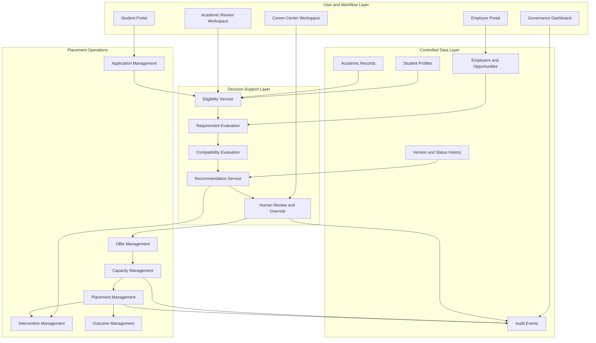

# Internship Placement and Matching System — Case Summary

## Case

Internship Placement and Matching System

## Domain

University Career Services and Internship Operations

## Case Status

Design Complete

## Case Type

Business Analysis, Decision-Support Design and System Analysis Case Study

## Executive Summary

This case study designs an explainable internship placement and matching system
for a university career center.

The case addresses a common operational problem: internship placement
activities are often distributed across emails, spreadsheets, forms,
department records, employer messages and student documents.

This fragmentation makes it difficult to:

- Determine whether students are academically eligible
- Maintain complete and current student profiles
- Structure employer requirements consistently
- Compare eligible students with suitable opportunities
- Track applications across different channels
- Manage opportunity capacity accurately
- Explain why a recommendation was generated
- Preserve human responsibility for final decisions
- Identify students who remain without a placement
- Connect placement recommendations with internship outcomes
- Produce reliable operational and governance reports

The proposed system introduces a unified decision-support workflow covering:

1. Student profile management
2. Academic eligibility evaluation
3. Employer verification
4. Internship opportunity approval
5. Application validation
6. Mandatory requirement evaluation
7. Multi-dimensional compatibility analysis
8. Explainable recommendation generation
9. Authorized human review
10. Controlled manual overrides
11. Placement offers
12. Capacity reservations
13. Final placement confirmation
14. Internship monitoring
15. Outcome evaluation
16. Unplaced-student intervention

The system does not automatically make final placement decisions.

Recommendations remain advisory and require authorized human review.

## Business Problem

The current internship placement process depends heavily on manual
coordination.

Information may be distributed across:

- Email attachments
- Shared spreadsheets
- Student information systems
- Online forms
- Employer websites
- Messaging applications
- Department records
- Paper documents
- Staff notes

This creates several connected problems.

### Fragmented Student Information

Student academic records, skills, preferences, documents and availability may
exist in different locations.

As a result:

- The same information is collected repeatedly.
- Old CV or profile versions may be used.
- Missing documents are discovered late.
- Staff manually transfer data between files.
- Students cannot clearly see whether their profiles are complete.

### Inconsistent Academic Eligibility

Departments may apply different academic conditions.

Eligibility may depend on:

- Enrollment status
- Academic program
- Academic year
- GPA
- Completed credits
- Required courses
- Internship period
- Previous internship completion
- Department approval

Without a structured rule model:

- Rules may be interpreted differently.
- Missing data may be treated as failure.
- Exceptions may be approved through informal email.
- Historical rule versions may be lost.
- Students may receive unclear explanations.

### Unstructured Employer Requirements

Employer requirements may be written as free text without distinguishing:

- Mandatory requirements
- Preferred qualifications
- Optional information

This may cause:

- Preferred qualifications to be treated as exclusions
- Mandatory conditions to be overlooked
- Inconsistent candidate comparison
- Difficulty explaining why a candidate was excluded
- Employer dissatisfaction with unsuitable applications

### Manual Matching

Career-center staff may compare candidates using:

- Spreadsheet filters
- CV review
- Personal notes
- Informal knowledge
- Email searches

This process is difficult to reproduce and audit.

It may also unintentionally favor students whose profiles are more familiar to
staff.

### Weak Capacity Management

Applications, recommendations, offers, reservations and placements may not be
distinguished clearly.

This creates a risk that:

- Capacity is allocated twice.
- Declined offers continue blocking positions.
- Employers receive too many accepted candidates.
- Available capacity is not visible.
- Students are offered opportunities that are already full.

### Limited Student Visibility

Students may not know:

- Whether they are eligible
- Which documents are missing
- Whether their application is being reviewed
- Why they were rejected
- Whether an offer is still valid
- Whether their placement is fully confirmed

### Delayed Intervention

Students with no active application, recommendation or offer may be identified
only near the academic deadline.

This may create:

- Emergency placement activity
- Missed internship requirements
- Graduation risk
- Unequal support
- Increased staff workload

## Project Objective

The objective of this case is to design a controlled internship placement
system that can:

- Standardize academic eligibility
- Maintain structured student profiles
- Verify employers
- Approve complete internship opportunities
- Validate applications before processing
- Separate mandatory requirements from preferences
- Evaluate compatible student-opportunity combinations
- Generate understandable recommendations
- Preserve human decision authority
- Manage opportunity capacity safely
- Prevent duplicate and conflicting placements
- Identify students requiring intervention
- Connect placements with final internship outcomes
- Support reliable KPI reporting
- Preserve privacy and auditability

## Scope

### Included

The case includes:

- Student placement profiles
- Student skills
- Student preferences
- Academic records
- Academic eligibility
- Academic exception requests
- Employer verification
- Employer representatives
- Internship opportunities
- Opportunity requirements
- Applications
- Requirement evaluations
- Match evaluations
- Recommendations
- Human review decisions
- Manual overrides
- Placement offers
- Capacity reservations
- Confirmed placements
- Placement cancellations
- Internship outcomes
- Student and employer evaluations
- Intervention cases
- Notifications and tasks
- KPI reporting
- Fairness and access monitoring
- Audit events

### Excluded

The case does not define a production implementation for:

- Payroll processing
- Internship compensation payment
- Employee onboarding
- Full recruitment management
- Legal contract generation
- Insurance processing
- Attendance hardware
- University course grading
- Employer human-resources systems
- Production database infrastructure
- Cloud deployment architecture
- Machine-learning model training
- Automated final placement decisions

## Stakeholders

The main stakeholders are:

### Students

Students need:

- Clear eligibility information
- Profile-completeness guidance
- Relevant opportunities
- Application visibility
- Explainable decisions
- Offer and placement status
- Support when no placement is available

### Employers

Employers need:

- Structured opportunity creation
- Suitable candidates
- Clear capacity status
- Controlled candidate access
- Timely communication
- Reliable placement confirmation

### Career-Center Specialists

Career-center staff need:

- One operational workflow
- Consistent statuses
- Reduced repetitive work
- Explainable recommendations
- Capacity visibility
- Intervention alerts
- Reliable reports

### Academic Advisors and Department Coordinators

Academic roles need:

- Versioned eligibility rules
- Controlled exception handling
- Department-scoped authority
- Placement suitability review
- Completion and academic-credit visibility

### Career-Center Management

Managers need:

- Placement-cycle performance
- Review-backlog visibility
- Employer performance
- Override monitoring
- Unplaced-student reporting
- Capacity and outcome information

### University Administration

University administration needs:

- Reliable institutional reporting
- Placement-rate monitoring
- Risk visibility
- Data protection
- Process accountability

### Privacy, Security and Audit Roles

Governance roles need:

- Purpose-based access
- Sensitive-data protection
- Decision traceability
- Export controls
- Small-group protection
- Rule and model versioning
- Audit evidence

## Proposed Solution

The proposed solution is a unified decision-support platform.

The platform connects students, academic units, employers and career-center
staff through one controlled placement lifecycle.

```mermaid
flowchart LR
    A[Student Profile] --> B[Academic Eligibility]
    B --> C[Application Validation]
    C --> D[Mandatory Requirement Evaluation]
    D --> E[Compatibility Evaluation]
    E --> F[Explainable Recommendation]
    F --> G[Human Review]
    G --> H[Placement Offer]
    H --> I[Capacity Reservation]
    I --> J[Student and Employer Decisions]
    J --> K[Final Placement]
    K --> L[Internship Monitoring]
    L --> M[Outcome Evaluation]

    N[Employer Verification] --> O[Opportunity Approval]
    O --> C

    P[Unplaced Student Detection] --> Q[Intervention Case]
    B --> P
    F --> P
    K --> P
```



## Future Process

### 1. Student Profile Creation

The student creates a placement profile containing:

- Skills
- Career interests
- Role preferences
- Industry preferences
- Location preferences
- Working-model preferences
- Availability
- Required documents

Authoritative academic information remains separate and cannot be edited
directly by the student.

### 2. Academic Eligibility Evaluation

The system evaluates approved academic rules.

Possible results are:

- Eligible
- Ineligible
- Review required
- Data incomplete

Every failed condition remains individually explainable.

### 3. Academic Exception Review

When policy permits an exception:

- A request is created.
- The exact failed rule is identified.
- Supporting evidence is attached.
- An authorized academic role makes the decision.
- Scope and validity dates are preserved.
- Eligibility is recalculated.

### 4. Employer Verification

An employer must be reviewed before publishing active opportunities.

Employer statuses include:

- Pending
- Active
- Restricted
- Suspended
- Rejected
- Inactive

Representatives may access only their own employer's approved records.

### 5. Opportunity Creation and Approval

Employers enter structured opportunity information, including:

- Role
- Responsibilities
- Industry
- Location
- Working model
- Internship dates
- Application deadline
- Capacity
- Mandatory requirements
- Preferred requirements
- Optional requirements

An opportunity becomes active only after required reviews are completed.

### 6. Application Validation

Before accepting an application, the system validates:

- Profile completeness
- Academic eligibility
- Opportunity status
- Application deadline
- Required documents
- Application limit
- Duplicate application
- Conflicting placement

### 7. Mandatory Requirement Evaluation

Mandatory requirements are evaluated before compatibility scoring.

A confirmed mandatory failure excludes the student-opportunity combination from
standard ranking.

Missing evidence remains distinct from a confirmed failure.

### 8. Compatibility Evaluation

Eligible combinations are evaluated across multiple dimensions:

- Skill compatibility
- Academic relevance
- Preferred requirement satisfaction
- Role preference alignment
- Industry preference alignment
- Location compatibility
- Working-model compatibility
- Internship-period compatibility
- Language compatibility

### 9. Confidence Evaluation

The system calculates confidence separately from compatibility.

Confidence considers:

- Profile completeness
- Academic-data freshness
- Skill evidence
- Requirement clarity
- Preference freshness
- Evidence completeness
- Data consistency

A high compatibility score with low confidence is displayed as uncertain rather
than fully reliable.

### 10. Recommendation Generation

The system creates an advisory recommendation containing:

- Eligibility evidence
- Requirement results
- Indicator values
- Overall compatibility
- Confidence
- Preferences
- Capacity
- Conflicts
- Data-quality warnings
- Rule version
- Model version
- Explanation

### 11. Human Review

An authorized reviewer may:

- Approve
- Reject
- Request information
- Place on hold
- Escalate
- Apply an authorized override

The system recommendation remains preserved separately.

### 12. Placement Offer

An approved recommendation may create a placement offer.

Creating the offer may reserve capacity temporarily.

An offer does not equal a confirmed placement.

### 13. Student and Employer Decisions

Student and employer decisions remain separate.

A student must explicitly accept.

No response is not treated as acceptance.

### 14. Final Placement Confirmation

Placement is confirmed only when all required conditions are satisfied.

These may include:

- Student acceptance
- Employer acceptance
- Career-center approval
- Academic approval
- Active opportunity
- Valid capacity reservation
- Required documents
- No conflicting placement
- Valid internship dates

### 15. Internship Monitoring and Outcome

The system records:

- Internship start
- Support incidents
- Material role changes
- Early termination
- Student evaluation
- Employer evaluation
- Completion
- Academic-credit result

Internship completion and academic-credit approval remain separate.

### 16. Student Intervention

The system identifies students at risk because of:

- No application
- No recommendation
- Repeated rejection
- Missing information
- Restrictive preferences
- No compatible opportunity
- Placement cancellation
- Approaching deadline

Staff receive structured intervention tasks.

## Matching Model

The proposed model uses staged evaluation.

### Stage 1: Academic Eligibility

A student must be academically eligible or have a valid approved exception.

### Stage 2: Mandatory Employer Requirements

Every mandatory requirement must pass.

A preferred qualification cannot compensate for a mandatory failure.

### Stage 3: Student Hard Constraints

The system evaluates required student constraints such as:

- Internship dates
- Location limits
- Working-model requirements
- Availability restrictions

### Stage 4: Compatibility Indicators

Only valid combinations receive compatibility indicators.

### Stage 5: Confidence and Operational Validation

Data reliability, capacity and conflicts are evaluated separately.

### Stage 6: Human-Reviewed Recommendation

The system creates an advisory result for an authorized reviewer.

## Default Compatibility Weights

| Dimension | Weight |
|---|---:|
| Skill Compatibility | 25% |
| Academic Relevance | 15% |
| Preferred Requirement Satisfaction | 15% |
| Role Preference Alignment | 10% |
| Industry Preference Alignment | 10% |
| Location Compatibility | 8% |
| Working-Model Compatibility | 7% |
| Internship-Period Compatibility | 5% |
| Language Compatibility | 5% |
| **Total** | **100%** |

These weights are illustrative and require stakeholder approval before real
institutional use.

## Core Design Decisions

### Eligibility Is Separate From Compatibility

Academic eligibility and mandatory requirements act as gates.

Compatibility scoring begins only after the gates pass.

This prevents a strong preferred qualification from compensating for an
invalid academic or mandatory condition.

### Recommendation Is Separate From Decision

The system recommendation and human decision are modeled independently.

A reviewer may disagree with the system, but the original recommendation must
remain visible.

### Offer Is Separate From Placement

An offer records a proposed internship arrangement.

A placement is created only after all required responses and approvals are
complete.

### Reservation Is Separate From Confirmed Capacity

A pending offer may reserve capacity temporarily.

A confirmed placement consumes capacity.

A declined or expired offer releases the reservation.

### Compatibility Is Separate From Confidence

Compatibility describes how well available information aligns.

Confidence describes how reliable that information is.

### Student Preferences Are Separate From Employer Requirements

Employer requirements determine opportunity suitability.

Student preferences determine whether an otherwise valid opportunity aligns
with the student's goals and constraints.

### Internship Completion Is Separate From Academic Credit

A completed internship may still require a separate academic assessment.

### Historical Decisions Are Versioned

Important records preserve:

- Rule version
- Model version
- Profile version
- Preference version
- Opportunity version
- Requirement version
- Decision version

## Conceptual Data Model

The conceptual model includes the following main entity groups.

### Student and Academic Data

- Student
- Student Profile
- Student Academic Record
- Academic Program
- Student Skill
- Student Preference
- Student Document
- Placement Cycle

### Eligibility

- Academic Eligibility Evaluation
- Eligibility Rule Result
- Academic Exception Request

### Employer and Opportunity

- Employer
- Employer Representative
- Internship Opportunity
- Opportunity Requirement
- Document Requirement

### Application and Matching

- Application
- Application Status History
- Requirement Evaluation
- Match Evaluation
- Match Indicator
- Placement Recommendation
- Recommendation Evidence

### Human Decision and Offer

- Placement Decision
- Manual Override
- Placement Offer
- Capacity Reservation

### Placement and Outcome

- Placement
- Placement Status History
- Placement Cancellation
- Internship Outcome
- Student Internship Evaluation
- Employer Internship Evaluation

### Operations and Governance

- Intervention Case
- Audit Event
- Rule Configuration Version

## API Design

The OpenAPI contract defines operations for:

- Retrieving and updating student profiles
- Managing student skills and preferences
- Evaluating academic eligibility
- Requesting and deciding academic exceptions
- Registering and reviewing employers
- Creating and approving opportunities
- Managing structured opportunity requirements
- Retrieving opportunity capacity
- Submitting and withdrawing applications
- Evaluating mandatory requirements
- Calculating compatibility
- Generating recommendations
- Recording human decisions
- Creating manual overrides
- Creating placement offers
- Recording student and employer responses
- Expiring offers
- Confirming placements
- Cancelling placements
- Recording internship outcomes
- Managing intervention cases

The contract includes:

- Controlled status values
- Idempotency support
- Optimistic concurrency
- Business-rule error structures
- Pagination
- Authorization expectations
- Resource version handling

## Capacity Model

Opportunity capacity is calculated using:

```text
Available Capacity =
Total Capacity
- Confirmed Placements
- Active Reservations
```

Applications do not consume capacity.

Recommendations do not consume capacity.

Capacity must never become negative.

Concurrent attempts to reserve the final available position must allow only one
successful transaction.

## Human Review and Overrides

The system retains human accountability.

### Human Review

Every final recommendation decision records:

- Reviewer
- Decision
- Reason category
- Detailed explanation
- Timestamp
- Recommendation version
- Supporting evidence

### Manual Override

An override records:

- Original system result
- Final human result
- Override category
- Detailed justification
- Supporting evidence
- Reviewer
- Secondary approver when required
- Validity period

High-impact overrides may require two authorized users.

## Risk and Control Approach

The major risks identified in the case include:

- Incorrect academic eligibility
- Eligible students excluded because of missing data
- Unauthorized academic exceptions
- Unsafe or unverified employers
- Invalid opportunities
- Incorrect mandatory requirement evaluation
- Unexplained recommendations
- Excessive reliance on compatibility scores
- Recommendation concentration
- Hidden or sensitive matching factors
- Capacity over-allocation
- Expired reservations
- Conflicting placements
- Unauthorized overrides
- Excessive employer access
- Sensitive-data misuse
- Unauthorized accounts
- Bulk data export
- Integration failure
- Notification failure
- Unplaced students
- Overwritten decision history
- Inconsistent KPI definitions
- Small-group privacy exposure
- Recovery failure

The proposed control framework combines:

- Preventive validation
- Detective monitoring
- Corrective workflows
- Role-based permissions
- Segregation of duties
- Versioning
- Audit events
- Reconciliation
- Privacy controls
- Fairness review
- Incident escalation
- Recovery testing

## Key Controls

Important controls include:

- Academic rule versioning
- Authoritative data sources
- Employer verification
- Opportunity approval
- Structured requirements
- Application uniqueness
- Mandatory evaluation before scoring
- Recommendation evidence
- Human decision requirement
- Capacity transaction control
- Date-overlap validation
- Override authorization
- Secondary approval
- Purpose-based employer access
- Sensitive-feature prohibition
- Student intervention alerts
- Small-group suppression
- Immutable audit history
- Backup and recovery reconciliation

## KPI Framework

The case defines KPIs across the full placement lifecycle.

### Participation

- Placement cycle participation rate
- Profile completion rate
- Missing document rate

### Eligibility

- Academic eligibility rate
- Academic ineligibility rate
- Review-required rate
- Data-incomplete rate
- Exception approval rate

### Opportunity Supply

- Active opportunity count
- Total capacity
- Opportunity-to-student ratio
- Approval rate
- Cancellation rate
- Opportunity diversity

### Applications

- Applications per student
- Application submission rate
- Validation failure rate
- Withdrawal rate
- Employer-review conversion

### Matching

- Mandatory requirement pass rate
- Average compatibility
- High-compatibility rate
- Low-confidence rate
- Recommendation generation rate
- No-recommendation rate
- Recommendation approval rate
- Recommendation-to-placement conversion
- Recommendation effectiveness

### Offers and Placements

- Offer acceptance
- Offer expiration
- Employer confirmation
- Student response time
- Placement rate
- Unplaced student rate
- Placement cancellation
- Duplicate placement conflicts

### Capacity

- Capacity utilization
- Available capacity
- Reserved capacity
- Reservation expiration
- Capacity release time
- Capacity conflict attempts

### Outcomes

- Internship completion
- Successful completion
- Early termination
- Academic-credit approval
- Student satisfaction
- Employer satisfaction
- Placement relevance

### Governance

- Manual override rate
- High-impact override rate
- Secondary approval compliance
- Decision reason completeness
- Audit completeness
- Appeal and reversal rates

### Fairness and Access

- Placement rate by academic program
- Recommendation rate by program
- No-recommendation rate
- Opportunity access
- Recommendation concentration
- Employer rejection differences
- Intervention case rate

Fairness KPIs support investigation.

They do not automatically prove unfair treatment.

## Analytical SQL

The case includes a PostgreSQL-oriented analytical query library.

The queries cover:

- Profile readiness
- Eligibility distribution
- Eligibility failure reasons
- Academic exceptions
- Opportunity supply
- Capacity reconciliation
- Applications
- Mandatory requirement results
- Match-score distribution
- Confidence distribution
- Recommendation approval
- Students with no recommendation
- Recommendation concentration
- Offer conversion
- Response times
- Placement rates
- Employer fill rates
- Employer acceptance
- Placement cancellations
- Internship outcomes
- Recommendation effectiveness
- Manual overrides
- Intervention backlog
- Data quality
- Fairness review
- Duplicate applications
- Overlapping placements
- Audit completeness
- Executive scorecards

The SQL remains an analytical design artifact and would require adaptation to a
physical production schema.

## Test Strategy

The case defines test scenarios for:

- Student profiles
- Academic eligibility
- Boundary values
- Academic exceptions
- Employers
- Opportunities
- Applications
- Mandatory requirements
- Matching calculations
- Confidence handling
- Recommendation explanations
- Human review
- Manual overrides
- Capacity
- Concurrent reservations
- Offers
- Placements
- Outcomes
- Intervention
- Authorization
- Privacy
- Auditability
- Integrations
- KPI reporting
- Recovery
- End-to-end workflows
- Negative and abuse cases

Critical tests include:

- GPA boundary evaluation
- Deadline boundary evaluation
- Missing-data handling
- Mandatory requirement failure
- Compatibility calculation
- Weight-total validation
- Human-review authorization
- Secondary override approval
- Negative-capacity prevention
- Concurrent final-position reservation
- Overlapping placement prevention
- Sensitive-data exclusion
- Duplicate integration processing
- Small-group reporting suppression
- Backup recovery reconciliation

## Main Process Improvements

| Current State | Proposed State |
|---|---|
| Multiple spreadsheets | Unified controlled records |
| Repeated profile collection | Versioned student profile |
| Manual academic checks | Versioned eligibility evaluation |
| Informal exceptions | Authorized exception workflow |
| Free-text employer requirements | Structured mandatory and preferred requirements |
| Manual candidate comparison | Explainable multi-dimensional evaluation |
| No recommendation evidence | Indicator and evidence records |
| Recommendation treated as decision | Separate system result and human decision |
| Manual capacity tracking | Transactional reservation and placement capacity |
| Offer confused with placement | Separate offer and final confirmation |
| Late identification of unplaced students | Automated intervention alerts |
| Overwritten decision history | Versioning and audit events |
| Manual KPI aggregation | Defined formulas and analytical queries |
| Limited fairness visibility | Contextual fairness and access monitoring |

## Expected Business Value

### For Students

- Clearer eligibility
- Fewer repeated submissions
- More relevant opportunities
- Transparent application status
- Understandable decisions
- Better deadline support
- Earlier intervention

### For Employers

- Better structured opportunities
- Fewer invalid candidates
- More suitable candidate lists
- Accurate position capacity
- Clear offer status
- Better university communication

### For Career-Center Staff

- Reduced repetitive administration
- Standard workflows
- Better case prioritization
- Explainable recommendations
- Capacity visibility
- Reliable reporting
- Complete decision history

### For Academic Units

- Consistent academic rules
- Controlled exceptions
- Clear decision ownership
- Reduced invalid placement requests
- Better outcome visibility

### For University Management

- Reliable placement-cycle reporting
- Employer performance monitoring
- Operational risk visibility
- Fairness and access indicators
- Auditable decision processes

## Success Criteria

The proposed system design is successful when:

- Student profiles are complete and versioned.
- Academic eligibility is evaluated consistently.
- Missing data is distinguished from failure.
- Academic exceptions require proper authority.
- Employers are verified.
- Opportunities use structured requirements.
- Mandatory rules are evaluated before compatibility.
- Student preferences remain distinct from eligibility.
- Recommendations are explainable.
- Compatibility and confidence remain separate.
- Final decisions require authorized human review.
- Manual overrides preserve original results.
- Opportunity capacity cannot become negative.
- Expired offers release reservations.
- Conflicting placements are prevented.
- Unplaced students are detected early.
- Placement outcomes remain connected to recommendations.
- Sensitive information is protected.
- Historical decisions remain auditable.
- KPI definitions are reproducible and versioned.
- Small groups receive privacy protection.

## Limitations

This case is a system-design and business-analysis exercise.

It does not represent a deployed university system.

The case does not include:

- A running web application
- A physical production database
- Real student or employer data
- Real institutional policy approval
- Production security configuration
- Infrastructure deployment
- A trained machine-learning model
- Live integration with a university system
- Legal validation for a specific jurisdiction
- Completed user research with a real university

The matching weights, thresholds and service-level targets are illustrative.

They require validation by:

- Students
- Employers
- Career-center staff
- Academic representatives
- Privacy specialists
- Security specialists
- Accessibility specialists
- University governance roles

## Assumptions Requiring Validation

The design assumes that:

- The university can provide authoritative academic records.
- Academic eligibility rules can be structured.
- Employers can classify requirements.
- Student preferences can be collected using controlled values.
- Career-center staff will review recommendations.
- Opportunity capacity can be maintained centrally.
- Important status changes can produce audit events.
- Required stakeholders will approve KPI definitions.
- Privacy governance will define retention and small-group thresholds.

## Portfolio Relevance

This case demonstrates practical capability across several areas.

### Business Analysis

- Problem framing
- Scope definition
- Stakeholder analysis
- Current-state analysis
- Future-state process design
- Requirement specification
- Business-rule definition

### Systems Analysis

- Entity modeling
- Status modeling
- Process dependencies
- Data-quality rules
- Integration requirements
- API contract design
- Traceability

### Decision-Support Design

- Eligibility gates
- Multi-dimensional compatibility
- Confidence calculation
- Explainability
- Human review
- Controlled overrides
- Fairness monitoring

### Data and Analytics

- KPI design
- Numerator and denominator definition
- Funnel analysis
- Capacity reporting
- Outcome analysis
- Analytical SQL
- Data-quality monitoring

### Risk and Governance

- Risk registers
- Preventive controls
- Detective controls
- Corrective controls
- Segregation of duties
- Privacy design
- Auditability
- Recovery planning

### Quality Assurance

- Boundary testing
- Authorization testing
- Concurrency testing
- Integration testing
- End-to-end scenarios
- KPI validation
- Recovery testing

## Case Deliverables

| File | Purpose |
|---|---|
| `README.md` | Case overview and navigation |
| `01-problem-brief.md` | Business problem, objectives and boundaries |
| `02-stakeholders.md` | Stakeholder goals, authority and conflicts |
| `03-requirements.md` | Functional, non-functional and governance requirements |
| `04-as-is-process.md` | Current manual process and weaknesses |
| `05-to-be-process.md` | Proposed future workflow |
| `06-business-rules.md` | Detailed business and governance rules |
| `07-data-model.md` | Conceptual entities and relationships |
| `08-matching-model.md` | Eligibility gates, scoring and explainability |
| `09-api-contract.yml` | OpenAPI contract |
| `10-kpi-framework.md` | Operational, outcome and governance KPIs |
| `11-analytics.sql` | Analytical SQL query library |
| `12-risk-controls.md` | Risk register and control framework |
| `13-test-scenarios.md` | Functional, control and end-to-end tests |
| `14-case-summary.md` | Final case summary |

## Final Architecture View



## Final Conclusion

The Internship Placement and Matching System case demonstrates how a complex
university placement process can be transformed into a structured,
explainable and auditable decision-support workflow.

The central design principle is separation.

The case separates:

- Student-editable information from authoritative academic data
- Academic eligibility from opportunity compatibility
- Mandatory requirements from preferred qualifications
- Student constraints from ranking preferences
- Compatibility from confidence
- System recommendations from human decisions
- Offers from confirmed placements
- Reservations from consumed capacity
- Internship completion from academic-credit approval
- Fairness indicators from automatic conclusions

This separation prevents a single score or status from hiding the real
placement process.

The proposed system combines automation with human responsibility.

Automation supports:

- Validation
- Rule evaluation
- Compatibility calculation
- Capacity management
- Alerts
- Reporting
- Audit evidence

Human roles remain responsible for:

- Academic exceptions
- Opportunity approval
- Recommendation review
- Manual overrides
- Final placement decisions
- Fairness investigation
- Governance actions

The result is not an autonomous placement engine.

It is a controlled decision-support design that improves consistency,
transparency, operational visibility and accountability while preserving
authorized human judgment.
