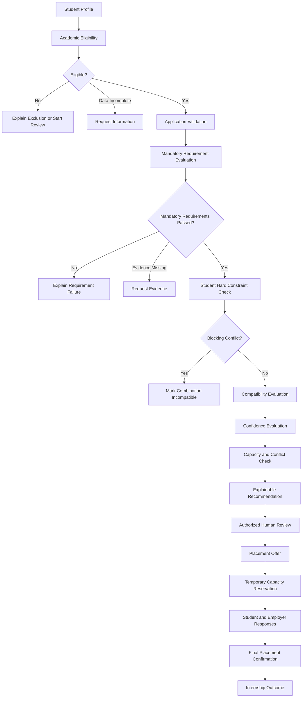

# Internship Placement and Matching System

## Status

**Completed**

## Case Type

Business Analysis, System Design and Explainable Decision-Support Case Study

## Domain

University Career Services and Internship Operations

## Overview

This case study designs an explainable internship placement and matching system
for a university career center.

The proposed system brings together:

- Student placement profiles
- Authoritative academic records
- Academic eligibility rules
- Employer verification
- Internship opportunities
- Structured employer requirements
- Student applications
- Compatibility evaluations
- Explainable recommendations
- Human review decisions
- Placement offers
- Capacity reservations
- Confirmed placements
- Internship outcomes
- Student intervention cases
- Operational and governance reporting

The central design principle is that the system supports placement decisions
without making final placement decisions autonomously.

Academic eligibility, employer requirements, compatibility, confidence,
capacity and human approval remain separate and traceable.

## Business Problem

Internship placement processes are frequently managed through disconnected
tools and communication channels such as:

- Email
- Spreadsheets
- Online forms
- Student information systems
- Employer messages
- Shared documents
- Department records
- Staff notes

This fragmentation may create:

- Repeated collection of student information
- Inconsistent academic eligibility decisions
- Unstructured employer requirements
- Manual candidate comparison
- Limited application visibility
- Capacity conflicts
- Unexplained recommendations
- Informal exception handling
- Delayed identification of unplaced students
- Inconsistent performance reporting
- Weak historical traceability

## Project Objective

The objective of this case is to design a controlled system that can:

1. Maintain structured and versioned student profiles.
2. Evaluate academic eligibility consistently.
3. Support authorized academic exceptions.
4. Verify employers before opportunity publication.
5. Structure mandatory, preferred and optional requirements.
6. Validate applications before processing.
7. Compare valid student-opportunity combinations.
8. Generate explainable placement recommendations.
9. Preserve authorized human decision-making.
10. Prevent capacity over-allocation.
11. Prevent conflicting confirmed placements.
12. Identify students requiring intervention.
13. Connect recommendations with placement outcomes.
14. Support reliable operational and governance reporting.
15. Protect personal and sensitive information.

## Main Stakeholders

| Stakeholder | Primary Need |
|---|---|
| Students | Clear eligibility, relevant opportunities and transparent status |
| Employers | Structured opportunities and suitable candidates |
| Career-Center Specialists | One controlled operational workflow |
| Career-Center Manager | Placement-cycle performance and risk visibility |
| Academic Advisors | Consistent eligibility and exception handling |
| Department Coordinators | Academic suitability and placement oversight |
| University Administration | Reliable institutional reporting |
| IT Team | Maintainable services and controlled integrations |
| Privacy Team | Purpose-based processing and data minimization |
| Information Security | Authentication, authorization and monitoring |
| Internal Audit | Traceable rules, decisions and overrides |

## Proposed Decision Flow



## Core Design Principles

### Eligibility Before Scoring

Academic eligibility and mandatory employer requirements act as gates.

A high compatibility score cannot compensate for:

- Academic ineligibility
- Failed mandatory requirement
- Missing mandatory evidence
- Invalid employer status
- Invalid opportunity
- Blocking placement conflict

### Compatibility Is Advisory

Compatibility evaluates how well an eligible student aligns with an
opportunity.

It does not represent:

- General student quality
- Guaranteed internship success
- Employer acceptance
- Academic approval
- Final placement confirmation

### Confidence Is Separate

The system displays compatibility and confidence independently.

Example:

```text
Compatibility score: 88
Confidence level: 57
```

This means the available information indicates strong alignment, but additional
verification may be required.

### Human Review Is Required

Recommendations remain advisory.

Authorized reviewers may:

- Approve
- Reject
- Request additional information
- Place a recommendation on hold
- Escalate a case
- Apply an authorized override

The original system recommendation remains preserved.

### Capacity Is Transactionally Controlled

Applications and recommendations do not consume opportunity capacity.

An approved placement offer may create a temporary reservation.

A confirmed placement consumes capacity.

```text
Available Capacity =
Total Capacity
- Confirmed Placements
- Active Reservations
```

Available capacity must never become negative.

### Historical Decisions Are Preserved

Important records retain:

- Academic rule version
- Opportunity requirement version
- Student profile version
- Student preference version
- Matching-model version
- Human decision version
- Offer version
- Placement status history

## Matching Dimensions

The illustrative matching model evaluates nine dimensions.

| Dimension | Default Weight |
|---|---:|
| Skill Compatibility | 25% |
| Academic Relevance | 15% |
| Preferred Requirement Satisfaction | 15% |
| Role Preference Alignment | 10% |
| Industry Preference Alignment | 10% |
| Location Compatibility | 8% |
| Working-Model Compatibility | 7% |
| Internship-Period Compatibility | 5% |
| Language Compatibility | 5% |
| **Total** | **100%** |

These weights are proposed case-study values and require stakeholder validation
before institutional use.

## Recommendation Output

An explainable recommendation may contain:

- Academic eligibility result
- Mandatory requirement results
- Compatibility indicators
- Overall compatibility score
- Confidence level
- Student preference alignment
- Capacity status
- Conflict status
- Data-quality warnings
- Recommendation rank
- Rule-set version
- Matching-model version
- Human-readable explanation

Example:

```yaml
recommendation_status: recommended
compatibility_score: 90.50
confidence_level: 94
mandatory_requirements_passed: true
hard_constraint_conflict: false
capacity_status: available
human_review_required: true
```

## Main Entities

The conceptual data model includes:

### Student and Academic Entities

- Student
- Student Profile
- Student Academic Record
- Academic Program
- Student Skill
- Student Preference
- Student Document
- Placement Cycle

### Employer and Opportunity Entities

- Employer
- Employer Representative
- Internship Opportunity
- Opportunity Requirement
- Document Requirement

### Evaluation and Recommendation Entities

- Academic Eligibility Evaluation
- Eligibility Rule Result
- Academic Exception Request
- Requirement Evaluation
- Match Evaluation
- Match Indicator
- Placement Recommendation
- Recommendation Evidence

### Decision and Placement Entities

- Placement Decision
- Manual Override
- Placement Offer
- Capacity Reservation
- Placement
- Placement Status History
- Placement Cancellation
- Internship Outcome

### Operations and Governance Entities

- Intervention Case
- Audit Event
- Rule Configuration Version

## API Scope

The OpenAPI contract covers operations for:

- Student profiles, skills and preferences
- Academic eligibility evaluations
- Academic exception requests
- Employer registration and status decisions
- Opportunity and requirement management
- Application submission and withdrawal
- Requirement evaluations
- Compatibility calculations
- Recommendation generation
- Human decisions and overrides
- Placement offers
- Student and employer responses
- Capacity reservations
- Final placements
- Placement cancellations
- Internship outcomes
- Intervention cases

The API design also includes:

- Idempotency support
- Optimistic concurrency
- Controlled status values
- Structured business-rule errors
- Pagination
- Resource versioning
- Authorization boundaries

## KPI Categories

The case defines measurable indicators for:

- Student participation
- Profile readiness
- Academic eligibility
- Opportunity supply
- Application activity
- Mandatory requirement performance
- Compatibility and confidence
- Recommendation generation
- Offer conversion
- Student placement
- Capacity utilization
- Employer participation
- Internship completion
- Student intervention
- Manual overrides
- Fairness and access
- Data quality
- Auditability
- System reliability

Examples include:

- Profile Completion Rate
- Academic Eligibility Rate
- Opportunity-to-Eligible-Student Ratio
- Application Submission Rate
- Mandatory Requirement Pass Rate
- Students With No Recommendation Rate
- Recommendation Approval Rate
- Offer Acceptance Rate
- Student Placement Rate
- Capacity Utilization Rate
- Successful Completion Rate
- Manual Override Rate
- Recommendation Concentration Rate
- Audit Event Completeness Rate

## Key Risks

The risk framework covers:

- Incorrect academic eligibility
- Missing or stale academic data
- Unauthorized academic exceptions
- Unverified employers
- Invalid opportunities
- Incorrect requirement evaluation
- Unexplained recommendations
- Excessive reliance on scores
- Recommendation concentration
- Sensitive information used in matching
- Capacity over-allocation
- Expired reservations
- Conflicting placements
- Unauthorized overrides
- Excessive employer data access
- Bulk exports
- Integration failures
- Notification failures
- Unplaced students
- Overwritten decision history
- Inconsistent KPI definitions
- Small-group privacy exposure
- Recovery failure

## Key Controls

Important controls include:

- Versioned academic rules
- Authoritative academic data
- Employer verification
- Opportunity approval
- Structured requirements
- Application uniqueness
- Eligibility before scoring
- Explainable recommendation evidence
- Mandatory human review
- Override authorization
- Secondary approval
- Atomic capacity reservation
- Placement date-overlap validation
- Purpose-based access
- Small-group report suppression
- Immutable audit events
- Intervention alerts
- Backup and recovery reconciliation

## Testing Coverage

The test strategy includes:

- Normal workflow tests
- Boundary-value tests
- Eligibility tests
- Academic exception tests
- Authorization tests
- Employer-isolation tests
- Requirement evaluation tests
- Compatibility calculation tests
- Confidence tests
- Explanation tests
- Override tests
- Capacity concurrency tests
- Offer lifecycle tests
- Placement conflict tests
- Privacy tests
- Integration retry tests
- KPI calculation tests
- Recovery tests
- End-to-end placement scenarios
- Negative and abuse tests

## Case Deliverables

| File | Description |
|---|---|
| [`01-problem-brief.md`](01-problem-brief.md) | Defines the business problem, objectives, scope and constraints |
| [`02-stakeholders.md`](02-stakeholders.md) | Analyzes stakeholder goals, authority, responsibilities and conflicts |
| [`03-requirements.md`](03-requirements.md) | Defines functional, non-functional, integration and governance requirements |
| [`04-as-is-process.md`](04-as-is-process.md) | Maps the current manual internship placement process |
| [`05-to-be-process.md`](05-to-be-process.md) | Designs the proposed future-state workflow |
| [`06-business-rules.md`](06-business-rules.md) | Defines eligibility, matching, capacity, placement and governance rules |
| [`07-data-model.md`](07-data-model.md) | Defines the conceptual entities, fields and relationships |
| [`08-matching-model.md`](08-matching-model.md) | Defines matching gates, indicators, formulas and explainability |
| [`09-api-contract.yml`](09-api-contract.yml) | Provides the OpenAPI contract for the proposed services |
| [`10-kpi-framework.md`](10-kpi-framework.md) | Defines operational, outcome and governance KPIs |
| [`11-analytics.sql`](11-analytics.sql) | Provides a PostgreSQL-oriented analytical SQL library |
| [`12-risk-controls.md`](12-risk-controls.md) | Defines risks, controls, ownership and monitoring |
| [`13-test-scenarios.md`](13-test-scenarios.md) | Defines functional, control and end-to-end test scenarios |
| [`14-case-summary.md`](14-case-summary.md) | Summarizes the complete case and its expected value |
| [`ADR-001`](adr/adr-001-separate-eligibility-from-scoring.md) | Records the decision to separate eligibility from compatibility scoring |

## Expected Business Value

### Students

- Clearer eligibility results
- Better application visibility
- More relevant recommendations
- Understandable decision explanations
- Earlier support before deadlines

### Employers

- Structured opportunity definitions
- More suitable candidate submissions
- Accurate capacity information
- Controlled access to candidate information
- Clear offer and placement status

### Career-Center Staff

- Reduced repetitive administration
- Consistent workflows
- Better review prioritization
- Explainable recommendations
- Reliable intervention alerts
- Improved reporting

### Academic Units

- Versioned eligibility rules
- Controlled academic exceptions
- Clear decision authority
- Traceable academic approvals
- Better outcome visibility

### University Management

- Placement-cycle scorecards
- Employer-performance monitoring
- Capacity visibility
- Governance and override reporting
- Fairness and access indicators
- Auditable placement decisions

## Limitations

This repository contains a system-design case study.

It does not include:

- A deployed application
- A physical production database
- Real student or employer data
- Live university integrations
- A trained machine-learning model
- Production infrastructure
- Institution-approved matching weights
- Jurisdiction-specific legal validation

All thresholds, weights and service targets are illustrative and require
stakeholder validation before real implementation.

## Skills Demonstrated

- Business analysis
- Stakeholder analysis
- Requirements engineering
- Process modeling
- Business-rule design
- Conceptual data modeling
- Decision-support design
- Explainable scoring
- API design
- SQL analytics
- KPI development
- Risk assessment
- Privacy and security analysis
- Control design
- Test planning
- Architecture decision records

## Final Design Statement

The Internship Placement and Matching System is designed as a controlled
decision-support platform rather than an autonomous placement engine.

The design separates:

- Eligibility from compatibility
- Mandatory requirements from preferences
- Compatibility from confidence
- Recommendations from human decisions
- Offers from confirmed placements
- Reservations from consumed capacity
- Internship completion from academic-credit approval
- Fairness indicators from automatic conclusions

This separation improves consistency, explainability, accountability,
auditability and operational control throughout the internship placement
lifecycle.
