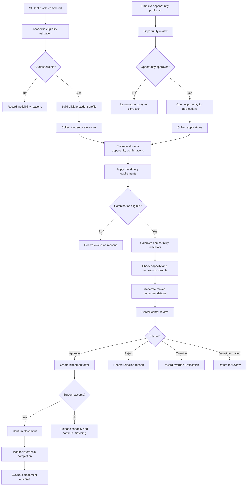

# Internship Placement and Matching System

## Case Status

**In Progress**

## Overview

This case study designs an explainable internship placement and matching system
for a university career center.

The proposed system helps students, employers and university staff manage the
complete internship-placement process.

It evaluates:

- Student eligibility
- Academic program requirements
- Skills and interests
- Employer requirements
- Internship capacity
- Location preferences
- Working-model preferences
- Application limits
- Previous placements
- Fairness constraints
- Human review decisions

The system generates ranked placement recommendations but does not make final
placements automatically.

Authorized career-center staff review the recommendations before confirming a
student-employer match.

## Business Problem

Universities often manage internship applications using spreadsheets, email
messages, application forms and manual comparisons.

This creates several operational problems:

- Students apply to positions for which they are not academically eligible.
- Employers receive applications that do not meet their requirements.
- Career-center staff compare large numbers of applications manually.
- Student preferences are not evaluated consistently.
- Internship capacities are difficult to track.
- Some students receive multiple opportunities while others receive none.
- Placement decisions may be difficult to explain.
- Application deadlines and required documents may be missed.
- Conflicts between university rules and employer conditions may be detected
  too late.
- Historical placement outcomes are not used systematically.

## Proposed Solution

The proposed system converts student, employer and internship information into
structured and explainable placement recommendations.

The general process is:

1. Register students, employers and internship opportunities.
2. Validate academic and administrative eligibility.
3. Collect student preferences and employer requirements.
4. Calculate compatibility indicators.
5. Remove ineligible student-opportunity combinations.
6. rank eligible combinations using documented matching rules.
7. Detect capacity, fairness and conflict conditions.
8. Present recommendations and supporting evidence to career-center staff.
9. Record approval, rejection or override decisions.
10. Monitor placement acceptance and completion outcomes.

## Main Users

### Students

Students use the system to:

- Maintain their profile
- Enter skills and interests
- Upload or reference required documents
- Review internship opportunities
- Submit ranked preferences
- Track application status
- Accept or decline placement offers
- Report internship outcomes

### Employers

Employers use the system to:

- Maintain company information
- Publish internship opportunities
- Define required and preferred qualifications
- Set capacity and working conditions
- Review eligible candidates
- Submit candidate evaluations
- Confirm accepted placements

### Career Center Staff

Career-center staff use the system to:

- Validate opportunities
- Review student eligibility
- Monitor application volume
- Review matching recommendations
- Resolve conflicts
- Apply documented overrides
- Confirm placements
- Monitor unplaced students
- Produce institutional reports

### Academic Departments

Academic departments use the system to:

- Define internship requirements
- Confirm academic eligibility
- Review internship relevance
- Approve exceptional placements
- Monitor department-level placement outcomes

### University Administration

University administration uses the system to:

- Monitor placement rates
- Compare departments
- Evaluate employer participation
- Review fairness indicators
- Identify capacity shortages
- Support policy decisions

## Main Objectives

The system should:

- Reduce manual application comparison
- Prevent academically invalid placements
- Improve student-opportunity compatibility
- Respect employer capacity
- Preserve student preferences
- Identify students at risk of remaining unplaced
- Make recommendations explainable
- Support fair and auditable placement decisions
- Track the complete placement lifecycle
- Measure placement quality and completion outcomes

## Scope

The case covers:

- Student profile management
- Academic eligibility
- Employer management
- Internship-opportunity management
- Student preferences
- Employer requirements
- Candidate screening
- Compatibility scoring
- Placement recommendations
- Human review
- Capacity management
- Offer acceptance
- Placement confirmation
- Completion monitoring
- Fairness and risk controls
- Reporting and analytics

## Out of Scope

The initial design does not include:

- Payroll management
- Employee contracts
- Immigration or work-permit processing
- Automatic legal approval
- Real-time labor-market forecasting
- Fully autonomous placement decisions
- Employer payroll integrations
- Production identity-verification services

These areas may be referenced as external dependencies when necessary.

## Core Decision Questions

The system should help answer:

- Is the student academically eligible for this internship?
- Does the student meet the employer's mandatory requirements?
- How well do the student's skills match the opportunity?
- Does the opportunity satisfy the student's preferences?
- Is there remaining employer capacity?
- Has the student exceeded the application or placement limit?
- Would the recommendation create an unfair concentration of opportunities?
- Is a human override required?
- Which students are at risk of remaining unplaced?
- Did the final placement result in successful internship completion?

## Matching Dimensions

The proposed matching model considers multiple dimensions.

### Academic Eligibility

Examples include:

- Academic department
- Current year of study
- Minimum GPA
- Required completed courses
- Internship-credit eligibility
- Department approval
- Previous mandatory internship completion

### Student Skills

Examples include:

- Technical skills
- Business skills
- Language proficiency
- Software knowledge
- Certifications
- Project experience
- Communication skills

### Employer Requirements

Requirements may be classified as:

- Mandatory
- Preferred
- Optional

A student who does not meet a mandatory requirement may be excluded from the
eligible candidate pool.

### Student Preferences

Preferences may include:

- Industry
- Role type
- City
- Remote, hybrid or on-site work
- Internship period
- Company size
- Paid or unpaid opportunity
- Language of work
- Preferred employers
- Unacceptable conditions

### Operational Constraints

The matching process must also consider:

- Employer capacity
- Application deadlines
- Internship dates
- Schedule conflicts
- University application limits
- Previously accepted offers
- Department placement quotas
- Required documentation
- Employer suspension status

## Recommendation Principles

The matching system follows these principles:

### Eligibility Before Ranking

Ineligible combinations must be removed before compatibility ranking.

A high skill match cannot compensate for a mandatory eligibility failure.

### Mandatory and Preferred Requirements

Mandatory requirements act as exclusion conditions.

Preferred requirements contribute to compatibility but do not automatically
exclude the student.

### Preference Awareness

Student preferences should influence recommendations.

The system should not treat all eligible opportunities as equally desirable to
the student.

### Explainability

Every recommendation should show:

- Eligibility result
- Matching factors
- Missing preferred qualifications
- Satisfied mandatory requirements
- Student preference alignment
- Employer capacity
- Final recommendation status

### Human Review

The system recommends placements but does not confirm them automatically.

Authorized staff may:

- Approve a recommendation
- Reject a recommendation
- Request additional information
- Apply an override
- Place the recommendation on hold

### Auditability

Every important action should preserve:

- Responsible user
- Timestamp
- Previous status
- New status
- Decision reason
- Related student
- Related opportunity

## High-Level Placement Workflow

## Planned Case Documents

| No. | Document | Purpose |
|---:|---|---|
| 01 | `01-problem-brief.md` | Define the placement problem and institutional impact |
| 02 | `02-stakeholders.md` | Analyze students, employers, departments and career-center roles |
| 03 | `03-requirements.md` | Document functional and non-functional requirements |
| 04 | `04-as-is-process.md` | Model the current manual application and placement process |
| 05 | `05-to-be-process.md` | Design the proposed placement workflow |
| 06 | `06-business-rules.md` | Define eligibility, capacity, ranking and override rules |
| 07 | `07-data-model.md` | Model students, opportunities, applications and placements |
| 08 | `08-matching-model.md` | Define compatibility dimensions and recommendation logic |
| 09 | `09-api-contract.yml` | Design student, opportunity and placement API operations |
| 10 | `10-kpi-framework.md` | Define placement, fairness and operational KPIs |
| 11 | `11-analytics.sql` | Add application, matching and placement analysis queries |
| 12 | `12-risk-controls.md` | Define fairness, privacy, data and decision controls |
| 13 | `13-test-scenarios.md` | Document functional, boundary and matching tests |
| 14 | `14-case-summary.md` | Summarize the completed case and demonstrated skills |
| ADR-001 | `adr/adr-001-human-reviewed-placement.md` | Record the human-review decision |
| ADR-002 | `adr/adr-002-rule-based-explainability.md` | Record the explainable matching approach |

## Planned Data Entities

The case is expected to include:

- Student
- Academic Program
- Student Skill
- Student Preference
- Employer
- Internship Opportunity
- Opportunity Requirement
- Application
- Eligibility Evaluation
- Match Evaluation
- Recommendation
- Recommendation Evidence
- Placement Offer
- Placement
- Placement Decision
- Internship Outcome
- Document Requirement
- Audit Event

## Planned Business Rules

The case will define rules for:

- Academic eligibility
- Minimum GPA
- Required course completion
- Mandatory employer qualifications
- Preferred qualifications
- Application limits
- Employer capacity
- Internship-date conflicts
- Duplicate placements
- Student preference handling
- Offer expiration
- Placement confirmation
- Human override
- Recommendation explanation
- Unplaced-student prioritization

## Planned KPIs

The case will evaluate indicators such as:

### Placement Outcomes

- Student Placement Rate
- Unplaced Student Rate
- Offer Acceptance Rate
- Internship Completion Rate
- Successful Completion Rate

### Matching Quality

- Mandatory Requirement Satisfaction Rate
- Average Compatibility Score
- First-Preference Placement Rate
- Employer Candidate Acceptance Rate
- Placement Rejection Rate

### Operational Efficiency

- Average Time to Placement
- Application Review Time
- Pending Decision Age
- Opportunity Fill Rate
- Employer Capacity Utilization

### Fairness and Access

- Placement Rate by Academic Department
- Placement Rate by Student Year
- Opportunity Distribution Rate
- Students With No Recommendation
- Override Rate
- Recommendation Concentration Rate

Fairness indicators are intended to support review and investigation.

They should not be interpreted as proof of discrimination without additional
context and analysis.

## Main Risks

The case will examine risks including:

- Incorrect academic eligibility
- Missing student information
- Outdated employer requirements
- Unfair recommendation outcomes
- Excessive reliance on numerical scores
- Manipulation of student profiles
- Unauthorized access to personal information
- Employer-capacity errors
- Duplicate placement offers
- Unexplained manual overrides
- Students remaining unplaced
- Historical bias in matching rules
- Schedule and location conflicts
- Expired opportunities remaining active
- Decisions made without sufficient evidence

## Human Review Model

The system does not automatically confirm a placement.

Human review is required because:

- Student circumstances may not be fully represented in structured data.
- Employer requirements may require interpretation.
- Academic departments may approve documented exceptions.
- Accessibility or personal constraints may require special consideration.
- Matching scores may hide important qualitative differences.
- Capacity and timing information may change.
- Fairness concerns may require broader institutional review.

Any manual override must include:

- Responsible reviewer
- Override reason
- Affected student
- Affected opportunity
- Previous recommendation
- Final decision
- Timestamp
- Supporting evidence

## Expected Skills Demonstrated

This case is intended to demonstrate:

- Business analysis
- Requirements engineering
- Education operations analysis
- Career-services process design
- Eligibility-rule design
- Matching-system design
- Conceptual data modeling
- API contract design
- SQL analytics
- KPI development
- Fairness-aware system analysis
- Privacy and access-control analysis
- Acceptance testing
- Architecture decision documentation
- Technical writing

## Current Progress

| Component | Status |
|---|---|
| Case overview | Completed |
| Problem brief | Planned |
| Stakeholder analysis | Planned |
| Requirements | Planned |
| Current process | Planned |
| Proposed process | Planned |
| Business rules | Planned |
| Data model | Planned |
| Matching model | Planned |
| API contract | Planned |
| KPI framework | Planned |
| Analytical SQL | Planned |
| Risk and controls | Planned |
| Test scenarios | Planned |
| Architecture decisions | Planned |
| Final summary | Planned |

## Next Step

The next document will define the current internship-placement problem,
operational challenges, institutional impact and measurable target outcomes.
