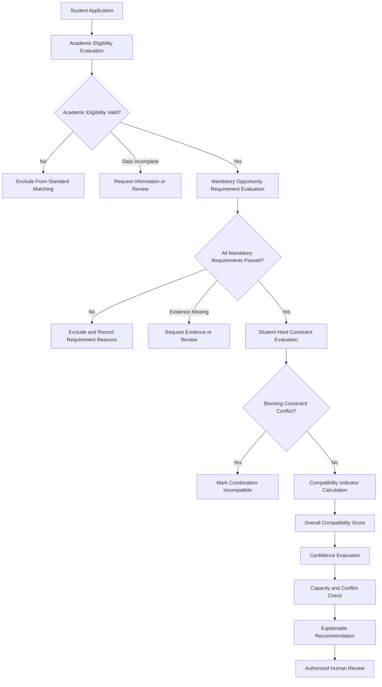

# ADR-001: Separate Eligibility From Compatibility Scoring

## Status

Accepted

## Date

2026-08-03

## Case

Internship Placement and Matching System

## Decision Type

Business Architecture and Decision-Support Design

## Decision Owners

- Career-Center Process Owner
- Academic Governance Owner
- Matching Model Owner
- System Design Owner

## Related Artifacts

- `01-problem-brief.md`
- `03-requirements.md`
- `05-to-be-process.md`
- `06-business-rules.md`
- `07-data-model.md`
- `08-matching-model.md`
- `09-api-contract.yml`
- `10-kpi-framework.md`
- `12-risk-controls.md`
- `13-test-scenarios.md`

## Context

The Internship Placement and Matching System must determine whether a student
can be considered for a specific internship opportunity.

This determination contains two fundamentally different questions.

### Question 1: Is the Student Eligible?

Eligibility determines whether the student is permitted to continue in the
placement process.

Eligibility may depend on:

- Active enrollment
- Academic program
- Academic year
- Minimum GPA
- Completed credits
- Required courses
- Previous mandatory internship completion
- Approved internship period
- Employer mandatory requirements
- Required documents
- Student availability
- Valid academic exceptions
- Employer and opportunity status

Eligibility conditions are normally binary or controlled review decisions.

A condition may produce:

- Passed
- Failed
- Data incomplete
- Review required
- Not applicable

### Question 2: How Compatible Is the Student With the Opportunity?

Compatibility evaluates how strongly an eligible student aligns with an
opportunity.

Compatibility may consider:

- Skill alignment
- Academic relevance
- Preferred employer qualifications
- Role preference
- Industry preference
- Location preference
- Working-model preference
- Internship-period alignment
- Language alignment

Compatibility is comparative and may be expressed through multiple indicators
and an overall score.

These two questions serve different business purposes.

Eligibility determines whether a combination is valid.

Compatibility helps authorized reviewers compare valid combinations.

## Problem

Combining eligibility and compatibility into one score would create several
risks.

### Mandatory Failures Could Be Hidden

A student could fail an essential condition but still receive a high combined
score because of strengths in other dimensions.

Example:

```text
Mandatory language requirement: Failed
Skill compatibility: 100
Academic relevance: 95
Role preference alignment: 100
Combined result: 82
```

A reviewer might incorrectly interpret the result as a valid recommendation
even though the mandatory requirement failed.

### Academic Rules Could Become Negotiable Through Weighting

Academic eligibility rules are institutional conditions.

They should not be weakened because a student:

- Has strong technical skills
- Strongly prefers the opportunity
- Applied early
- Is known to the employer
- Has a high score in another category

### Missing Data Could Produce Misleading Scores

When mandatory data is missing, the system must not silently assign:

- A neutral value
- A zero value
- An estimated value
- A favorable default

Missing mandatory information should produce `data incomplete` or `review
required`, not a compatibility result that appears complete.

### Explanations Would Become Difficult

A single blended score would make it harder to explain:

- Whether the student was academically permitted
- Which employer requirements were mandatory
- Which conditions failed
- Which dimensions only influenced ranking
- Whether an exception was applied
- Why human review was required

### Appeals and Audits Would Become Weaker

Students, academic reviewers and auditors must be able to distinguish:

- A rule-based exclusion
- A missing-data issue
- A preference mismatch
- A low compatibility result
- A capacity problem
- A human decision

A combined score would reduce this traceability.

## Decision

The system will separate eligibility evaluation from compatibility scoring.

The decision-support process will use a gated model.



Compatibility scoring will occur only when:

1. Academic eligibility is valid.
2. Any required academic exception is approved and active.
3. All employer mandatory requirements pass.
4. Required evidence is available.
5. No blocking student constraint fails.
6. The application and opportunity remain valid.

## Eligibility Layer

The eligibility layer determines whether the student-opportunity combination
may continue.

### Academic Eligibility

Academic eligibility may evaluate:

- Enrollment status
- Academic program
- Academic year
- GPA
- Completed credits
- Required course completion
- Previous internship completion
- Internship period
- Academic exception validity

### Opportunity Eligibility

Opportunity eligibility may evaluate:

- Employer status
- Opportunity status
- Application deadline
- Required academic program
- Mandatory skills
- Required language level
- Mandatory certification
- Required availability
- Required working model
- Required location condition
- Mandatory documents

### Operational Eligibility

Operational checks may include:

- Duplicate active application
- Conflicting confirmed placement
- Application limit
- Opportunity cancellation
- Expired recommendation
- Invalid dates

### Eligibility Output

The eligibility layer must produce structured results.

```yaml
academic_eligibility:
  status: eligible
  rule_set_version: ACADEMIC-RULES-2026.1

mandatory_requirements:
  status: passed
  requirement_version: 3

student_constraints:
  status: passed

overall_gate_status: passed
```

A failed result must identify:

- Rule or requirement identifier
- Expected value
- Observed value
- Result status
- Explanation
- Rule version
- Evaluation timestamp

## Compatibility Layer

The compatibility layer evaluates only combinations that pass the eligibility
gates.

The initial compatibility dimensions are:

| Dimension | Default Weight |
|---|---:|
| Skill Compatibility | 25% |
| Academic Relevance | 15% |
| Preferred Requirement Satisfaction | 15% |
| Role Preference Alignment | 10% |
| Industry Preference Alignment | 10% |
| Location Compatibility | 8% |
| Working-Model Compatibility | 7% |
| Internship-Period Compatibility | 5% |
| Language Compatibility | 5% |
| **Total** | **100%** |

The weights are illustrative and require stakeholder approval before
institutional use.

### Compatibility Output

```yaml
match_status: evaluated
overall_compatibility_score: 85.60
compatibility_classification: very_strong
confidence_level: 91
model_version: MATCHING-MODEL-1.0
```

The compatibility result does not create:

- Academic approval
- Employer acceptance
- Student acceptance
- Placement offer
- Capacity reservation
- Final placement

## Confidence Is Also Separate

Compatibility and confidence will remain separate.

Compatibility answers:

```text
How well does the available information align?
```

Confidence answers:

```text
How reliable and complete is the information used?
```

Example:

```text
Compatibility score: 88
Confidence level: 57
```

This result means that the available information suggests strong compatibility,
but the recommendation requires additional verification.

A low-confidence result must not be hidden inside the compatibility score.

## Student Preferences Are Not Eligibility Rules by Default

Student preferences will normally influence ranking rather than academic or
employer eligibility.

Examples include:

- Preferred industry
- Preferred role
- Preferred city
- Preferred employer
- Preferred working model

However, a student may classify certain conditions as hard constraints.

Examples include:

- Remote only
- Unavailable during the required internship period
- Unacceptable location
- Documented travel limitation

A hard constraint may prevent a recommendation, but it remains separate from
academic eligibility and employer mandatory requirements.

## Human Review Remains Required

Passing eligibility gates and receiving a high compatibility score does not
create a final placement.

Authorized reviewers must evaluate:

- Eligibility evidence
- Mandatory requirement results
- Compatibility indicators
- Confidence level
- Student preferences
- Capacity status
- Operational conflicts
- Data-quality warnings
- Relevant exceptions
- Recommendation explanation

The reviewer may:

- Approve
- Reject
- Request information
- Place on hold
- Escalate
- Apply an authorized override

The original system results must remain preserved.

## Decision Drivers

This decision is based on the following priorities.

### Academic Integrity

Academic conditions must remain enforceable and explainable.

### Employer Requirement Integrity

Mandatory employer requirements must not be weakened by unrelated strengths.

### Student Transparency

Students should receive understandable reasons for:

- Ineligibility
- Missing information
- Requirement failure
- Preference mismatch
- Low compatibility
- Capacity unavailability

### Human Accountability

The system should support staff decisions without making final placement
decisions autonomously.

### Auditability

Every final placement should be traceable through:

1. Academic eligibility
2. Mandatory requirement evaluation
3. Compatibility evaluation
4. Recommendation
5. Human decision
6. Offer
7. Student and employer responses
8. Final confirmation

### Model Governance

Changing compatibility weights must not change academic eligibility.

Changing an academic rule must not silently modify the meaning of historical
compatibility scores.

### Fairness Review

Separating gates from scoring makes it possible to examine:

- Which rules exclude students
- Which requirements produce the most failures
- Which students receive no recommendation
- Whether compatibility indicators are concentrated
- Whether human reviewers frequently override specific rules

## Considered Alternatives

## Alternative 1: One Combined Placement Score

All academic, employer, student and operational factors would contribute to one
score.

Example:

```text
Academic eligibility: 25%
Skills: 25%
Employer requirements: 20%
Student preferences: 20%
Capacity: 10%
```

### Advantages

- Simple single-number output
- Easy candidate ordering
- Fewer result objects

### Disadvantages

- Mandatory failures may be compensated by other strengths.
- Academic policies become weights instead of gates.
- Missing mandatory data becomes difficult to handle correctly.
- Explanations become less clear.
- Score changes may alter both eligibility and ranking.
- Appeals become difficult.
- Reviewers may treat the score as a final decision.

### Decision

Rejected.

---

## Alternative 2: Eligibility Penalties Inside the Score

Students would receive score penalties for failed conditions.

Example:

```text
Missing required course: -40 points
Language requirement failure: -30 points
```

### Advantages

- Retains one numerical result
- Allows configurable severity

### Disadvantages

- A sufficiently strong score can still hide a mandatory failure.
- Penalty values are arbitrary.
- Mandatory conditions become negotiable.
- Multiple failures may produce unclear or negative scores.
- Reviewers may not understand the original failure.
- Rule changes become difficult to compare historically.

### Decision

Rejected.

---

## Alternative 3: Human Review Without Compatibility Scoring

The system would apply eligibility rules and then send all valid applications
directly to reviewers without calculating compatibility.

### Advantages

- Simple model governance
- No scoring-model risk
- Maximum reviewer discretion

### Disadvantages

- High manual workload
- Inconsistent candidate comparison
- Limited prioritization
- Difficult review of large candidate populations
- Students with no suitable opportunity may be identified late
- Reviewer decisions may depend heavily on personal familiarity

### Decision

Rejected as the primary design.

Human review remains required, but structured compatibility indicators will
support it.

---

## Alternative 4: Separate Eligibility and Scoring

Academic rules, mandatory employer requirements and blocking constraints act as
gates.

Only valid combinations receive compatibility indicators.

### Advantages

- Mandatory conditions remain enforceable.
- Eligibility explanations remain clear.
- Missing mandatory data can stop processing safely.
- Compatibility weights can change independently.
- Appeals and audits are easier.
- Reviewers can distinguish exclusion from weak alignment.
- Fairness monitoring can analyze both gate and ranking effects.
- Historical versions remain interpretable.

### Disadvantages

- More entities and statuses are required.
- Workflow logic becomes more complex.
- Reviewers must understand multiple result types.
- Additional testing is required.
- Exception handling must be carefully controlled.

### Decision

Accepted.

## Consequences

## Positive Consequences

### Clear Decision Structure

The system can show:

```text
Academic eligibility: Passed
Mandatory requirements: Passed
Student hard constraints: Passed
Compatibility: 85.60
Confidence: 91
Capacity: Available
Human decision: Pending
```

### Safer Mandatory Rules

A mandatory failure cannot be hidden by a strong score elsewhere.

### Better Explanations

Students and reviewers can understand whether a result was caused by:

- Academic rule
- Employer requirement
- Missing evidence
- Preference alignment
- Compatibility indicator
- Capacity condition
- Human judgment

### Independent Governance

Academic rules and matching weights can have different owners and approval
processes.

### Better Testing

Boundary and failure tests can validate eligibility independently from scoring.

### Better Analytics

The institution can measure:

- Eligibility rate
- Failed-rule frequency
- Mandatory requirement pass rate
- Recommendation rate
- No-recommendation rate
- Compatibility distribution
- Override rate
- Recommendation effectiveness

### Improved Fairness Review

Reviewers can analyze whether outcome differences originate from:

- Eligibility rules
- Employer requirements
- Student preferences
- Opportunity supply
- Compatibility weights
- Human decisions

## Negative Consequences

### Increased Model Complexity

The system requires separate entities for:

- Eligibility evaluation
- Rule results
- Requirement evaluations
- Match evaluation
- Match indicators
- Recommendation
- Human decision

### Additional Workflow States

The system must support statuses such as:

- Eligible
- Ineligible
- Data incomplete
- Review required
- Excluded
- Evaluated
- Recommended
- Capacity hold
- Approved
- Rejected

### More Reviewer Training

Reviewers must understand the difference between:

- Eligibility
- Compatibility
- Confidence
- Recommendation
- Final decision

### Additional Recalculation Logic

The system must determine which changes require:

- Eligibility reevaluation
- Requirement reevaluation
- Match reevaluation
- Recommendation superseding

### More Extensive Testing

The design requires tests for:

- Gate sequencing
- Missing data
- Mandatory failure
- Weight calculations
- Rule and model versioning
- Historical stability
- Human overrides

## Data Model Impact

The decision requires separate records for:

- `ACADEMIC_ELIGIBILITY_EVALUATION`
- `ELIGIBILITY_RULE_RESULT`
- `ACADEMIC_EXCEPTION_REQUEST`
- `REQUIREMENT_EVALUATION`
- `MATCH_EVALUATION`
- `MATCH_INDICATOR`
- `PLACEMENT_RECOMMENDATION`
- `RECOMMENDATION_EVIDENCE`
- `PLACEMENT_DECISION`
- `MANUAL_OVERRIDE`

These records must remain linked but independently queryable.

## API Impact

The API must expose separate operations for:

- Academic eligibility evaluation
- Academic exception decisions
- Requirement evaluation
- Compatibility evaluation
- Recommendation generation
- Human recommendation decisions
- Manual overrides
- Placement offers
- Final placement confirmation

The API must not provide one endpoint that silently performs and confirms the
entire placement lifecycle.

## Reporting Impact

Reports must not treat the following as interchangeable:

```text
Eligible Student
Recommended Student
Student With Offer
Student Who Accepted
Confirmed Placement
Successful Internship Outcome
```

Each stage requires its own numerator, denominator and status definition.

## Audit Impact

Audit history must preserve:

- Eligibility rule version
- Requirement version
- Matching-model version
- Profile version
- Preference version
- Recommendation result
- Human decision
- Override details
- Final placement status

## Security and Authorization Impact

Different roles may control different decisions.

| Decision | Authorized Role |
|---|---|
| Configure academic eligibility rule | Academic rule owner |
| Approve academic exception | Academic authority |
| Configure compatibility model | Matching model owner |
| Review recommendation | Career-center reviewer |
| Approve high-impact override | Authorized secondary approver |
| Confirm final placement | Placement authority |

A user authorized to review compatibility must not automatically receive
authority to override academic eligibility.

## Exception Handling

An exception does not remove the separation between eligibility and scoring.

When an academic exception is approved:

1. The original rule failure remains recorded.
2. The exception is stored separately.
3. A new eligibility evaluation is created.
4. The new evaluation may pass the eligibility gate.
5. Compatibility scoring then proceeds normally.

Example:

```yaml
original_rule_result:
  rule_id: BR-AE-004
  result: failed

academic_exception:
  status: approved
  valid_to: 2026-09-30

new_eligibility_result:
  status: eligible_with_exception
```

A compatibility score must not be used as an informal substitute for an
academic exception.

## Implementation Rules

The following implementation rules are mandatory.

### Rule 1

Do not calculate a standard compatibility score when academic eligibility is
invalid.

### Rule 2

Do not calculate a standard compatibility score when a mandatory employer
requirement has a confirmed failure.

### Rule 3

Do not convert missing mandatory data into a neutral compatibility value.

### Rule 4

Do not allow preferred qualifications to override mandatory failures.

### Rule 5

Do not allow recommendation generation to create a final placement.

### Rule 6

Store the eligibility and matching versions used for every recommendation.

### Rule 7

Preserve the original evaluation after human review or override.

### Rule 8

Show capacity separately from compatibility.

An opportunity may have:

```text
Compatibility: 94
Capacity: Full
```

The student remains strongly compatible, but an offer cannot be created while
capacity is unavailable.

### Rule 9

Show placement urgency separately from compatibility.

A student approaching an academic deadline may receive higher review priority,
but the compatibility score must not be inflated.

### Rule 10

Require reevaluation when a material input changes.

Examples include:

- Academic record
- Academic rule
- Mandatory requirement
- Opportunity dates
- Student hard constraint
- Matching-model version
- Requirement evidence

## Validation Scenarios

This decision is validated through scenarios including:

- Student passes all eligibility gates and receives a score.
- Student fails minimum GPA and receives no standard score.
- Student has missing GPA and receives `data incomplete`.
- Student fails a mandatory language requirement.
- Student misses a preferred qualification but remains scoreable.
- Student has a hard location conflict.
- Student receives high compatibility with low confidence.
- Compatibility score equals the recommendation threshold.
- Capacity is full despite strong compatibility.
- Academic exception allows a new eligibility evaluation.
- Reviewer rejects a strong recommendation.
- Override preserves the original recommendation.
- Historical score remains unchanged after a new model version.

## Monitoring

The institution should monitor the effect of this decision using:

- Academic eligibility rate
- Eligibility data-incomplete rate
- Failed-rule frequency
- Academic exception approval rate
- Mandatory requirement pass rate
- Students with no recommendation rate
- Compatibility-score distribution
- Low-confidence recommendation rate
- Recommendation approval rate
- Manual override rate
- Recommendation concentration rate
- Recommendation-to-placement conversion
- Successful internship completion rate

## Review Triggers

This ADR should be reviewed when:

- Academic policies materially change.
- Employer requirements can no longer be structured reliably.
- A new matching model is introduced.
- The university proposes automated final decisions.
- Compatibility scores are used outside internship placement.
- Missing-data treatment changes.
- Fairness monitoring identifies repeated gate-related concerns.
- Manual override rates become unusually high.
- A legal, privacy or academic review requires a different decision structure.
- A serious incident demonstrates that the gate model is insufficient.

## Reversal Conditions

This decision should be reversed only when there is strong evidence that:

- A different design preserves mandatory rule integrity.
- Eligibility remains independently explainable.
- Missing data is handled safely.
- Academic authority remains protected.
- Human accountability remains visible.
- Historical decisions remain auditable.
- The alternative has been approved by academic, operational, privacy and
  governance owners.

Convenience or a desire for one simplified score is not sufficient reason to
reverse this decision.

## Final Decision Statement

The Internship Placement and Matching System will treat eligibility as a set of
controlled gates and compatibility as a separate advisory evaluation.

Academic rules, employer mandatory requirements and blocking student
constraints determine whether a student-opportunity combination may proceed.

Only combinations that pass those gates may receive compatibility indicators,
an overall score and a recommendation.

Compatibility does not override eligibility.

Recommendation does not equal placement.

Final placement remains an authorized human decision supported by explainable,
versioned and auditable evidence.
